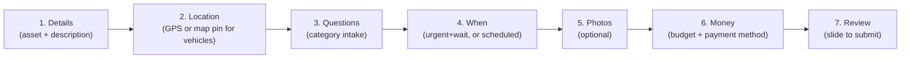
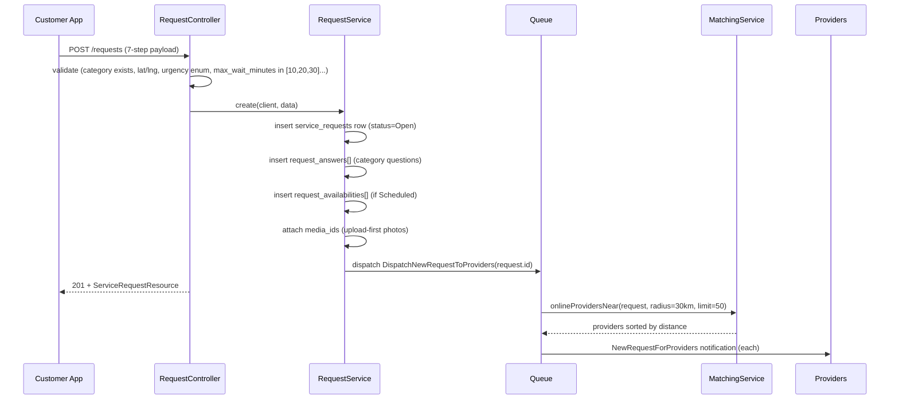

# 1. Creation

Customer builds a request through a 7-step wizard and submits it; the backend
persists it and fans it out to nearby providers.

- Wizard: `frontend/apps/customer/app/request/new.tsx`
- Backend: `RequestController::store` → `RequestService::create`

## Wizard steps

Step 1 and 2 vary by the category's derived `asset_type`:

| asset_type | Category types | Asset step | Location step |
|---|---|---|---|
| `vehicle` | Roadside | Vehicle picker required | Interactive map, drag-pan a fixed center pin |
| `property` | Residential/Condo | Property picker required | Skipped if the asset has saved coords + geofence (read-only map shown instead) |
| `pet` | Pet | Pet picker required | Standard GPS capture |
| `null` | Beauty | No asset step | Standard GPS capture |

## Submission → dispatch

## Fields collected

| Field | Step | Column (table) | Required |
|---|---|---|---|
| service_category_id | param | `service_category_id` (service_requests) | ✓ |
| asset_id | 1 | `asset_id` | if category has an asset_type |
| description | 1 | `description` | ✓ (5–1000 chars) |
| latitude / longitude | 2 | `latitude` / `longitude` | ✓ |
| address | 2 | `address` | optional |
| reception_type / entry_code | 2 | same | optional |
| question answers | 3 | `question_id` / `answer` (request_answers) | optional |
| urgency | 4 | `urgency` | default `urgent` |
| max_wait_minutes | 4 | `max_wait_minutes` | required if urgent (10/20/30) |
| availabilities | 4 | `starts_at` / `ends_at` (request_availabilities) | required if scheduled |
| photos | 5 | `media_ids` (media, morph) | optional, max 5 |
| budget_max | 6 | `budget_max` | default 120 |
| payment_method | 6 | `payment_method` | default `cash` |

## Entry points

- Home screen "quick help" tiles (top 4 categories).
- Categories browse screen (`/categories`, grouped by type).
- Direct deep link with a `categoryId` param.
- No duplicate/re-request shortcut exists — every request starts from a blank wizard.

## Known gaps

- **Filament admin create bypasses `RequestService::create` entirely** —
  no `DispatchNewRequestToProviders` call, so an admin-created request never
  reaches a provider unless someone manually re-triggers dispatch.
- **30km match radius and 50-provider cap are hardcoded** in
  `MatchingService::onlineProvidersNear` — not configurable per category or
  request.
- **No server-side guardrail matching the wizard's step sequencing** — the
  API validates fields, not order; a direct POST can skip steps a real user
  couldn't (e.g. submit without ever calling the location step's GPS flow,
  as long as lat/lng are present).
- **Category-question visibility depends on asset detail fields** (floor,
  unit, address already answered by the asset) — a fragile coupling since
  adding a new asset field silently changes which questions show.
