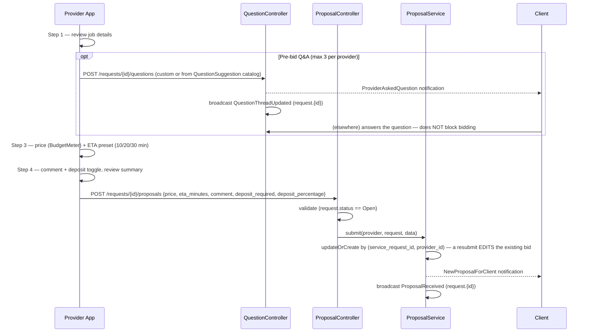

# 2. Bid

A provider who was notified (or is browsing "nearby") opens the request and
submits a proposal through a 4-step wizard, optionally asking pre-bid
questions first.

- Wizard: `frontend/apps/provider/app/job/[id]/bid.tsx`
- Backend: `ProposalController::store` → `ProposalService::submit`

## Flow

## Fields collected

| Field | Column (proposals) | Validation |
|---|---|---|
| price | `price` | numeric ≥0 (client UI narrows to 60–2×avg; **backend doesn't enforce that range**) |
| eta_minutes | `eta_minutes` | 1–1440 (client offers 10/20/30 presets) |
| comment | `comment` | optional, max 500 |
| deposit_required | `deposit_required` | optional boolean |
| deposit_percentage | `deposit_percentage` | 1–100, only meaningful if deposit_required |
| deposit_amount | `deposit_amount` | computed client-side: `round(price × pct / 100)` |

## Known gaps

- **`eta_minutes` and the request's `max_wait_minutes` have no relationship.**
  A provider can bid a 45-minute ETA on a request where the client said "up
  to 10 min" and nothing flags it, sorts it lower, or warns either side.
  These two fields look like they should talk to each other; today they
  don't.
- **Bidding twice is silently an edit, not a new bid** — `updateOrCreate`
  means a provider can't see "bid history," only their current live bid.
  There's no withdraw endpoint either — the only way to remove a bid is to
  never let the client see it, which isn't actually possible once submitted.
- **No bid cap or countdown** — proposals stay open indefinitely until the
  client accepts one or cancels the request; a request can accumulate an
  unbounded number of bids.
- **Backend price validation is looser than the UI suggests** — `min:0` on
  the server vs. a 60–2×avg slider on the client means a scripted client
  could submit a R$0.01 or absurdly high bid.
