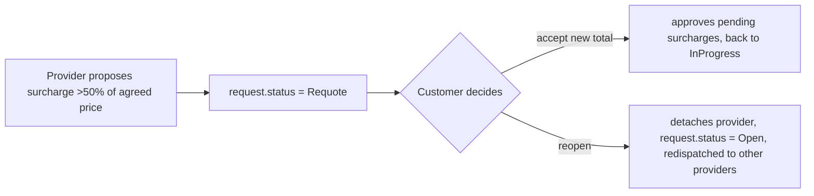

# 3. Response

The customer reviews incoming proposals and accepts one. There's no reject
and no negotiation — only accept-one (which auto-rejects the rest) or cancel
the whole request.

- Screen: `ProposalsList.tsx`, inline on `request/[id]/index.tsx`
- Backend: `ProposalController::accept` → `ProposalService::accept`

## Flow

```mermaid
sequenceDiagram
    participant C as Customer App
    participant API as ProposalController
    participant Svc as ProposalService
    participant W as Winning provider
    participant L as Losing providers

    C->>API: GET /requests/{id}/proposals?sort=price|eta|rating
    API-->>C: paginated list (rating_avg, price, eta, deposit info, Q&A thread per proposal)
    C->>C: top proposal → slide-to-confirm; others → tap "accept"
    C->>API: POST /proposals/{id}/accept
    API->>API: validate request.status == Open
    API->>Svc: accept(proposal)
    Svc->>Svc: proposal.status = Accepted
    Svc->>Svc: ALL other proposals on this request → status = Rejected (no notification sent)
    Svc->>Svc: request.status = Accepted, accepted_provider_id/accepted_proposal_id/accepted_at set
    alt urgency == Urgent
        Svc->>Svc: generate 4-digit start_code
    end
    Svc-->>W: ProposalAccepted notification
    Note over L: silence — losing providers are never told
    API-->>C: unlocks tracking map, progress strip, start-code display
```

## Requote sub-flow

Not really a "response" action by the customer up front — it's a forced
re-response triggered mid-job by a large surcharge (see
[Performance](./04-performance.md)):



## Known gaps

- **No per-proposal reject.** The only way to decline a single bid is to
  accept a different one (which rejects it as a side effect) or cancel the
  entire request. There's no "no thanks" button.
- **No negotiation/counter-offer.** A customer can't propose a different
  price back to a provider — accept-as-is or don't.
- **Rejected providers are never notified.** They find out only by the
  request disappearing from their feed (or not — see below).
- **`max_wait_minutes` has no enforcement.** `RequestStatus::Expired` exists
  in the enum but nothing schedules a transition to it — a customer can sit
  on an urgent request indefinitely with no auto-expiry or auto-cancel, even
  though the UI collects a "max wait time" during creation that implies one
  should exist.
