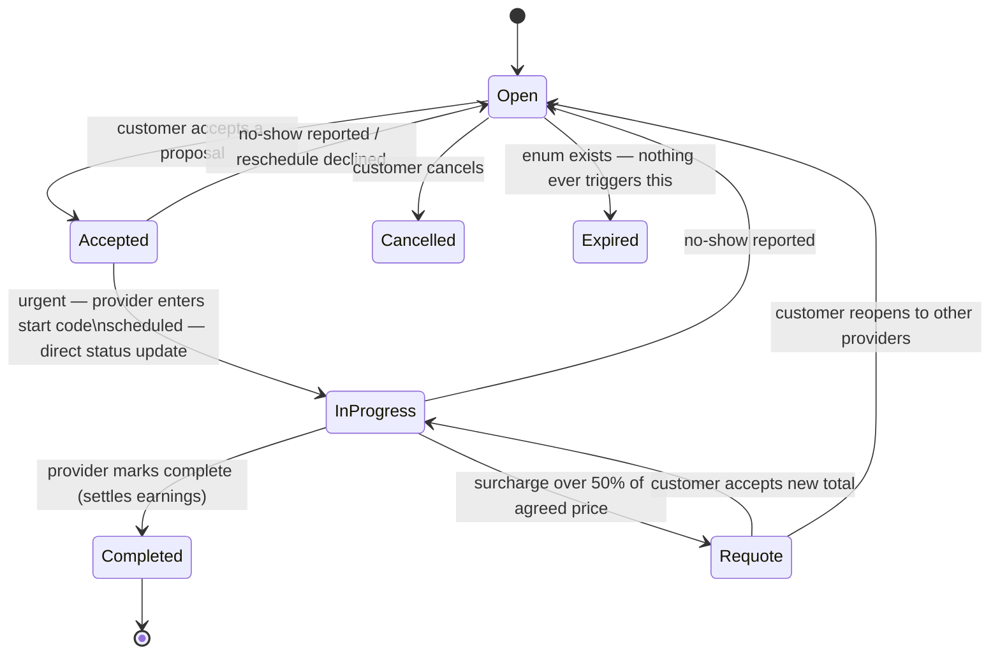
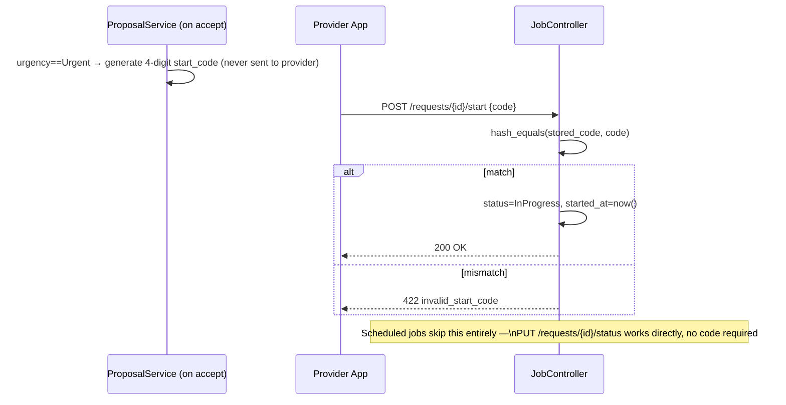
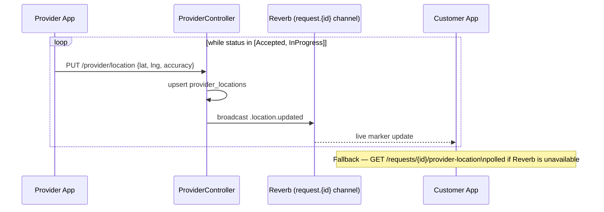
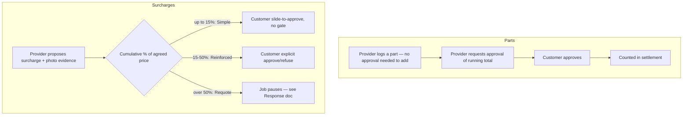
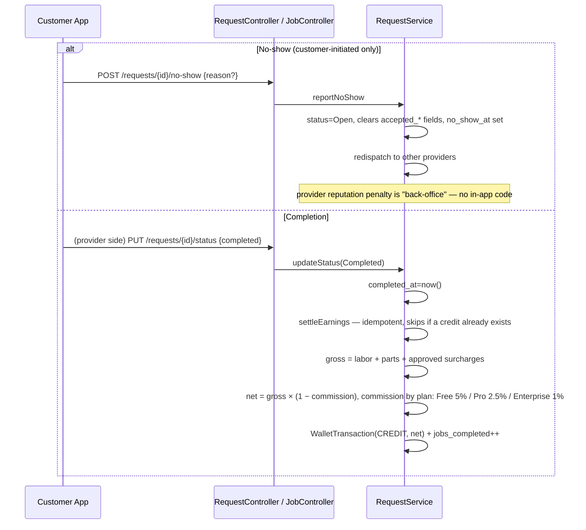

# 4. Performance

Everything between "accepted" and "completed": starting the job, live
tracking, parts, surcharges, and the side-flows that can interrupt it
(no-show, reschedule, requote).

## Status machine

## Start-of-service code

## Live tracking

## Parts & surcharges

## No-show & completion

## Known gaps

- **`RequestStatus::Expired` is dead code** — defined in the enum, never
  assigned anywhere.
- **No-show is customer-initiated only** — there's no symmetric provider
  "customer no-show" report.
- **Provider reputation penalty on no-show is undocumented in code** — the
  comment says "back-office reputation pipeline" but nothing in this repo
  implements it.
- **Parts require no approval to *add*, only to *total*.** A provider could
  log an arbitrarily large parts list and the customer only sees it when
  approval is explicitly requested — there's no line-item approval, only an
  aggregate one.
