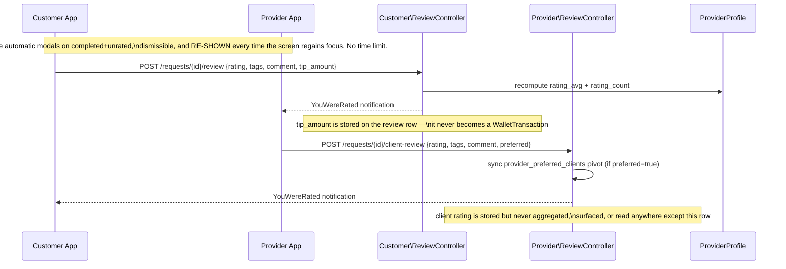
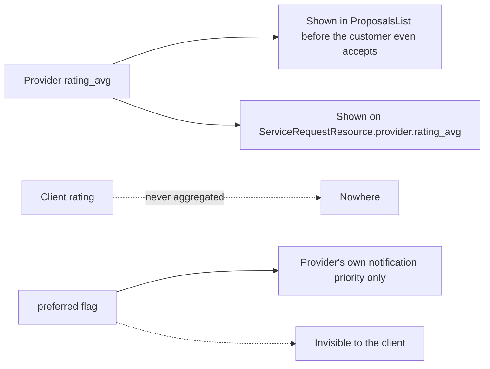

# 5. Rate

After completion, both sides are prompted to rate each other. One `reviews`
table, `author_role` ('client' / 'provider') distinguishes direction.

- Customer form: `frontend/apps/customer/src/components/ReviewForm.tsx`
- Provider form: `frontend/apps/provider/src/components/RateClientForm.tsx`

## Flow

## Fields collected

| | Customer → Provider | Provider → Client |
|---|---|---|
| rating | 1–5 stars | 1–5 stars |
| tags | multi-select, max 40 chars each | multi-select, max 40 chars each |
| comment | optional, max 500 | optional, max 500 |
| extra | **tip_amount** (0–9999 BRL) | **preferred** toggle (default true) |

## Where it surfaces afterward

## Known gaps

- **Tips don't pay.** `reviews.tip_amount` is captured and validated but
  never converted into a `WalletTransaction` — the provider never actually
  receives the tip a customer thinks they sent.
- **Client ratings are a dead end.** No `rating_avg` for clients, no history
  screen, nothing reads the value except its own row. A provider who rates
  a difficult client 1 star gets nothing out of it beyond the private
  "preferred" toggle (which is opt-in *positive* signal only — there's no
  symmetric "avoid this client" mechanism that affects anything).
- **Rating has zero effect on matching.** `MatchingService` doesn't factor
  in `rating_avg` at all — a 1-star and a 5-star provider are equally likely
  to be notified about a new request.
- **Re-prompt-on-every-focus could be an aggressive UX pattern** worth a
  second look — a customer/provider dismissing the modal 5 times will see it
  a 6th time on the next visit, with no persistent snooze/skip.
- **Test coverage is thin**: one backend notification test, two e2e specs
  that only assert the rating UI is present — no test actually submits a
  review end-to-end, so `rating_avg` recalculation and the preferred-pivot
  sync are unverified by automation today.
