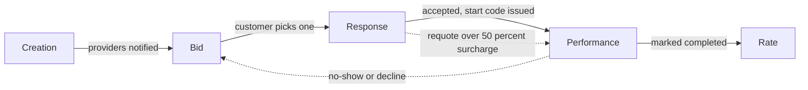

# Request lifecycle

Five stages take a service request from creation to a closed, rated job. Each
stage has its own doc below with a Mermaid flow and a **Known gaps** section
— gaps are things that exist in the code today (or conspicuously don't) and
aren't fixed by writing this doc; they're a punch list for later.

1. [Creation](./01-creation.md) — customer builds and submits a request.
2. [Bid](./02-bid.md) — providers see it and submit proposals.
3. [Response](./03-response.md) — customer accepts one proposal.
4. [Performance](./04-performance.md) — the job gets done (start → parts →
   surcharges → completion), including no-show/dispute/reschedule side-flows.
5. [Rate](./05-rate.md) — customer and provider rate each other.

## End-to-end overview

## Cross-cutting gaps

These surfaced repeatedly across stages, so they're collected here instead of
repeated per-file:

- **`RequestStatus::Expired` and `max_wait_minutes` don't do anything yet.**
  Both fields exist; nothing ever transitions a request to `Expired`, and
  nothing compares a provider's `eta_minutes` bid against the client's stated
  `max_wait_minutes`. They're currently just displayed, not enforced.
- **Filament admin-created requests skip the entire dispatch pipeline.**
  Creating a `ServiceRequest` directly (outside `RequestService::create`)
  never calls `DispatchNewRequestToProviders` — an admin-created request
  silently sits with zero notified providers.
- **No reject / negotiate on proposals.** A customer can only accept-one
  (which silently rejects the rest with no notification) or cancel the whole
  request. There's no per-proposal decline, and no counter-offer mechanism.
  This is a real behavioral gap, not a documentation-only afterthought — flag
  it before assuming "reject" exists anywhere in the UI.
- **Tips are recorded but never paid.** `reviews.tip_amount` is captured and
  stored; nothing ever turns it into a `WalletTransaction` or otherwise pays
  the provider.
- **Client ratings are a dead end.** Provider→client reviews are stored but
  never aggregated, surfaced, or exposed anywhere — no `rating_avg` for
  clients, no history screen, nothing reads them except the "preferred
  clients" toggle (which only affects the *provider's own* notification
  order, invisible to the client).
