# Journey screenshots

23 screenshots across 1 flows, captured per step during `npx playwright test --project=journeys`. Paths are relative to `e2e/`.

| # | Flow (test) | Step | Screenshot | Path |
|---|---|---|---|---|
| 1 | full-demo | create — step 1 details | 01-create-step-1-details.png | `screens/full-demo/01-create-step-1-details.png` |
| 2 | full-demo | create — step 2 location | 02-create-step-2-location.png | `screens/full-demo/02-create-step-2-location.png` |
| 3 | full-demo | create — step 3 questions | 03-create-step-3-questions.png | `screens/full-demo/03-create-step-3-questions.png` |
| 4 | full-demo | create — step 3 questions answered | 04-create-step-3-questions-answered.png | `screens/full-demo/04-create-step-3-questions-answered.png` |
| 5 | full-demo | create — step 4 schedule | 05-create-step-4-schedule.png | `screens/full-demo/05-create-step-4-schedule.png` |
| 6 | full-demo | create — step 5 photos | 06-create-step-5-photos.png | `screens/full-demo/06-create-step-5-photos.png` |
| 7 | full-demo | create — step 5 photos attached | 07-create-step-5-photos-attached.png | `screens/full-demo/07-create-step-5-photos-attached.png` |
| 8 | full-demo | create — step 6 budget & payment | 08-create-step-6-budget-payment.png | `screens/full-demo/08-create-step-6-budget-payment.png` |
| 9 | full-demo | create — step 6 budget raised, payment picked | 09-create-step-6-budget-raised-payment-picked.png | `screens/full-demo/09-create-step-6-budget-raised-payment-picked.png` |
| 10 | full-demo | create — step 7 review | 10-create-step-7-review.png | `screens/full-demo/10-create-step-7-review.png` |
| 11 | full-demo | create — submitted (request detail) | 11-create-submitted-request-detail.png | `screens/full-demo/11-create-submitted-request-detail.png` |
| 12 | full-demo | provider — open job (send proposal) | 12-provider-open-job-send-proposal.png | `screens/full-demo/12-provider-open-job-send-proposal.png` |
| 13 | full-demo | provider — bid wizard | 13-provider-bid-wizard.png | `screens/full-demo/13-provider-bid-wizard.png` |
| 14 | full-demo | provider — asked the client a question | 14-provider-asked-the-client-a-question.png | `screens/full-demo/14-provider-asked-the-client-a-question.png` |
| 15 | full-demo | provider — bid sent | 15-provider-bid-sent.png | `screens/full-demo/15-provider-bid-sent.png` |
| 16 | full-demo | customer — answered the pro question | 16-customer-answered-the-pro-question.png | `screens/full-demo/16-customer-answered-the-pro-question.png` |
| 17 | full-demo | customer — proposals | 17-customer-proposals.png | `screens/full-demo/17-customer-proposals.png` |
| 18 | full-demo | customer — proposal accepted | 18-customer-proposal-accepted.png | `screens/full-demo/18-customer-proposal-accepted.png` |
| 19 | full-demo | provider — en route, road route on map | 19-provider-en-route-road-route-on-map.png | `screens/full-demo/19-provider-en-route-road-route-on-map.png` |
| 20 | full-demo | customer — live tracking with route + start code | 20-customer-live-tracking-with-route-start-code.png | `screens/full-demo/20-customer-live-tracking-with-route-start-code.png` |
| 21 | full-demo | provider — job started | 21-provider-job-started.png | `screens/full-demo/21-provider-job-started.png` |
| 22 | full-demo | provider — job completed | 22-provider-job-completed.png | `screens/full-demo/22-provider-job-completed.png` |
| 23 | full-demo | customer — receipt | 23-customer-receipt.png | `screens/full-demo/23-customer-receipt.png` |

## full-demo

### 1. create — step 1 details

`screens/full-demo/01-create-step-1-details.png`

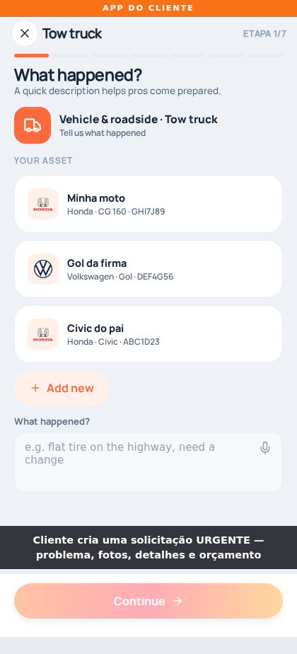

### 2. create — step 2 location

`screens/full-demo/02-create-step-2-location.png`

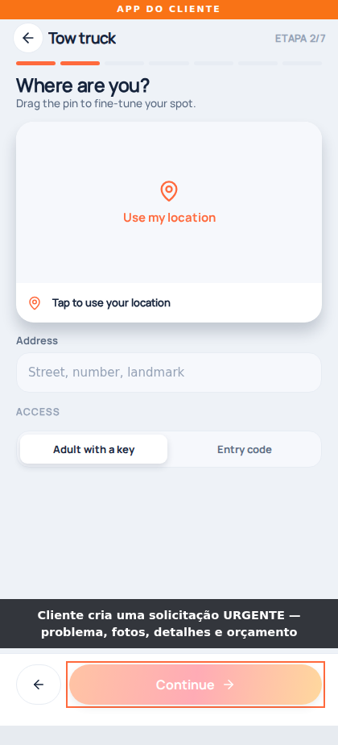

### 3. create — step 3 questions

`screens/full-demo/03-create-step-3-questions.png`

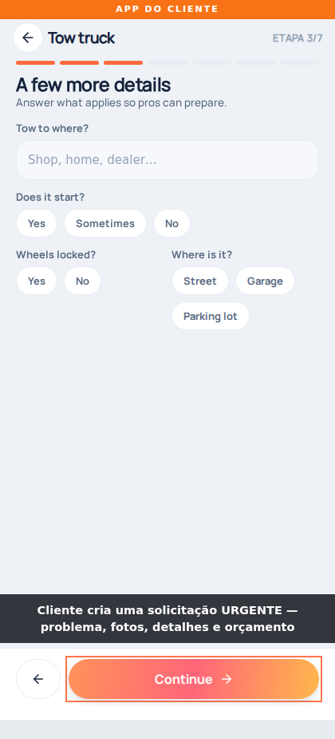

### 4. create — step 3 questions answered

`screens/full-demo/04-create-step-3-questions-answered.png`

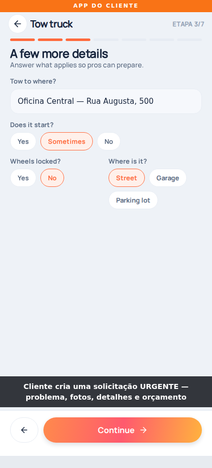

### 5. create — step 4 schedule

`screens/full-demo/05-create-step-4-schedule.png`

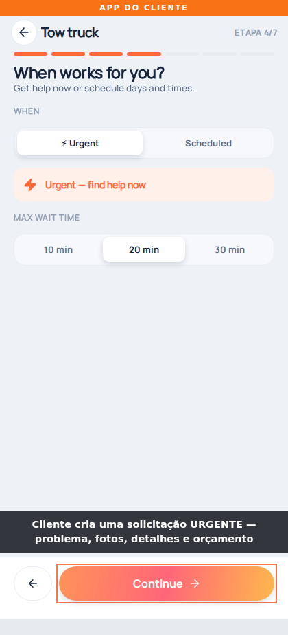

### 6. create — step 5 photos

`screens/full-demo/06-create-step-5-photos.png`

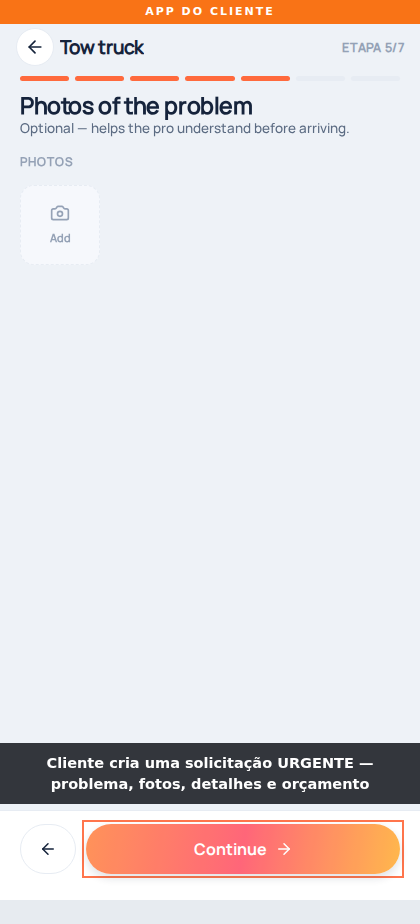

### 7. create — step 5 photos attached

`screens/full-demo/07-create-step-5-photos-attached.png`

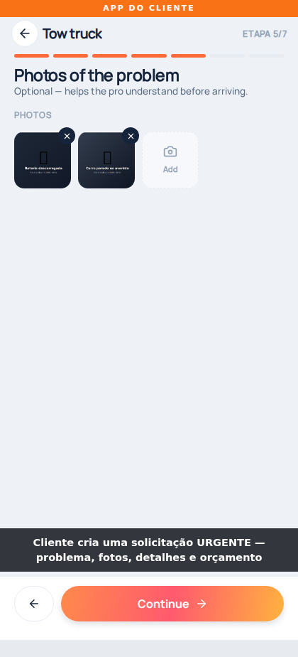

### 8. create — step 6 budget & payment

`screens/full-demo/08-create-step-6-budget-payment.png`

### 9. create — step 6 budget raised, payment picked

`screens/full-demo/09-create-step-6-budget-raised-payment-picked.png`

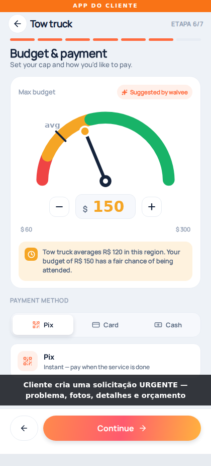

### 10. create — step 7 review

`screens/full-demo/10-create-step-7-review.png`

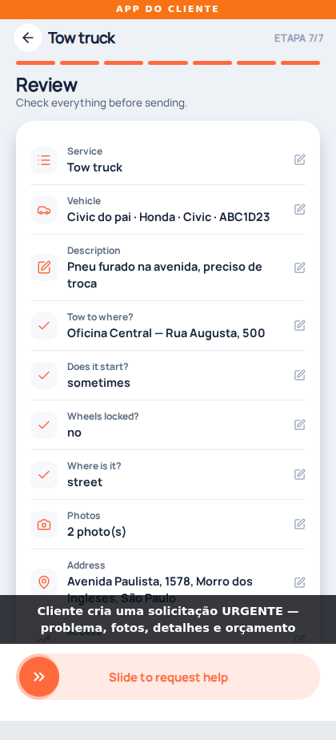

### 11. create — submitted (request detail)

`screens/full-demo/11-create-submitted-request-detail.png`

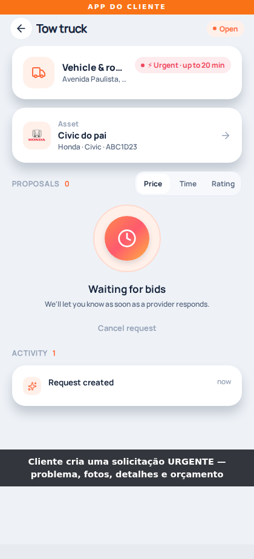

### 12. provider — open job (send proposal)

`screens/full-demo/12-provider-open-job-send-proposal.png`

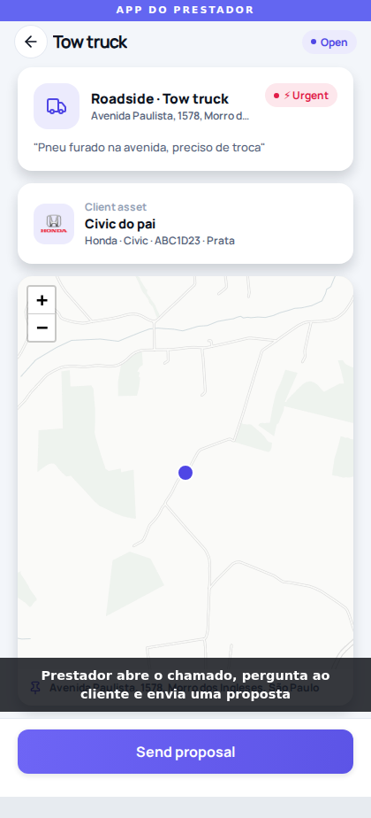

### 13. provider — bid wizard

`screens/full-demo/13-provider-bid-wizard.png`

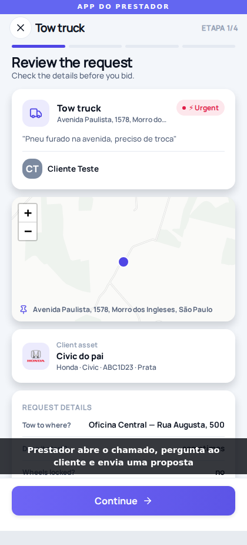

### 14. provider — asked the client a question

`screens/full-demo/14-provider-asked-the-client-a-question.png`

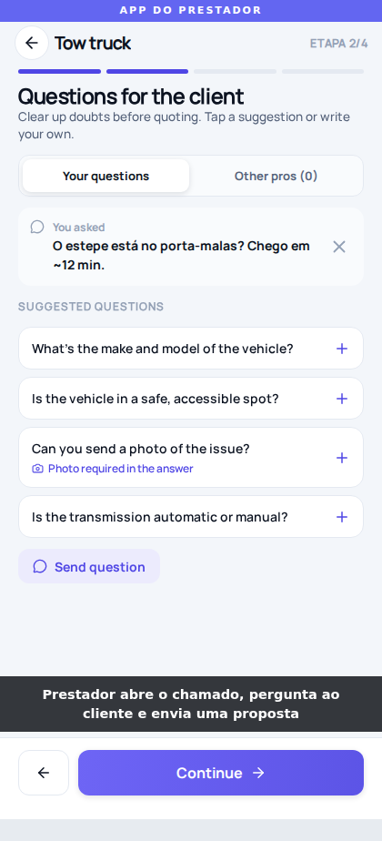

### 15. provider — bid sent

`screens/full-demo/15-provider-bid-sent.png`

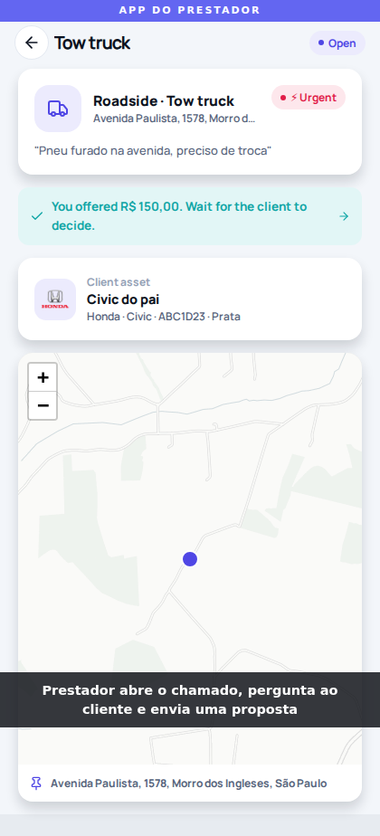

### 16. customer — answered the pro question

`screens/full-demo/16-customer-answered-the-pro-question.png`

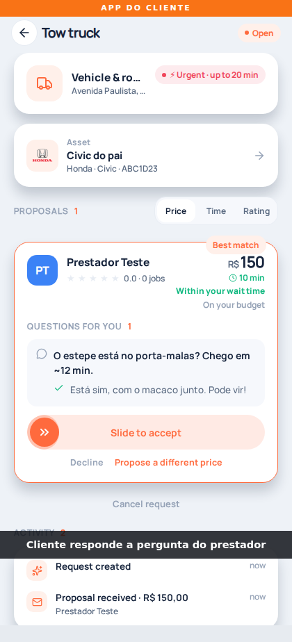

### 17. customer — proposals

`screens/full-demo/17-customer-proposals.png`

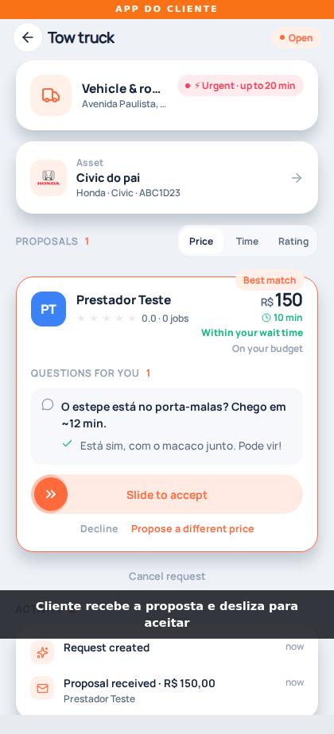

### 18. customer — proposal accepted

`screens/full-demo/18-customer-proposal-accepted.png`

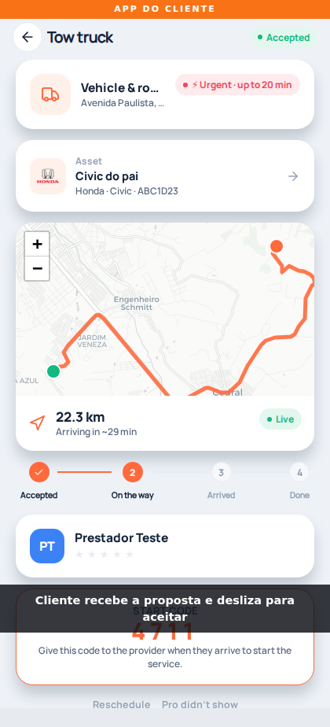

### 19. provider — en route, road route on map

`screens/full-demo/19-provider-en-route-road-route-on-map.png`

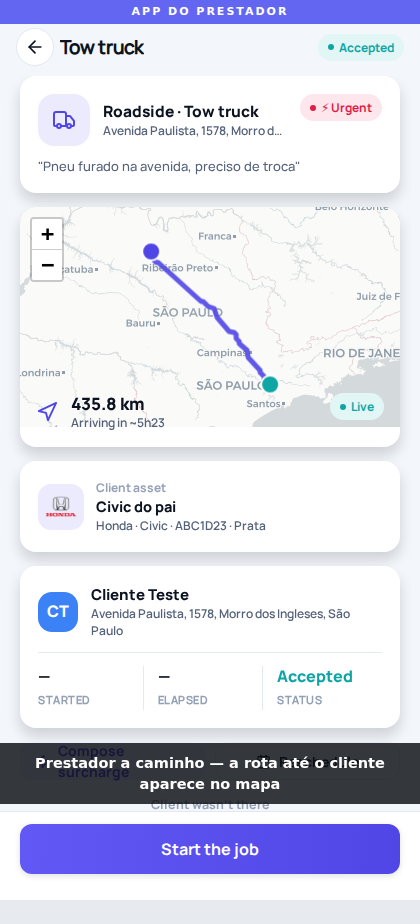

### 20. customer — live tracking with route + start code

`screens/full-demo/20-customer-live-tracking-with-route-start-code.png`

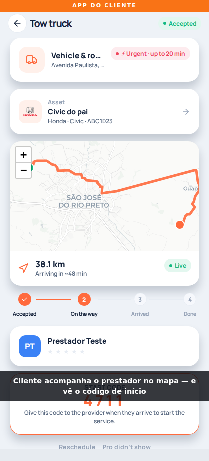

### 21. provider — job started

`screens/full-demo/21-provider-job-started.png`

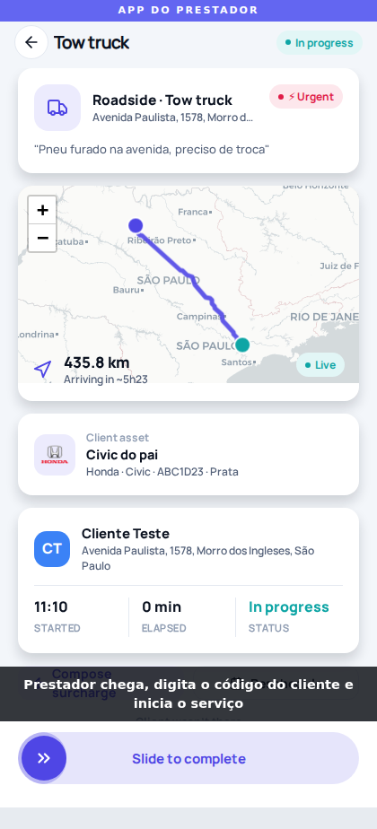

### 22. provider — job completed

`screens/full-demo/22-provider-job-completed.png`

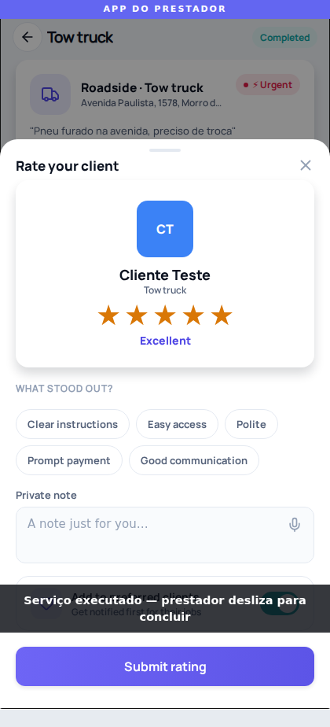

### 23. customer — receipt

`screens/full-demo/23-customer-receipt.png`

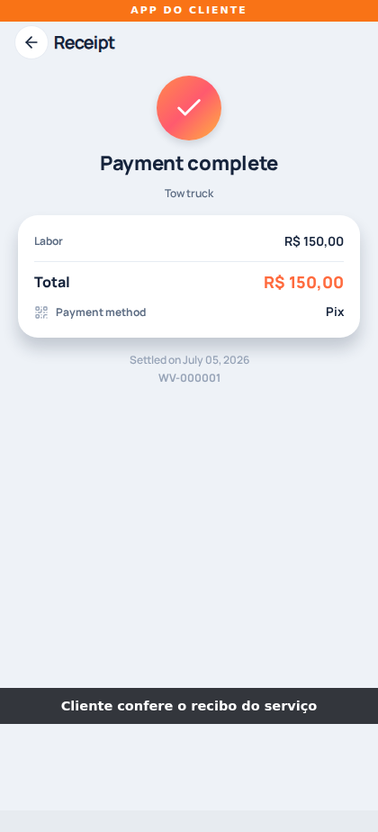

