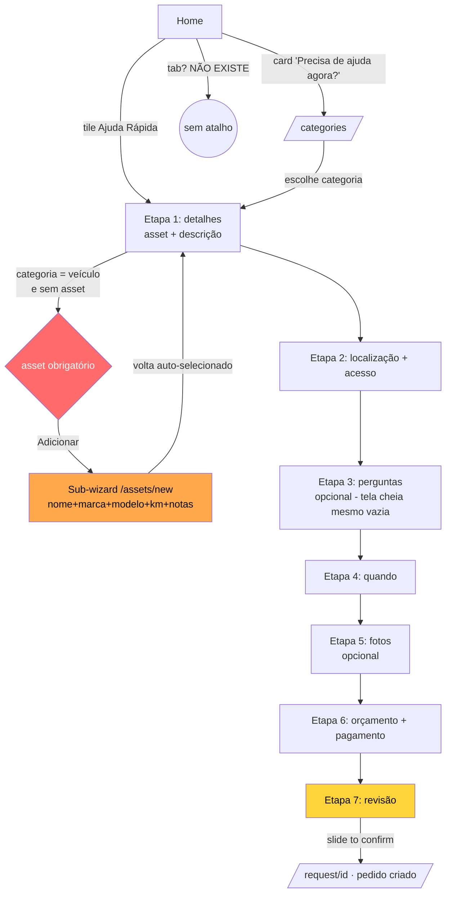
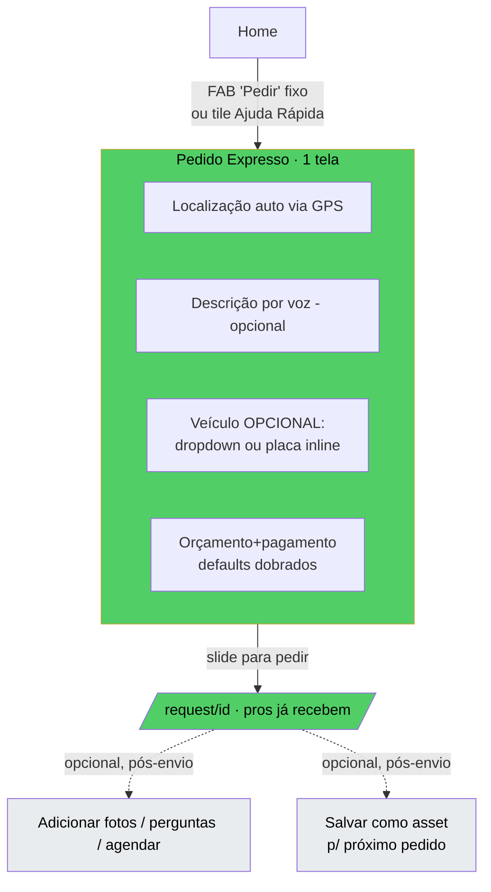

# Auditoria UX — Cluster Home / Descoberta + Criação de Pedido + Assets (App do Cliente)

**Produto:** Chama Fácil · App do Cliente (React Native / Expo Router)
**Escopo:** funil central de conversão — descoberta → criar pedido de serviço; mais o subsistema de "assets" (veículo/imóvel/pet) que alimenta o pedido.
**Data:** 2026-07-20
**Persona-âncora do redesenho:** *"aflito na estrada"* — carro quebrado, à noite, sem bateria no celular, com pressa e estresse alto.

Classificação de severidade: **Crítico** (mata conversão / bloqueia tarefa) · **Alto** · **Médio** · **Baixo**.

---

## 0. Veredito executivo (leia isto primeiro)

O app foi desenhado como um **CRM de patrimônio pessoal** ("assets são o centro de gravidade" — comentário literal em `HomeAssets.tsx:31-35`), não como um app de socorro/serviço sob demanda. Toda a arquitetura assume que **o pedido é sobre uma "coisa" cadastrada**. Isso produz três defeitos estruturais que sabotam a conversão:

1. **Cadastro de asset é pré-requisito de fato para pedir socorro** em categorias de veículo (`new.tsx:212`). Um motorista com carro quebrado que nunca cadastrou o carro é jogado num sub-wizard de cadastro no meio do pedido.
2. **Onboarding do zero abre um modal full-screen de "cadastre seu patrimônio"** (`HomeAssets.tsx:55` → `FirstAssetTutorial`), cujo CTA leva a `/assets/new`, não a pedir ajuda. A primeira experiência de quem instala o app aflito é um tutorial de inventário.
3. **Criar um pedido custa 7 telas fixas + slide-to-confirm** (`new.tsx:38`), sem nenhum caminho expresso para urgência, e **sem CTA "pedir agora" fixo na thumb-zone** em nenhuma tela.

Para a persona da estrada, o app atual é praticamente inutilizável sob estresse. Recomendo **redesenho do funil** (não ajuste incremental) — detalhado na seção 9.

---

## 1. HOME — `apps/customer/app/(tabs)/home.tsx`

### 1.1 Objetivo + papel no funil
Tela de entrada e hub de conversão. Deveria responder em <2s: *"como eu peço ajuda agora?"*. Hoje responde: *"aqui está seu patrimônio, seus pedidos ativos, e — lá embaixo — atalhos"*.

### 1.2 Arquitetura de informação
Ordem vertical real (`home.tsx:133-197`):
1. `HomeAssets` (rail de patrimônio) — **primeiro**
2. Pedidos ativos (máx. 2 cards, `MAX_HOME_CARDS`, :47)
3. "Ajuda rápida" — 4 atalhos de categoria (:161)
4. Card gradiente "Precisa de ajuda agora?" (`home.needHelpTitle`, :182-197)

**Problemas de hierarquia (Alto):**
- A ação de maior intenção comercial (*pedir*) está em **3º e 4º lugar**, abaixo do inventário. Um app de serviço sob demanda coloca a ação primária no topo e fixa.
- O card **"Precisa de ajuda agora?"** — que pelo nome é a CTA de emergência — está no **rodapé do scroll** e ainda por cima **não cria um pedido**: leva a `/categories` (:182), somando um hop. Os atalhos de "Ajuda rápida" logo acima levam **direto** a `/request/new` (:170). Inconsistência: o botão que *soa* mais urgente é o mais lento.
- `HomeAssets` ocupa o espaço nobre mesmo para quem não tem asset e não quer cadastrar nada agora.

**Info agrupável/escondível:** o rail de assets deveria ceder o topo à ação de pedir; assets são contexto, não a tarefa primária da home.

### 1.3 Fluxo
- Caminho mais curto para pedir: **Home → tile "Ajuda rápida" → wizard** (bom, 1 toque até o wizard). Mas depende do slug estar em `QUICK_HELP_SLUGS` (:54) — lista fixa de 4 (`guincho, bateria, encanador, limpeza`). Qualquer outra necessidade = Home → card gradiente → `/categories` → wizard (2 hops antes do wizard).
- **Sem FAB "pedir agora"** persistente. A CTA primária rola para fora da tela.

### 1.4 Heurísticas / Leis
- **Jakob (Alto):** apps de serviço sob demanda (99, iFood, Uber) abrem na ação. Aqui abrem no inventário — quebra de expectativa.
- **Fitts (Alto):** CTA primária não está fixa na thumb-zone; está no meio de um scroll (`home.tsx:182`).
- **Hick (Médio):** boa contenção — só 4 atalhos (:54) em vez do catálogo inteiro. Positivo.
- **Nielsen — Correspondência (Médio):** "Precisa de ajuda agora?" promete imediatismo e entrega uma lista de categorias.

### 1.5 UI / estados
- Skeletons presentes e corretos: `SkeletonList` para pedidos (:139), `SkeletonTiles` para categorias (:163). Bom.
- Card gradiente "Precisa de ajuda agora?" (`home.needHelpTitle`, :182-197): `LinearGradient` com `flex:1` no texto + caixa 46×46 do ícone. **Sem clipping/overflow** aparente — o texto usa flex e o ícone é fixo; textos longos de i18n podem empurrar altura, mas não vazam. OK.
- **Bug menor (Baixo):** `stepOf` (:40-44) retorna 3 tanto para `isActiveStatus` quanto para o `else` (completed/cancelled). Inócuo porque terminais são filtrados por `rankOf` (:68), mas é código morto enganoso.
- **Estado vazio de "pedidos ativos" (Médio):** quando `candidates.length === 0`, a seção some inteira (:159, `: null`). Não há reforço de CTA ali; usuário novo vê rail de assets vazio → pula direto para atalhos. Aceitável, mas perde-se a chance de uma CTA de conversão no espaço mais visível.

### 1.6 Acessibilidade (WCAG 2.2)
- `IconButton` de menu e sino têm `accessibilityLabel` (:119, :124). Bom.
- **Falha (Alto):** os tiles de "Ajuda rápida" (`CatTile`, :168) e o card gradiente (:182) — verificar se `CatTile`/`Pressable` expõem `accessibilityRole="button"`. O `Pressable` do card gradiente (:182) **não tem** role nem label — leitor de tela anuncia nada de útil.
- `AvatarGrad` decorativo sem label — OK se marcado como não-acessível (não verificado).

---

## 2. TABS — `apps/customer/app/(tabs)/_layout.tsx`

### 2.1 Objetivo
Navegação raiz: **Home · Pedidos · Perfil** (3 abas, :33-44).

### 2.2 Análise (Crítico para o funil)
- **Não há aba/ação de "Pedir" / "+".** A criação de pedido — a ação de maior valor do app — **não tem lugar na navegação persistente**. Ela vive enterrada no conteúdo scrollável da Home. Toda tab-bar de app transacional reserva o centro para a ação primária (o "+" central do Instagram, o botão de pedir do iFood).
- Consequência: se o usuário está em Pedidos ou Perfil e quer pedir, precisa voltar à Home e rolar. **Fitts + Jakob violados**.
- Alturas/insets tratados corretamente (`TAB_BAR_H + insets.bottom`, :26-28). Sem problema técnico.

**Recomendação (Crítico):** transformar em 4 itens com um **"+" central elevado** (`Pedir`) que abre o fluxo de pedido, ou um FAB global sobre as abas.

---

## 3. CATEGORIAS — `apps/customer/app/categories.tsx`

### 3.1 Objetivo + papel
Catálogo completo agrupado por tipo (`CATEGORY_TYPE_ORDER`, :35). Segundo hop de descoberta quando o atalho não cobre a necessidade.

### 3.2 Arquitetura / Fluxo
- Grid de cards 31% (3 por linha, :48), agrupado por `SectionLabel`. Limpo.
- Tap → `/request/new?categoryId` (:46). Direto ao wizard — bom.
- **Hick (Médio):** sem busca/filtro. Se o catálogo crescer, rolar seções vira custo. Falta um campo de busca no topo — especialmente porque a persona aflita sabe *o que* precisa ("guincho") mas pode não achar visualmente rápido.

### 3.3 UI / estados
- Skeleton dedicado e caprichado (:21-33). Bom.
- **Sem estado de erro** — se `useCategories` falhar, a tela fica em branco (nem loading nem conteúdo). Faltam empty/error states (Médio).

### 3.4 A11y
- Cards são `Card onPress` sem `accessibilityRole`/label explícito visível aqui (:43-48) — depende do `Card` interno. Verificar.

---

## 4. NOVO PEDIDO — `apps/customer/app/request/new.tsx` ⭐ TELA-CHAVE

### 4.1 Objetivo + papel no funil
**A tela de conversão.** É onde o dinheiro entra. Tudo deveria ser subordinado a: *reduzir o tempo e a fricção até o "slide para pedir"*.

### 4.2 Estrutura atual
Wizard de **7 etapas FIXAS** (`STEP_KEYS`, :38):
`details → location → questions → when → photos → money → review`
`stepKeys = STEP_KEYS` sempre (:116) — **nenhuma etapa é pulada dinamicamente**, mesmo quando opcional/vazia.

### 4.3 Fluxo — contagem de toques (persona da estrada, guincho, carro NÃO cadastrado)

| Etapa | O que exige | Toques mínimos |
|---|---|---|
| Entrar | tile "Guincho" na home | 1 |
| 1 details | **escolher/criar asset** + descrever (≥5 chars, :212) | cria asset = **sub-wizard inteiro** (ver §5.3) + digitar descrição |
| 2 location | tap "usar localização" (GPS) | 1-2 |
| 3 questions | opcional (pode pular) | 1 (Continuar) |
| 4 when | urgente já é default | 1 |
| 5 photos | opcional | 1 (Continuar) |
| 6 money | defaults ok | 1 (Continuar) |
| 7 review | slide-to-confirm | slide |

**Total: ~7 telas + 1 sub-wizard de asset + slide.** Para alguém à noite, com pressa, isso é uma eternidade.

### 4.4 O bloqueio crítico: asset obrigatório
```
new.tsx:212
(stepKey === 'details' && description.trim().length >= 5 && (assetType == null || assetId != null))
```
Para categorias com `asset_type` (guincho, bateria = veículo), **`canContinue` é falso até existir `assetId`**. O botão Continuar fica morto. Se o usuário não tem carro cadastrado, ele **é obrigado a**:
- tocar "Adicionar" (`onAddNew`, :92) → `router.push('/assets/new?pick=1&type=vehicle')`
- passar pelo wizard de asset (nome + marca/modelo + fotos + notas)
- voltar, ter o asset auto-selecionado (`takeCreatedAsset`, :85-90)

**Isto é Crítico.** Pedir um guincho **não deveria exigir cadastrar o veículo como patrimônio**. É a inversão do modelo de socorro: a informação do carro é útil, mas deve ser **opcional e inline** (placa/modelo em 1 campo), nunca um pré-cadastro bloqueante.

Mitigação parcial existente: auto-pick quando há exatamente 1 asset do tipo (:79-82) e o comentário explica bem a intenção. Mas isso só ajuda quem **já** cadastrou. O caso "primeiro pedido, zero assets" — o mais comum e mais urgente — é o pior atendido.

### 4.5 Outras fricções de fluxo
- **Etapas opcionais como etapas plenas (Alto):** `questions` (:382) e `photos` (:428) são opcionais mas consomem uma tela cheia + toque em "Continuar" cada. Deveriam ser dobráveis dentro de outra etapa ou puláveis automaticamente quando vazias. `visibleQuestions.length === 0` já é detectado (:384) mas **mesmo assim renderiza a etapa** com "nenhuma pergunta extra" (:391) — uma tela inteira para dizer "nada aqui".
- **Botão Continuar desabilitado sem explicação (Alto, Nielsen error prevention/help):** `canContinue` (:211-217) só desabilita o botão. O usuário que não digitou 5 chars ou não escolheu asset vê um botão cinza e **não sabe por quê**. Falta mensagem inline ("Descreva o problema para continuar").
- **Slide-to-confirm na 7ª tela (Médio):** gesto deliberado de confirmação é bom contra toque acidental, mas colocá-lo no fim de um funil de 7 telas para um pedido *urgente* é fricção sobre fricção.
- **Positivo:** a etapa `review` é totalmente editável (`SumRow onPress → goTo`, :491-516) — ótimo para "reconhecer em vez de lembrar". A adaptação de localização por asset (property reusa pino/endereço, :99-107, :315-335) é elegante.

### 4.6 Heurísticas / Leis (evidência)
- **Doherty (Alto):** etapa `location` faz `getCurrentCoords` + `reverseGeocode` (:124-135, :139-143) **sem skeleton no card do mapa** — durante a captura o card fica no estado "tap para localizar"; se o GPS/geocode demora, não há feedback de progresso além do texto "locating" (:360). O mapa em si não tem placeholder de carregamento.
- **Miller (Médio):** 7 etapas excede o "chunk" confortável; a barra de progresso (`Wiz`, progress :59-63) ajuda, mas o número cru "ETAPA x/7" (`Wiz.tsx:55`) comunica *"isto é longo"*.
- **Hick (Médio):** etapa `money` apresenta velocímetro + steppers + campo + 3 métodos de pagamento (:454-484) — muita decisão para um default que já funciona.
- **Nielsen — Flexibilidade (Alto):** não há caminho expresso. Um pedido urgente percorre exatamente o mesmo túnel de 7 etapas que um agendamento planejado.

### 4.7 UI / estados
- Upload de foto é "upload-first" e falha **silenciosamente não-fatal** (:160-166) — boa resiliência.
- Erro de submit → `Alert` (:198). Erro de localização → `Alert` (:131). Consistente, mas Alert nativo é abrupto; um toast/inline seria mais suave.
- Toggle `shareNote` (:296-305): `Pressable` embrulha um `Card` com `Toggle` **visual**. O `Toggle` não é um `Switch` real — sem `accessibilityRole="switch"`/`state` (ver §4.8).

### 4.8 Acessibilidade (WCAG 2.2)
- **Crítico:** `BudgetMeter` (velocímetro, `new.tsx:456` / `BudgetMeter.tsx`) é um SVG com `PanResponder` (`BudgetMeter.tsx:84-91`). **Zero semântica de acessibilidade** — sem `accessibilityRole="adjustable"`, sem `accessibilityValue`, sem incremento por teclado/leitor. Usuário de leitor de tela **não consegue definir orçamento**. WCAG 2.2 (4.1.2 Name/Role/Value, 2.1.1 Keyboard). O campo numérico (:152) é uma saída parcial, mas o medidor visual principal é inacessível.
- **Alto:** `AssetSelector` cards (`AssetSelector.tsx:44`) — `Card onPress` sem role/label/`accessibilityState={{selected}}`; a seleção é comunicada só por cor de borda + ícone check (:57).
- **Alto:** `Toggle` de `shareNote` sem role de switch (:303).
- **Médio:** `Segment` (urgência, acesso, pagamento) e chips de `DynamicFields` (`DynamicFields.tsx:63`) comunicam seleção **só por cor** — sem `accessibilityState`. Falha 1.4.1 (uso de cor) + 4.1.2.
- **Médio:** alvos de toque do `SumRow` edit (ícone 15px, :534) e steppers OK (40px). O ícone de remover foto (24px, :437) está abaixo dos 44px recomendados.

---

## 5. LISTA DE PEDIDOS — `apps/customer/app/(tabs)/requests.tsx`

### 5.1 Objetivo + papel
Acompanhamento pós-conversão. Onde o cliente vê propostas e status.

### 5.2 AI / Fluxo
- Ordenação por acionabilidade (`STATUS_PRIORITY`, :12-20) — em progresso primeiro. Boa lógica de produto.
- Filtro via `RequestFilterSheet` (bottom sheet, :114). Chip de filtro ativo + contagem + limpar (:70-82). Bom.
- **Filtragem client-side apenas** (`matches` sobre páginas carregadas, :37-40, comentário :36). Com paginação, o `filteredCount` mente: conta só o que já baixou. Débito conhecido (comentário admite), mas é uma **inconsistência de dados visível ao usuário** (Médio).

### 5.3 UI / estados
- Empty states bem-feitos e distintos: sem-match (filtro) vs vazio-real com CTA "novo pedido" → `/categories` (:84-100). Excelente.
- **Botão de filtro (`:45-67`)** tem `accessibilityRole/Label/State` corretos. Bom exemplo — que deveria ser replicado nos cards de asset.

### 5.4 A11y
- Cabeçalho e filtro acessíveis. `RequestCard` (`RequestCard.tsx:26`) — `Card onPress` sem label agregado; leitor lê fragmentos soltos. Status por `Badge` com `dot` só em InProgress (:56) — cor+texto presente (bom), mas sem role.

---

## 6. ASSETS — `index.tsx`, `new.tsx`, `[id]/index.tsx`, `[id]/edit.tsx`, `[id]/setup.tsx`

### 6.1 Papel no funil
Subsistema de patrimônio. **Deveria ser um acelerador opcional** (pré-preencher pedidos, guardar histórico). Na prática, virou **pedágio** do funil (§4.4) e do onboarding (§7).

### 6.2 `assets/index.tsx` — lista
- `PaginatedList` com filtro por tipo em chips horizontais (:34-43), empty state, footer "Adicionar" (:48-56). Sólido e consistente.
- Positivo: reuso de `assetCaption`/`ICON` (`assetDisplay`) — sem reimplementação.

### 6.3 `assets/new.tsx` — cadastro (sub-wizard)
- Reusa o mesmo chrome `Wiz` do pedido (:184) — **ótima consistência de DS**.
- Etapas adaptam a tipo e entry-point: property = `details/location/area`; outros = `details`; modo picker remove `type` (:79-82). Inteligente.
- **Cards de tipo animados** com reveal de benefícios (:194-258) — bonito, mas é **muito investimento de UX numa etapa que, para a persona da estrada, é puro atrito**. O caso `pick=1&type=vehicle` (vindo do pedido) felizmente já fixa o tipo e pula essa etapa.
- **Problema (Alto):** mesmo no modo picker, `details` ainda pede nickname obrigatório (`canContinue`, :156-160; `nickname.trim().length >= 2`) + oferece marca/modelo + km + notas privadas/pro. Para desbloquear um pedido de guincho, o usuário é forçado a **batizar o carro** ("Meu Gol"). Isso é fricção cerimonial no meio de uma emergência.
- Notas privada vs. compartilhável (:355-376) — bom modelo de privacidade, mas totalmente fora de lugar no fluxo urgente.

### 6.4 `assets/[id]/index.tsx` — detalhe
- Duas abas (`identity`/`history`, :147-150). Timeline unificada de 3 fontes (requests + readings + parts) num único `TimelineEvent` ordenado (:36-89) — **arquitetura de dados exemplar**, com honestidade de paginação (:268-275, "ainda há mais").
- Skeleton dedicado (`SkeletonScreen`, :91) e `NotFoundView` (:93-104). Robusto.
- Densidade alta mas justificada (é a tela de "ficha" do bem).

### 6.5 `assets/[id]/edit.tsx`
- Formulário plano (não-wizard) — apropriado para edição. `Alert` de confirmação para arquivar (:82-90) com estilo destructive — correto.
- **Positivo:** arquivar (soft-delete) em vez de excluir; hint textual (:171). Bom para prevenção de erro.

### 6.6 `assets/[id]/setup.tsx` — setup guiado de cômodos
- Bem-comentado, honesto ("nada fabrica medição", :18-20). Chips de cômodos sugeridos + "medir o primeiro" (AR) ou "Depois" (:98-106).
- Escopo correto (só primeiro imóvel, `guided=1`). Não impacta o funil de veículo. OK.

---

## 7. ONBOARDING DO ZERO — `HomeAssets.tsx` + `FirstAssetTutorial.tsx`

### 7.1 O problema estrutural (Crítico)
`HomeAssets` (:36-96): se `assets.length === 0` → `FirstAssetEmpty` (:55) → abre **modal full-screen** `FirstAssetTutorial` automaticamente na primeira visita (`HomeAssets.tsx:125-146`, `FirstAssetTutorial.tsx:52`).

O CTA final do tutorial (`start`, `FirstAssetTutorial.tsx:41-46`) faz `router.push('/assets/new?guided=1')` — **empurra cadastro de patrimônio como primeira ação do app**, antes de qualquer pedido.

**Para a persona da estrada isto é o pior cenário possível:** instala o app com o carro quebrado, abre, e a primeira coisa é um carrossel de 3 telas sobre "cadastre sua casa/carro/pet, tire fotos, agende manutenção" (`firstAsset.steps.*`). A ação de *pedir socorro* não aparece nesse fluxo. É skipável (:60-65), mas o fardo cognitivo já foi imposto no pior momento.

### 7.2 Recomendação
Inverter: onboarding do zero deve oferecer **"Precisar de ajuda agora"** como ação primária e "cadastrar meu patrimônio" como secundária/adiável.

---

## 8. DESIGN SYSTEM — consistência e duplicação

### 8.1 Bottom sheets reimplementados (Alto)
Não existe um primitivo `BottomSheet` compartilhado. Cada sheet reimplementa: `Modal transparent` + backdrop `rgba(0,0,0,0.45)` + `insets.bottom` manual + "grabber" handle:
- `RequestFilterSheet.tsx:50-57` (backdrop, handle :57, insets :47)
- `AppDrawer.tsx:48-53` (mesmo padrão de Modal + inset manual)
- `RecordKmSheet` (referenciado em `[id]/index.tsx:280`) — mesma família
- `FirstAssetTutorial.tsx:52` (Modal full-screen)

Comentários repetidos em 3 arquivos explicando *o mesmo* gotcha de SafeAreaView/nav bar (`RequestFilterSheet.tsx:42-45`, `AppDrawer.tsx:50-52`, `Wiz.tsx:45-46`) — sintoma claro de padrão que deveria estar num único componente.

### 8.2 Card gradiente CTA duplicado (Médio)
`home.tsx:182-197` ("Precisa de ajuda agora?") e `HomeAssets.tsx:154-174` (`FirstAssetCard`) são **quase idênticos**: `Pressable → LinearGradient(t.grad) → texto flex + caixa 46×46 com ícone`. Deveria ser um `<GradientCTACard title body icon onPress/>` compartilhado.

### 8.3 Ícone de tipo de asset duplicado (Baixo)
`ICON` map de tipo de asset aparece em `assetDisplay` (importado em vários) **mas também redefinido localmente** em `[id]/index.tsx:30` (`const ICON: Record<string, IconName> = { vehicle: 'car', ... }`). Fonte de verdade divergente.

### 8.4 Positivos do DS
- `Wiz` reusado entre pedido e cadastro de asset — consistência forte.
- `PaginatedList`, `EmptyState`, `Skeleton*`, `Badge`, `Segment`, `Chip` bem reaproveitados.
- Tratamento de insets Android correto e consistente (com o custo da duplicação acima).

---

## 9. VEREDITO POR TELA

| Tela | Veredito | Severidade do pior achado |
|---|---|---|
| Home | **Redesenhar** hierarquia (ação primária ao topo/fixa) | Alto |
| Tabs `_layout` | **Redesenhar** (adicionar ação "Pedir") | Crítico |
| Categorias | **Ajustar** (busca + error state) | Médio |
| **Novo pedido** | **Redesenhar** (fluxo expresso + asset opcional) | **Crítico** |
| Lista de pedidos | **Manter** (ajuste: filtro server-side) | Médio |
| Assets (lista/detalhe/edit/setup) | **Manter** (bem construídos) | Baixo |
| Assets `new` (como pedágio) | **Ajustar** (não bloquear pedido) | Crítico |
| Onboarding zero (`FirstAssetTutorial`) | **Redesenhar** (inverter prioridade) | Crítico |
| BudgetMeter (a11y) | **Ajustar** (acessibilidade) | Crítico (WCAG) |

---

## 10. FLUXO IDEAL — persona "aflito na estrada"

**Princípio:** o carro é **contexto opcional**, não pré-requisito. Meta = do abrir-o-app ao pedido enviado em **≤ 4 toques**, com asset como enriquecimento *pós*-pedido.

### 10.1 Mock ASCII — Home redesenhada (ação primária fixa)

```
┌──────────────────────────────────────┐
│ ☰   Olá, Raul            🔔  (avatar)  │
├──────────────────────────────────────┤
│                                        │
│   O que você precisa agora?            │
│  ┌──────────┐ ┌──────────┐            │
│  │ 🪝 Guincho│ │ 🔋Bateria │  ← 1 toque │
│  └──────────┘ └──────────┘   = pedido  │
│  ┌──────────┐ ┌──────────┐            │
│  │ 🔧Encanad.│ │ 🧹Limpeza │            │
│  └──────────┘ └──────────┘            │
│         [  Ver tudo  ]                 │
│                                        │
│  ── Seus pedidos ativos ──             │
│  ┌────────────────────────────────┐   │
│  │ 🪝 Guincho · agora · 2 propostas│   │
│  └────────────────────────────────┘   │
│                                        │
│  ── Seu patrimônio (opcional) ──       │
│  [ carro ] [ casa ] [ + ]              │
│                                        │
├──────────────────────────────────────┤
│  🏠 Início   📋 Pedidos   👤 Perfil    │
│         ╭─────────────╮                │
│         │  ⚡ PEDIR    │  ← FAB fixo    │
│         ╰─────────────╯     thumb-zone │
└──────────────────────────────────────┘
```

### 10.2 Mock ASCII — Pedido expresso (1 tela para urgência)

```
┌──────────────────────────────────────┐
│ ✕  Guincho                    URGENTE │
├──────────────────────────────────────┤
│  📍 Sua localização                    │
│  ┌────────────────────────────────┐   │
│  │  [mapa · pino auto via GPS]  ✓ │   │
│  │  Av. Brasil, 1200 — captado    │   │
│  └────────────────────────────────┘   │
│                                        │
│  O que houve? (opcional)               │
│  ┌────────────────────────────────┐   │
│  │ 🎤 Carro não liga...           │   │
│  └────────────────────────────────┘   │
│                                        │
│  Carro (opcional)  [ Meu Gol ▾ ]       │
│    ou digite a placa: [ ABC1D23 ]      │
│                                        │
│  Orçamento  R$120 (sugerido) · Pix     │
│  [ ajustar ▾ ]        ← dobrado        │
│                                        │
├──────────────────────────────────────┤
│   ▸▸▸  Arraste para pedir socorro  ▸▸▸ │
└──────────────────────────────────────┘
```

Tudo essencial numa tela: localização (auto), descrição por voz (opcional), veículo **opcional** (dropdown se cadastrado, ou placa inline), orçamento/pagamento com defaults dobrados. Perguntas/fotos/agendamento passam a ser **"adicionar detalhes"** opcional *depois* do pedido enviado, enquanto os profissionais já começam a receber.

---

## 11. Mermaid — fluxo de criação ATUAL



## 12. Mermaid — fluxo PROPOSTO



---

## 13. Backlog priorizado

**Crítico**
1. Remover o bloqueio de asset obrigatório no pedido (`new.tsx:212`) → tornar veículo opcional com placa/modelo inline.
2. Inverter onboarding do zero (`HomeAssets.tsx:55` / `FirstAssetTutorial`) → ação primária = pedir, não cadastrar.
3. Adicionar ação "Pedir" persistente na navegação (`_layout.tsx`) — FAB ou aba central.
4. Acessibilizar `BudgetMeter` (role adjustable + accessibilityValue + teclado).
5. Criar caminho expresso de 1-2 telas para urgência (colapsar `questions`/`photos`/`review` em opcional pós-envio).

**Alto**
6. Mover CTA primária ao topo/fixo da Home; unificar o card "Precisa de ajuda agora?" para criar pedido direto (não `/categories`).
7. Pular automaticamente etapas opcionais/vazias no wizard (`questions` quando `visibleQuestions.length===0`, :384).
8. Mensagens inline explicando por que "Continuar" está desabilitado (`new.tsx:211-217`).
9. `accessibilityState={{selected}}` + role em `AssetSelector`, `Segment`, chips de `DynamicFields`, `Toggle` de shareNote.

**Médio**
10. Extrair `<BottomSheet>` e `<GradientCTACard>` compartilhados (fim da duplicação §8.1/8.2).
11. Busca + error state em `/categories`.
12. Skeleton/progresso no card do mapa durante GPS+geocode (`new.tsx` etapa location).
13. Filtro server-side na lista de pedidos (corrigir `filteredCount` enganoso, `requests.tsx:37`).

**Baixo**
14. Unificar `ICON` de tipo de asset (`[id]/index.tsx:30` vs `assetDisplay`).
15. Limpar `stepOf` morto (`home.tsx:40-44`).
16. Aumentar alvo do botão remover-foto para ≥44px (`new.tsx:437`).
```
