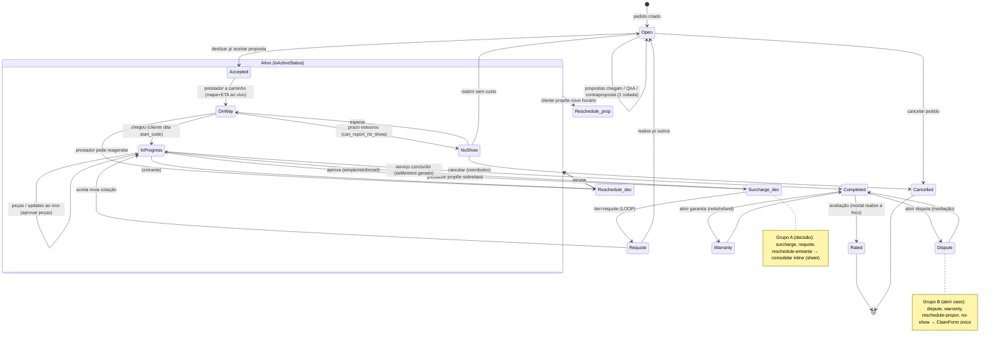

# Auditoria UX — Cluster "Ciclo de vida do pedido" (App do Cliente)

**Produto:** Chama Fácil — marketplace de serviços (React Native / Expo Router)
**Cluster:** Detalhe do pedido + Propostas/QnA + Rastreio + Exceções + Avaliação
**Data:** 2026-07-20
**Autor da auditoria:** Staff UX + QA + PM (revisão adversarial)
**Raiz:** `C:\Users\Raul\services-marketplace\frontend`

---

## 0. Mapa de arquivos e veredito rápido

| Arquivo | Papel | Veredito |
|---|---|---|
| `apps/customer/app/request/[id]/index.tsx` (872 linhas) | Tela-mãe unificada (3 abas + todos os estados) | **Ajustar (sobrecarregada)** |
| `apps/customer/app/request/[id]/proposals.tsx` | Redirect → `[id]` | Manter (legado) |
| `apps/customer/app/request/[id]/track.tsx` | Redirect → `[id]` | Manter (legado) |
| `apps/customer/app/request/[id]/receipt.tsx` | Rota standalone do recibo | **Questionável (duplica inline)** |
| `apps/customer/app/request/[id]/rate.tsx` | Rota standalone de avaliação | **Questionável (duplica modal + inline)** |
| `requote.tsx` / `surcharge.tsx` / `reschedule.tsx` / `no-show.tsx` / `dispute.tsx` / `warranty.tsx` | 6 telas de exceção | **Redesenhar / consolidar** |
| `packages/shared/src/ui/SlideToConfirm.tsx` | Confirmar deslizando | **Crítico (a11y)** |
| `packages/shared/src/ui/Stars.tsx` | Rating | **Alto (a11y)** |
| `QnaThread`, `AnswerList`, `BudgetMeter`, `PaymentSelector`, `MiniMap` | Componentes | Ajustar |
| `src/components/ProposalsList.tsx` | Lista de propostas inline | Ajustar |
| `src/components/ReviewForm.tsx`, `ReceiptView.tsx`, `JobSubject.tsx`, `EventFeed.tsx` | Blocos | Ajustar |

**Observação estrutural de partida:** o cluster tem **11 rotas**, mas **3 são redirects** (`proposals`, `track`) ou **duplicatas** (`receipt`, `rate`) do que já vive inline em `index.tsx`. O trabalho de verdade foi consolidado numa única tela gigante com abas — o que resolveu a fragmentação da navegação, **mas criou uma tela-monólito de 872 linhas** que renderiza propostas, mapa ao vivo, painel de obra, aprovação de peças, sobretaxa, reagendamento, no-show, requote, recibo, resumo e modal de avaliação — tudo condicionalmente. A pergunta central do cluster ("o número de telas faz sentido?") tem duas respostas opostas dependendo de onde se olha: **o caminho feliz está subconsolidado numa tela só; as exceções estão sobrefragmentadas em 6 rotas.**

---

## 1. `index.tsx` — Detalhe do pedido (tela-mãe)

### 1.1 Objetivo + posição no ciclo
Tela única que acompanha o pedido de `Open` (recebendo propostas) até `Completed` (recibo + avaliação). Entra logo após a criação do pedido e é o "cockpit" de todo o ciclo. Três abas: **Acompanhamento** (default), **Solicitação**, **Histórico**.

### 1.2 Arquitetura de informação
**Sobrecarga severa.** A aba "Acompanhamento" muda de conteúdo conforme o status e pode conter, em sequência: card de valor aprovado, lista de propostas, mapa+ETA OU painel de obra, card do prestador, card de start-code, card de aprovação de peças, banner "peças aprovadas", card de sobretaxa pendente, botão de reagendamento entrante, seção "Ações" (reagendar/no-show), aviso de bloqueio temporal, card de requote, recibo, resumo consolidado e par de botões garantia/disputa. São **até ~13 blocos** empilhados numa aba só (`index.tsx:383-571`).

Problemas concretos:
- **Header fixo faz três trabalhos** (`index.tsx:304-319`): BackBar + stepper de 4 passos (`TrackSteps`) + `JobSubject` (asset + fotos). Em telas pequenas o corpo scrollável perde metade da altura útil.
- **Card de contexto redundante** (`index.tsx:329-348`): repete categoria, endereço e urgência que já aparecem no BackBar (título = categoria) e no `JobSubject`. O endereço aparece aqui **e de novo** no `DetailRow` da aba Solicitação (`index.tsx:357`).
- **`start_code` como card gigante permanente** (`index.tsx:441-447`, fonte 30px, letter-spacing 6): fica visível durante todo o estado "ativo", inclusive depois de o serviço já ter começado (`InProgress`), quando o código já cumpriu sua função. Deveria sumir após `started_at`.
- **Aprovação de peças duplicada**: existe o fluxo inline de aprovar peça individual/todas (`index.tsx:448-479`) **e** o painel de obra (`JobProgressPanel`, `index.tsx:692-707`) lista as mesmas peças com ícone de check. O usuário vê a mesma peça em dois cards diferentes na mesma aba.
- **Valor aparece em 3 lugares**: `ApprovedValueCard` (`:387`), dentro do painel de obra (`partsTotal`, `:685`) e no `ReceiptView`. Intencional em parte (combinado vs. total), mas sem hierarquia clara.

**O que deveria virar detalhe/sumir:** start-code → chip pequeno no header que colapsa após início; card de contexto → fundir com BackBar; endereço → uma fonte só.

### 1.3 Fluxo
- **Toques no caminho feliz:** abrir pedido → (aba Acompanhamento já é default) → deslizar para aceitar proposta → aguardar → serviço → recibo/avaliação. **Poucos toques, bom.**
- **Abas em footer fixo** (`index.tsx:286-298`): decisão defensável (alcance do polegar), mas **ícones+labels de 3 abas competindo com o CTA de avaliação empilhado acima** deixam o rodapé alto e pesado no estado `Completed`.
- **Re-prompt de avaliação a cada foco** (`index.tsx:220-222`): reabre o modal toda vez que a tela ganha foco, até ser dismissado uma vez. O `dismissedRatePrompts` é um `Set` em memória que **reseta a cada reload do app** (`index.tsx:144-147`) — ou seja, o cliente que fechou o app volta a ser assediado. Padrão de nag; ver Nielsen §5.
- **Feedback de aceitar proposta:** o `SlideToConfirm` chama `onAccept` sem confirmação secundária nem estado de "aceitando…" visível além do `disabled`. Aceitar uma proposta é **irreversível e financeiramente relevante** — merece pelo menos um toast/splash de sucesso explícito.

### 1.4 Modelo de comunicação (QnA)
Ver §12 (análise dedicada). Aqui: o QnA está embutido **dentro de cada card de proposta** (`ProposalsList` → `ProposalCard` → `QnaThread`), o que acopla "negociar preço" (contraproposta) e "responder pergunta" na mesma superfície. Racional presente no código (`ProposalsList.tsx:67-79`): o back só devolve perguntas de quem já propôs. Efeito colateral: **o cliente não consegue responder uma pergunta sem já ter uma proposta na mão**, travando o pré-lance.

### 1.5 Heurísticas / Leis (com evidência)
- **Nielsen #8 (Estético e minimalista) — Alto:** `index.tsx:383-571`, aba única com 13 blocos condicionais.
- **Nielsen #5 (Prevenção de erro) — Médio:** aceitar proposta via slide não tem confirmação; `SlideToConfirm.onConfirm` dispara direto (`ProposalsList.tsx:382`).
- **Nielsen #1 (Visibilidade do status) — Bom→Médio:** stepper fixo é ótimo; mas `provAvailable === false` mostra "tracking.unavailable" sem explicar o porquê (`index.tsx:420`).
- **Nielsen #6 (Reconhecer > lembrar) — Médio:** o start-code exige o cliente lembrar de ditar; ok, mas concorre com tudo.
- **Lei de Hick — Alto:** estado `Completed` oferece simultaneamente Avaliar, Garantia, Disputa, Recibo, Resumo — 5 caminhos de saída sem priorização.
- **Lei de Miller / carga cognitiva — Alto:** ver 1.2.
- **Lei de Jakob — Médio:** slide-to-accept é padrão de "confirmação destrutiva/irreversível" (tipo deslizar para desligar), aplicado aqui a uma ação positiva; usuários podem hesitar.

### 1.6 UI
- `TrackingMap` (`index.tsx:98-142`): lógica sofisticada de re-centralização com yield ao usuário — bem pensada. Mas o comentário admite que **no web o snap-back não funciona** (stub sem ref, `:124`); aceitável já que o app shippado é nativo.
- Touch targets: os textos-como-botão ("Aprovar" `:469`, "Recusar", "Contraproposta" `:391`) são `Text` com `onPress` e **sem `hitSlop`** — alvos < 44px. Ver a11y §11.
- `ApprovedValueCard` tem hack de `lineHeight` documentado (`:769-772`) para não cortar "R$" — correto, mas sintoma de o sistema de tipografia não suportar override de tamanho com segurança.

### 1.7 Veredito da tela
**AJUSTAR (com urgência de descarga).** A consolidação foi a decisão certa; a execução empilhou tudo. Quebrar a aba "Acompanhamento" em sub-seções progressivas por status e tirar as ações de exceção da rolagem principal (ver §10, redesenho).

---

## 2. `proposals.tsx` e `track.tsx` — Redirects

### 2.1–2.7
Ambos são `<Redirect href={/request/[id]}>` (12 linhas cada). **Manter.** Preservam deep-links/notificações antigas. Zero problema de UX. Único reparo: são dívida de rota que idealmente viraria um rewrite no roteador, não um componente React que monta só para redirecionar (pisca um frame). **Baixo.**

---

## 3. `receipt.tsx` — Recibo standalone

### 3.1 Objetivo
Rota `/request/[id]/receipt` que renderiza `ReceiptView` com header de sucesso. Alvo de notificação `payment_settled` (`notificationLinks.ts:35`).

### 3.2–3.3 IA / Fluxo
`ReceiptView` **já é renderizado inline** no `index.tsx:558` quando `isCompleted`. Logo há **duas superfícies para o mesmo recibo**: a inline (sem header) e a rota (com header). Justificável só pelo deep-link da notificação de pagamento. Para o usuário navegando pelo app, é redundante.

### 3.5 Heurística
- **Nielsen #4 (Consistência) — Baixo:** mesma informação, dois enquadramentos (com/sem header de "Pago!"). Aceitável.

### 3.7 Veredito
**MANTER** como destino de notificação, mas documentar que é intencionalmente um alias. **Baixo.**

---

## 4. `rate.tsx` — Avaliação standalone

### 4.1 Objetivo
Rota que renderiza `ReviewForm`. C21.

### 4.2–4.3 IA / Fluxo
**Terceira superfície da mesma avaliação.** O `ReviewForm` aparece: (a) no **modal** que reabre a cada foco (`index.tsx:577-593`), (b) **inline** via CTA no footer (`index.tsx:288`) que também abre o modal, e (c) nesta **rota dedicada**. Três caminhos para uma review. O modal que se reabre sozinho + a rota dedicada = risco de o usuário avaliar duas vezes ou se confundir sobre "já avaliei?".

### 4.5 Heurística
- **Nielsen #8 / consistência — Médio:** três entradas para uma tarefa é excesso.

### 4.7 Veredito
**AJUSTAR:** manter a rota só como destino de notificação `review_request`; eliminar OU o modal-que-renasce OU o CTA inline (não os dois). **Médio.**

---

## 5–9. As SEIS telas de exceção

Antes de cada uma, o veredito estrutural do cluster:

> **As 6 exceções como telas separadas são fragmentação PARCIALMENTE injustificável.** Elas se dividem em dois grupos com naturezas opostas:
>
> **Grupo A — "Decisão sobre algo que o prestador propôs"** (o cliente aprova/recusa): `surcharge`, `requote`, `reschedule` (entrante). São essencialmente **o mesmo padrão**: card com motivo + fotos, breakdown de valor/data, e um par aprovar/recusar (SlideToConfirm + botão ghost). Já existem como *cards clicáveis inline* no `index.tsx` (`:486-498`) que **apenas empurram para a rota**. Isso é um salto de contexto desnecessário: a decisão poderia acontecer no próprio card (expandir) ou num bottom-sheet, como o `CounterOfferSheet` já faz.
>
> **Grupo B — "Abrir um caso novo com evidências"** (o cliente inicia): `dispute`, `warranty`, `reschedule` (propor), `no-show`. Envolvem formulário + upload de foto + texto. Aqui uma tela dedicada **se justifica** (foco, teclado, upload), mas os quatro compartilham 80% da estrutura (Card de cabeçalho + Field multiline com voz + grid de fotos + Button). Deveriam ser **um componente `ClaimForm` parametrizado**, não quatro telas copiadas.

### 5. `surcharge.tsx` — Sobretaxa (C16)
- **Objetivo:** cliente aprova/recusa acréscimo do prestador durante a obra. Entra em `InProgress`.
- **IA:** boa — motivo + fotos, breakdown (combinado + acréscimos anteriores + este = novo total), badge de tier, aviso de "reforçado", percentual acumulado (`surcharge.tsx:80-119`). Densa mas correta.
- **Fluxo:** `tier === 'requote'` **redireciona para a tela de requote** (`:38`, `:121-124`) → **loop de navegação entre duas telas de exceção** que dizem quase a mesma coisa. Confuso.
- **Feedback:** aprova → `router.back()` silencioso (`:31`), sem confirmação de "acréscimo aprovado". Recusar idem. Inconsistente com requote/no-show que dão `Alert.alert`.
- **Heurística:** Nielsen #1 (feedback ausente no sucesso) — **Médio**; Nielsen #4 (surcharge dá back silencioso, requote dá alert) — **Médio**.
- **Veredito:** **CONSOLIDAR no card inline** (Grupo A). O caso pendente já é mostrado no `index.tsx:486`; a aprovação deveria acontecer ali.

### 6. `requote.tsx` — Recotação (C40)
- **Objetivo:** aceitar nova cotação do prestador atual OU reabrir para outros. Entra em status `Requote`.
- **IA:** boa — motivo, original vs. novo total, hint de reabertura (`requote.tsx:55-81`).
- **Fluxo:** `SlideToConfirm` aceita; botão ghost "reabrir". Dá `Alert` de sucesso e `replace` (`:31-34`) — **correto**, mas inconsistente com surcharge (que é silencioso). O loop surcharge↔requote (§5) é o pior problema.
- **Heurística:** Lei de Jakob — **Baixo**; consistência de feedback — **Médio**.
- **Veredito:** **AJUSTAR** — unificar o padrão de feedback com surcharge; resolver o loop (um só destino para "renegociação de preço").

### 7. `reschedule.tsx` — Reagendamento (C43)
- **Objetivo:** cliente **propõe** novo horário OU **responde** proposta do prestador. Dupla função numa tela (`reschedule.tsx:33`, `:64-82`).
- **IA:** o campo de data é um **`Field` de texto com placeholder `2026-06-25` e regex `^\d{4}-\d{2}-\d{2}$`** (`:36`, `:72`) — **NÃO é um date picker**. Pedir para o usuário digitar ISO-8601 é falha grave de usabilidade e de acessibilidade (erro por formato, sem máscara, sem calendário). **Crítico de usabilidade.**
- **Fluxo:** período em `Segment` (manhã/tarde/noite/madrugada) é bom. Mas validação só no submit com `Alert` genérico (`:37-39`).
- **Não usa footer fixo** (botão "enviar" rola com o conteúdo, `:80`) — inconsistente com surcharge/requote/warranty que fixam o CTA.
- **Heurística:** Nielsen #5 e #9 (prevenção/recuperação de erro) — **Crítico** (campo de data textual); Nielsen #4 (CTA não-fixo) — **Baixo**.
- **Veredito:** **REDESENHAR o input de data** (calendário nativo) e padronizar footer. A resposta-a-proposta (Grupo A) deveria ser inline.

### 8. `no-show.tsx` — Prestador não apareceu (C35)
- **Objetivo:** esperar, reabrir sem custo, ou cancelar. Gated por `can_report_no_show` (servidor decide).
- **IA:** limpa — emoji 🕒, headline, 3 opções (`no-show.tsx:38-47`). Boa.
- **Fluxo:** "esperar" = `router.back()` (`:44`) sem nenhuma mudança de estado — o usuário volta e não vê confirmação de que "esperar" fez algo. Reabrir/cancelar dão `Alert`/replace corretos.
- **Emoji como ícone** (`:39`, fonte 40) em vez do sistema de ícones — inconsistência visual.
- **Heurística:** Nielsen #1 — **Médio** ("esperar" sem feedback).
- **Veredito:** **AJUSTAR.** Estrutura ok; é o exemplo mais próximo de "merece tela própria" do Grupo B por ser decisão de alto risco (cancelamento/reembolso).

### 9. `dispute.tsx` — Disputa (C37/C38) e `warranty.tsx` — Garantia (C41/C42)
- **Objetivo:** abrir caso pós-conclusão com evidências (foto+texto) e acompanhar status (timeline).
- **IA:** quase idênticas. Ambas: card cabeçalho + `Field` multiline com `voiceInput` + grid de fotos (máx 5) + botão submit + timeline/lista de status quando já existe caso. `dispute` usa stepper horizontal de 3 passos; `warranty` usa lista de claims com badge.
- **Duplicação de código:** `dispute.tsx:62-81` e `warranty.tsx:102-159` são o mesmo formulário com rótulos diferentes. `pickPhotos`/grid de thumbnails reimplementado em cada (warranty tem botão de remover foto, dispute **não** — inconsistência: no dispute você não consegue tirar uma foto adicionada por engano, `dispute.tsx:73`).
- **Fluxo:** ambos dão `Alert` de sucesso + `router.back()`. Consistentes entre si.
- **Heurística:** DRY/consistência — **Médio**; Nielsen #3 (controle: remover foto no dispute) — **Médio**.
- **Veredito:** **CONSOLIDAR num `ClaimForm`** compartilhado (Grupo B). Garantia e disputa são o mesmo formulário de "abrir caso" com `type` diferente.

---

## 10. Análise consolidada das exceções + proposta de redesenho

**Diagnóstico:** 6 rotas, ~600 linhas somadas, com 2 padrões repetidos. Além disso **todas** entram por cards/botões que já vivem no `index.tsx`, então o custo real é: *ver o card inline → tocar → nova tela → decidir → voltar*. Para decisões binárias (Grupo A) isso é 1 navegação a mais do que o necessário.

**Proposta:**

1. **Grupo A (aprovar/recusar do prestador) → resolver inline via bottom-sheet.** Reusar o padrão do `CounterOfferSheet` (`ProposalsList.tsx:189`). O card inline de sobretaxa/requote/reschedule-entrante abre um sheet com o breakdown e o SlideToConfirm — sem trocar de rota. Elimina o loop surcharge↔requote (vira um único sheet "Mudança de preço" que internamente sabe o tier).

2. **Grupo B (abrir caso) → um `ClaimForm` parametrizado**, uma rota `/request/[id]/claim?type=dispute|warranty|reschedule|no-show` (ou 2 rotas: `claim` e `reschedule`). Mesmo layout: cabeçalho contextual + input + evidências + submit. `no-show` pode ficar à parte por ser decisão (esperar/reabrir/cancelar), não formulário.

3. **Feedback uniforme:** todo sucesso → `SuccessSplash`/toast; nunca `router.back()` mudo (padroniza surcharge/no-show-esperar com o resto).

Resultado: **de 6 rotas para ~2 rotas + 1 sheet**, com feedback consistente.

---

## 11. Acessibilidade (WCAG 2.2) — achados por componente

### 11.1 `SlideToConfirm.tsx` — **CRÍTICO**
- **Zero props de acessibilidade** (grep: 0 ocorrências de `accessibilityLabel/Role/Value/accessible`). Um `PanResponder` puro num `Animated.View`.
- **Não operável por teclado** (WCAG 2.1.1 A) nem anunciado pelo TalkBack (4.1.2 A). O leitor de tela encontra um texto ("Deslize para aceitar R$…") mas **nenhum controle acionável**.
- **É a única forma de aceitar a "melhor" proposta e de aprovar sobretaxa/requote** (`ProposalsList.tsx:382`, `surcharge.tsx:43`, `requote.tsx:41`). Comentário no código confirma intenção: *"a plain click springs back… so the drag stays the only way to confirm"* (`SlideToConfirm.tsx:68-73`). Ou seja: **um usuário de leitor de tela ou teclado NÃO consegue aceitar proposta nem aprovar cobranças.** Bloqueio funcional total, não só cosmético.
- **WCAG 2.5.7 Dragging Movements (AA, novo na 2.2):** exige alternativa de ponto único a qualquer ação de arrastar. **Falha direta** — não há alternativa por toque simples.
- **Correção:** `accessibilityRole="adjustable"`/"button", `accessibilityActions` (activate), fallback de toque longo/duplo-toque que confirma, e um caminho de botão comum quando o leitor de tela está ativo (`AccessibilityInfo.isScreenReaderEnabled`).

### 11.2 `Stars.tsx` — **ALTO**
- Interativo (`onChange`) usa `Pressable` **sem `accessibilityRole` nem `accessibilityLabel`** (`Stars.tsx:24-27`). O TalkBack anuncia "★" (o glifo) e nada mais. Impossível saber "3 de 5 estrelas".
- Read-only (`View`) idem — a nota média do prestador não é anunciada.
- **WCAG 4.1.2 (Nome, Função, Valor) — falha.**
- **Correção:** `accessibilityRole="adjustable"` no container, `accessibilityLabel="Avaliação"`, `accessibilityValue={{ now: value, min: 1, max: 5 }}`; nas estrelas, `accessibilityLabel="{i} estrelas"`.

### 11.3 Textos-como-botão sem alvo tocável — **ALTO**
Espalhados: "Aprovar" (`index.tsx:469`), "Recusar/Contraproposta/Recusar lance" (`ProposalsList.tsx:387-392`), abas de gorjeta (`ReviewForm.tsx:89`), sort (`ProposalsList.tsx:253`), cancelar pedido (`ProposalsList.tsx:160`). São `Text` com `onPress`, **sem `accessibilityRole="button"` e frequentemente < 44×44px** (WCAG 2.5.8 Target Size AA, 2.2). Fonte 12–13px com padding vertical pequeno.

### 11.4 Contraste
- `t.colors.ink3` (texto terciário) em captions de baixa ênfase (hints, `arrivingIn`, timers) provavelmente < 4.5:1 sobre `surface`. Verificar tokens; captions críticas como "actionsLockedUntil" (`index.tsx:533`) e "unavailable" não devem ficar em ink3.
- `BudgetMeter`: zona vermelha `#ef4444` e o número no campo herdam a cor da zona (`BudgetMeter.tsx:158`) — texto de 30px em vermelho/amber sobre `surface2`; amber `#f5a524` como cor de texto raramente passa 4.5:1. **Médio.**

### 11.5 Alvos e estados de foto
Grids de foto (`dispute`, `warranty`, `JobSubject`, `QnaThread`) usam thumbnails de 38–76px sem `accessibilityLabel` ("foto 1 de 3"). Modal de foto fecha em qualquer toque — ok, mas sem botão de fechar visível/anunciado (`JobSubject.tsx:129`).

---

## 12. Modelo de comunicação: QnA estruturado vs. chat livre

**O que existe:** `QnaThread.tsx` — prestador faz **perguntas** pré-lance; cliente **responde** (texto + foto opcional/obrigatória). Sem chat livre. Contraproposta é um canal **separado** (`CounterOfferSheet`), só de preço+mensagem.

**Avaliação crítica:**
- **A favor (ajuda):** estrutura reduz ambiguidade, cria trilha auditável (útil para disputa/garantia), evita o caos de moderação de chat livre, e o formato "pergunta → resposta com foto" é ótimo para o domínio (o prestador precisa ver o vazamento antes de cotar). Alinha com o `AnswerList` do intake — a mesma gramática pergunta→resposta atravessa o produto.
- **Contra (trava):**
  1. **Assimetria de iniciativa:** só o **prestador** pergunta; o **cliente não tem como perguntar** ("você traz a peça?", "aceita pix?"). Toda a curiosidade do cliente tem que caber no campo de mensagem da contraproposta, o que força uma renegociação de preço só para conversar. **Alto.**
  2. **Acoplamento QnA↔proposta:** perguntas só aparecem de quem já propôs (`ProposalsList.tsx:67-79`), então **não há Q&A verdadeiramente pré-lance** do lado do cliente — ele responde depois que o preço já veio. Inverte a lógica de "pergunto para poder cotar".
  3. **Sem negociação iterativa:** contraproposta é 1 rodada (preço + msg); não há ida-e-volta. Se o prestador contrapropõe de volta, vira `pending_counter_offer` (`ProposalsList.tsx:353`) e o botão de contra some (`:390`) — o cliente só pode aceitar ou recusar, não recontrapropor. **Médio.**
  4. **Foto obrigatória sem preview de qualidade:** `image_required` bloqueia envio sem foto (`QnaThread.tsx:143`) mas não valida nada além de existir.

**Veredito:** o QnA estruturado é a decisão **certa** para confiança/auditoria, mas está **subdimensionado**: falta o canal simétrico (cliente pergunta) e negociação multi-rodada. Hoje ele *organiza* mas também *limita* a negociação cliente↔prestador. Recomendo: permitir pergunta do cliente (mesmo componente, papel invertido) e ao menos 2ª rodada de contraproposta.

---

## 13. Achados por severidade

### CRÍTICO
1. **`SlideToConfirm` inacessível** (teclado/TalkBack, WCAG 2.1.1/2.5.7/4.1.2) e é o **único** meio de aceitar proposta e aprovar cobranças — bloqueio funcional para usuários de leitor de tela. `SlideToConfirm.tsx` (todo o arquivo); usos em `ProposalsList.tsx:382`, `surcharge.tsx:43`, `requote.tsx:41`.
2. **Campo de data como texto ISO** no reagendamento — `reschedule.tsx:36,72`. Erro por formato garantido, sem calendário, inacessível.

### ALTO
3. **Sobrecarga da aba Acompanhamento** — até 13 blocos condicionais numa aba. `index.tsx:383-571`.
4. **`Stars` interativo/estático sem nome/valor** (WCAG 4.1.2) — `Stars.tsx:24-31`.
5. **QnA assimétrico** — cliente não pode perguntar; QnA só existe pós-proposta. `ProposalsList.tsx:67-79`.
6. **Textos-como-botão sem role/target-size** — espalhado (§11.3).
7. **Aceitar proposta sem confirmação nem feedback de sucesso explícito** — ação irreversível/financeira. `ProposalsList.tsx:382`.

### MÉDIO
8. Loop de navegação surcharge↔requote — `surcharge.tsx:38,121`.
9. Feedback de sucesso inconsistente (surcharge/no-show-"esperar" mudos vs. requote/dispute com Alert) — §5, §8.
10. Três superfícies para avaliar (modal renascente + inline + rota) — `index.tsx:577`, `rate.tsx`.
11. Duplicação dispute/warranty (+ dispute não deixa remover foto) — `dispute.tsx:73` vs `warranty.tsx:131`.
12. Duplicação de exibição de peças/valor na mesma aba — `index.tsx:448` vs `:692`.
13. Contraste de ink3/amber em textos críticos — §11.4.
14. Modal de avaliação renasce a foco e reseta a cada reload (nag) — `index.tsx:144,220`.
15. Contraproposta é rodada única, sem recontra — `ProposalsList.tsx:390`.
16. **Sem confirmação de conclusão pelo cliente:** existe start-code para *iniciar*, mas o cliente **nunca confirma que o serviço terminou / libera pagamento** — a liquidação (`settlement`) aparece pronta e o cliente só vê o recibo. Assimetria de controle relevante num marketplace. `index.tsx:558`, `ReceiptView.tsx`.

### BAIXO
17. Redirects montam um frame React (`proposals.tsx`, `track.tsx`).
18. Emoji como ícone no no-show — `no-show.tsx:39`.
19. `receipt.tsx` como alias intencional — documentar.
20. CTA não-fixo no reschedule vs. fixo nos demais.

---

## 14. Diagrama do ciclo de vida (Mermaid)



---

## 15. Mock ASCII — redesenho proposto do Detalhe

**Antes (hoje):** header triplo + aba com 13 blocos + footer alto.

**Depois — aba Acompanhamento enxuta, exceções em sheet:**

```
┌─────────────────────────────────────────┐
│ ‹  Elétrica · Tomada          [● Ao vivo]│  header: back + status
│  ●──────●──────○──────○                  │  stepper (colapsa após concluir)
│  [🚗 Gol · ABC1D23]        [📷📷 +2]      │  JobSubject (some se vazio)
├─────────────────────────────────────────┤
│  ┌───── valor combinado ─────┐           │
│  │        R$ 240,00          │           │  1 número, 1 fonte
│  │   total atual · R$ 300 ⚡ │           │
│  └───────────────────────────┘           │
│                                          │
│  ╔═ MUDANÇA DE PREÇO (1) ═══════════╗    │  card Grupo A → abre SHEET
│  ║ ⚡ +R$ 60  "troca de disjuntor"  ║    │  (não navega p/ outra rota)
│  ║ [ Ver e decidir ▸ ]              ║    │
│  ╚══════════════════════════════════╝    │
│                                          │
│  ┌── 🗺  mapa ao vivo ───────────────┐   │  some quando InProgress
│  │        (prestador → você)         │   │
│  │   2,3 km · chega em ~8 min        │   │
│  └───────────────────────────────────┘   │
│                                          │
│  ⚠ Ações desbloqueiam às 14:30           │  timer, não botões mortos
├─────────────────────────────────────────┤
│  [ Acompanhar ] [ Solicitação ] [ Hist ] │  footer: só as abas
└─────────────────────────────────────────┘

  Sheet de decisão (Grupo A, reusa CounterOfferSheet):
  ┌───────────────────────────────────────┐
  │            ▁▁▁                         │
  │  Sobretaxa proposta          [reforç.]│
  │  "troca de disjuntor queimado"  📷📷   │
  │  combinado      R$ 240,00             │
  │  + esta         R$  60,00             │
  │  ─────────────────────────            │
  │  novo total     R$ 300,00   (+25%)    │
  │                                       │
  │  ⟶⟶⟶ Aprovar R$ 300,00 ⟶⟶⟶  (+botão) │  slide COM alternativa
  │            Recusar                    │  de toque p/ a11y
  └───────────────────────────────────────┘
```

---

## 16. Recomendações priorizadas (o que fazer primeiro)

1. **[CRÍTICO] Tornar `SlideToConfirm` acessível** + fornecer botão-alternativa quando leitor de tela ativo. Desbloqueia aceitar proposta/aprovar cobrança para todos.
2. **[CRÍTICO] Trocar o campo de data do reschedule por date picker nativo.**
3. **[ALTO] Rotular `Stars`** (role adjustable + accessibilityValue).
4. **[ALTO] Descarregar a aba Acompanhamento**: sub-seções por status; start-code colapsa após início; matar duplicação peças/valor.
5. **[ALTO] Consolidar exceções**: Grupo A → sheets inline (resolve loop surcharge↔requote); Grupo B → `ClaimForm` único.
6. **[ALTO] Confirmação + feedback de sucesso ao aceitar proposta e em todas as decisões** (uniformizar; nada de `router.back()` mudo).
7. **[MÉDIO] QnA simétrico** (cliente pergunta) + 2ª rodada de contraproposta.
8. **[MÉDIO] Uma superfície de avaliação** (rota só p/ notificação; matar o modal renascente OU o CTA inline).
9. **[MÉDIO] Revisitar ausência de confirmação de conclusão pelo cliente** — decisão de produto sobre controle/escrow.
10. **[MÉDIO] Auditar contraste** ink3/amber em textos informativos críticos.
```
