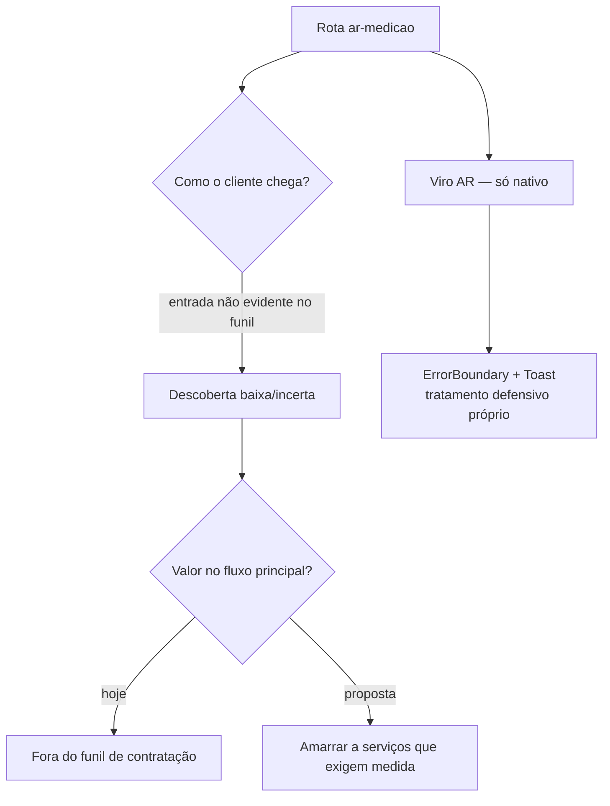

# Medição por AR (medicao / ar-medicao, Viro)

> **Escopo secundário.** Feature experimental, fora do fluxo principal de contratação. Coberta por leitura de código (é só-nativa: AR/Viro não renderiza no device web nem foi exercitada no walkthrough dinâmico). Análise deliberadamente curta e focada em descoberta, valor e risco de distração do funil.

## Visão geral (objetivo; personas)

**Objetivo.** `apps/customer/app/ar-medicao.tsx` oferece medição por realidade aumentada (biblioteca Viro) — presumivelmente para o cliente medir um ambiente/objeto e enriquecer o pedido com dimensões. É a única tela do cluster com `ErrorBoundary`/`Toast` próprios (`cluster-design-system-global.md §5.3`), o que sugere código mais defensivo justamente por ser instável/experimental.

**Personas.**
- **Cliente que precisa de dimensões** (ex.: metragem para um serviço). Nicho.
- **Curioso**: abre por novidade, sem intenção de contratar — risco de virar distração.

## Fluxos (texto + fluxograma Mermaid válido)

A leitura de código não revelou uma entrada clara a partir do funil de criação de pedido (o wizard de 7 etapas não a invoca no caminho feliz observado). A feature parece existir como rota isolada.



## Problemas encontrados (por severidade; evidência)

### Médio
- **Descoberta e amarração ao funil incertas.** Não há evidência de que a medição por AR seja oferecida no momento em que faria diferença (durante a criação de um pedido que precise de medidas). Como rota solta, corre o risco de baixa descoberta e de ser **distração do funil** — esforço de engenharia (Viro, AR nativo) para um caminho que não converte pedido.

### Baixo
- **Feature experimental/instável.** O tratamento defensivo próprio (ErrorBoundary/Toast que o resto do app não tem) indica que o AR falha o suficiente para justificar código de contenção. Expor uma feature frágil no caminho principal arriscaria a percepção de qualidade do app.

## Melhorias

| Problema | Impacto | Solução | Justificativa | Esforço | Prioridade |
|---|---|---|---|---|---|
| AR solta, sem amarração ao funil | Baixa descoberta; distração do funil | Esconder atrás de contexto: só surgir em categorias/serviços que exijam medida (etapa dinâmica do wizard) | Traz valor onde importa; protege o funil | M | Médio |
| Feature experimental exposta | Risco à percepção de qualidade | Marcar como beta/opcional; não colocar no caminho crítico | Contém risco de instabilidade nativa | P | Baixo |

**Mock ASCII — AR como etapa condicional de serviço:**

```
Wizard de criação (só quando a categoria exige medida)
┌─────────────────────────────────────────┐
│  ETAPA 4/7 · Medidas                     │
│  Este serviço precisa das dimensões.     │
│  ┌───────────────────────────────────┐   │
│  │  📏  Medir com a câmera (beta)    │   │  entra em contexto,
│  │      ou digitar manualmente       │   │  com fallback manual
│  └───────────────────────────────────┘   │
│  [ Pular ]                    [Continuar] │
└─────────────────────────────────────────┘
```

## UI
Não avaliada em runtime (só-nativa, não renderizada nesta sessão). O código carrega `ErrorBoundary`/`Toast` próprios — bom sinal de contenção, mas fora do sistema padrão do app.

## UX
O maior risco de UX é de **posicionamento**, não de tela: uma boa feature no lugar errado do fluxo não converte e ainda distrai. Amarrá-la a serviços que exigem medida a torna útil; deixá-la solta a torna um beco lateral.

## Design System
Diverge do resto ao trazer seu próprio ErrorBoundary/Toast (que o kit não oferece globalmente). Quando o DS ganhar Toast/ErrorBoundary compartilhados (ver relatório de design system, C5), esta tela deve migrar para eles.

## Performance
AR/Viro é pesado (câmera + render 3D nativo). Manter fora do caminho crítico evita custo em dispositivos fracos e reduz superfície de crash no funil principal.

## Acessibilidade
AR por câmera é intrinsecamente difícil de acessibilizar (depende de visão/movimento). Um **fallback de entrada manual de medidas** é obrigatório para não excluir usuários — reforça a recomendação de manter a AR como opção, nunca como único caminho.

## Quick Wins
- Marcar explicitamente como beta na UI. [P]
- Garantir fallback manual de medidas onde a AR for oferecida. [P]
- Não linká-la no caminho feliz até haver amarração de valor. [P]

## Score
- UX: 5/10
- UI: n/a (não renderizada; estimada 6/10)
- Performance: 5/10
- Acessibilidade: 3/10
- Consistência: 5/10

**Nota final: 4,8/10 (escopo secundário)** — Engenharia interessante em busca de um lugar no produto: hoje é uma rota experimental solta que arrisca distrair o funil; o valor aparece se for amarrada como etapa de serviços que exigem medida, sempre com fallback manual.
