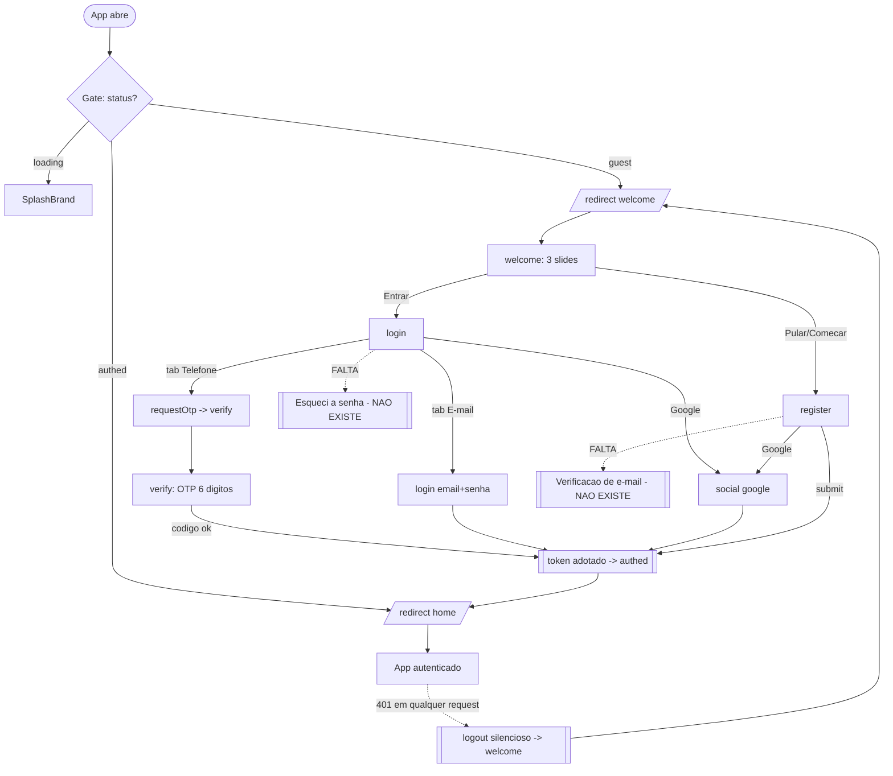

# Autenticação

## Visão geral (objetivo; personas envolvidas)

Módulo responsável por levar um visitante a uma sessão autenticada do app **Chama Fácil (Customer)**. Cobre as telas `welcome` (onboarding de 3 slides), `login` (telefone/OTP ou e-mail/senha), `register`, `verify` (OTP de 6 dígitos), o botão **Google** e toda a camada de auth (`AuthProvider`, `client`, `useGoogleSignIn`, componentes compartilhados em `packages/shared/src/ui/auth`).

Personas envolvidas:
- **"Aflito na estrada"** (carro quebrado, com pressa): precisa entrar/cadastrar em segundos; qualquer fricção de login atrasa o pedido de guincho.
- **Cliente recorrente**: espera autofill do gerenciador de senha e recuperação de senha quando esquece.
- **Persona involuntária de risco**: usuário comum que esbarra no toggle DEV/PROD e passa a falar com o backend errado.

O veredito do cluster é que a camada funciona no caminho feliz, mas carrega **6 achados Críticos** — a maioria de 1 a 3 linhas de código — que somam vazamento de infraestrutura, becos sem saída e falhas de WCAG generalizadas.

## Fluxos (texto + fluxograma Mermaid)

O gate em `app/_layout.tsx:30-93` decide entre `loading` (SplashBrand), `guest` (redireciona para `(auth)/welcome`) e `authed` (redireciona para `(tabs)/home`). O redirect é feito em `useEffect` (`_layout.tsx:76-82`), o que pode causar flash de 1 frame da tela "errada". Telas de POC (`medicao`, `ar-medicao`) são **exempt** e acessíveis sem auth (`_layout.tsx:79`) — débito conhecido, superfície de risco em produção.

Dentro da zona `(auth)`: welcome empurra para register/login; login ramifica em OTP (telefone → verify) ou e-mail/senha; register autentica direto (sem verificação de e-mail); Google faz `social('google', token)`. Qualquer **401** em qualquer request derruba a sessão globalmente e volta para welcome (`client.ts:165` → `AuthProvider.tsx:50-54`), sem refresh token e sem aviso.



## Problemas encontrados

### Crítico

- **Toggle DEV/PROD exposto pré-login em produção.** O `EnvSwitch` é montado em telas que o usuário final vê (`welcome.tsx:159`, `login.tsx:54`), sem gate `__DEV__`. Um toque acidental repontaria o app para o backend de desenvolvimento — dados/erros errados e "por que não recebo o código?". Evidência: `EnvSwitch.tsx`; `welcome.tsx:159`; `login.tsx:54`.
- **Não existe "Esqueci minha senha".** Nenhum link, tela ou endpoint de reset. Quem loga por e-mail/senha e esquece fica preso — beco sem saída total. Evidência: `login.tsx` (ausência).
- **Vazamento de infraestrutura no erro de login.** A mensagem de erro imprime `API: <host do backend>` para o usuário final, expondo o host de produção. Evidência: `login.tsx:82-83`.
- **Placeholder-como-label + contraste reprovado.** Os campos não têm label persistente (falha WCAG 3.3.2) e o placeholder usa `ink3` (~2.6:1 — o próprio `Text.tsx:25` admite reprovar AA), falhando 1.4.3. Ao digitar, o "rótulo" some. Evidência: `AuthField.tsx:35`; `Text.tsx:25`.
- **Ausência de autofill / textContentType.** Nenhum campo passa `autoComplete`/`textContentType` (e-mail, senha, nome, telefone). Gerenciadores de senha não preenchem — fricção enorme no login e cadastro, justamente para a persona apressada. Evidência: `login.tsx:75-76`; `register.tsx:47-50`. (Exceção positiva: o OTP em `verify` usa `autoComplete="sms-otp"` + `textContentType="oneTimeCode"`.)

### Alto

- **Links de ação sem role de botão e com contraste baixo.** "Entrar", "Criar conta", "Reenviar" são `<Text onPress>` sem `accessibilityRole="button"` (falha 4.1.2) e usam `accent` (#ff6a3d) sobre branco (~2.9:1 — falha 1.4.3); alvo efetivo < 24×24px (falha 2.5.8). Evidência: `welcome.tsx:189`; `login.tsx:96`; `register.tsx:62`; `verify.tsx:78,84`.
- **401 → logout global sem refresh.** Qualquer 401 transitório mata a sessão e joga para welcome, sem refresh token e sem aviso; o usuário "cai" sem entender. Evidência: `client.ts:165`; `AuthProvider.tsx:50-54`.
- **Termos/Privacidade não clicáveis no cadastro.** O texto "concorda com os Termos e a Política de Privacidade" é texto puro, sem link — problema legal + WCAG. Evidência: `register.tsx:60`.
- **Cenas ilustradas do onboarding não ocultas do leitor de tela.** VoiceOver/TalkBack lê "R$ 95", "Melhor opção", "João S. 4.7" fora de contexto (falha 1.1.1/1.3.1). Evidência: `welcome.tsx:52-132`.

### Médio

- **"Pular" leva a register + `<Text>` vazio clicável.** No último slide, `last ? '' : skip` renderiza um `<Text>` vazio com `onPress` e `flex:1` — meia largura vira alvo invisível que navega para register. Semanticamente, "pular" deveria ir ao conteúdo, não a um formulário. Evidência: `welcome.tsx:179-184`.
- **OtpInput sem `accessibilityLabel` e sem estado de erro.** O input real é escondido (`opacity:0`, 1×1px); o leitor encontra um Pressable sem nome + 6 Views de texto (1.3.1/4.1.2); borda das caixas não muda no erro. Evidência: `OtpInput.tsx:47-57`.
- **GoogleButton sem role/estado; botão aparece mesmo indisponível.** `Pressable` sem `accessibilityRole="button"` nem `accessibilityState`; e o botão é exibido mesmo sem `webClientId`, levando a um beco de erro `auth.googleUnavailable`. Evidência: `GoogleButton.tsx:11-15`; `useGoogleSignIn.ts:50-52`.
- **Erros de campo não anunciados** (sem `accessibilityLiveRegion`) — 3.3.1/4.1.3. Evidência: `AuthField.tsx:42`.
- **Telefone sem máscara/validação; `'55'` hardcoded** aceita qualquer entrada. Evidência: `login.tsx:31,72`; `register.tsx:49`.
- **Sem toggle mostrar senha; política mínima de 6 caracteres** (fraca, sem confirmar senha). Evidência: `login.tsx:76`; `register.tsx:50`.
- **Reenvio de OTP sem feedback** — `resend()` só reseta o timer, sem toast "código reenviado". Evidência: `verify.tsx:45-55`.
- **`slides[i]` sem guarda** — crash se a tradução vier parcial (o `FirstAssetTutorial` filtra chaves faltando; a welcome não). Evidência: `welcome.tsx:176`.
- **Sem `KeyboardAvoidingView` no login** (`scroll={false}`) — em telas pequenas o teclado cobre botão/Google. Evidência: `login.tsx:51,93`.
- **Assimetria register(só-email) ↔ login OTP** — quem se cadastra só com e-mail não consegue logar por telefone; nada avisa. Evidência: `register.tsx:24`; `login.tsx:30-33`.

### Baixo

- Números mágicos (fontSize/spacing) fora de tokens — pervasivo em `welcome/login/register`.
- Chaves de i18n mortas (labels de campo nunca renderizados, `welcome.createAccount`) — `pt-BR.json:98,107,109,132-139`.
- Default de `mode` diverge dev/prod (`login.tsx:17`).
- `DividerOr`/`BrandMark` sem tratamento de a11y decorativo.

## Melhorias

| Problema | Impacto | Solução proposta | Justificativa | Esforço | Prioridade |
|----------|---------|------------------|---------------|---------|-----------|
| EnvSwitch DEV/PROD visível | Repontar app p/ backend errado; suporte insano | Envolver em `if (!__DEV__) return null;` (ou gesto oculto de 7 toques) | Elimina risco de infra com 1 linha | P | Crítico |
| Vaza host no erro de login | Exposição de infra ao usuário | Remover `API: currentHost()` da mensagem | 1 linha; nenhum benefício ao usuário | P | Crítico |
| Sem "Esqueci a senha" | Beco sem saída p/ quem usa senha | Link abaixo do campo + tela de reset + endpoint | Recuperação de erro é requisito básico (Nielsen #9) | M | Crítico |
| Placeholder-como-label + ink3 | Falha 1.4.3/3.3.2; rótulo some ao digitar | Label persistente acima do campo; placeholder ≥4.5:1 | Refactor central do `AuthField` conserta login+register | M | Crítico |
| Sem autofill | Fricção alta; persona apressada abandona | Props obrigatórias `autoComplete`/`textContentType` no `AuthField` | Gerenciador de senha preenche em 1 toque | P | Crítico |
| Links `<Text onPress>` | Falha 4.1.2/1.4.3/2.5.8 | Trocar por `Button`/`Pressable role=button`, alvo ≥44dp, contraste ≥4.5:1 | Semântica + toque acessíveis | M | Alto |
| 401 → logout global | Usuário "cai" sem explicação | Refresh token + soft-retry; aviso antes de deslogar | Sessão não pode morrer em 401 transitório | G | Alto |
| Termos não clicáveis | Risco legal + WCAG | Tornar Termos/Privacidade links reais (`role=link`) | Consentimento exige acesso ao texto | P | Alto |
| Cenas não ocultas do TalkBack | Ruído fora de contexto (1.1.1) | `importantForAccessibility="no-hide-descendants"` + 1 label na ilustração | Leitor de tela previsível | P | Alto |

Mock ASCII do login corrigido:

```
+-------------------------------+
| Chama Facil                   |   (sem EnvSwitch)
| Bem-vindo de volta            |
| [ Telefone | E-mail ]         |
| E-mail                        |  <- label persistente
| voce@email.com                |  <- autoComplete=email
| Senha                    (o)  |  <- toggle mostrar senha
| ........................      |
|                Esqueci a senha|  <- NOVO, role=button
| [  Continuar             ->]  |
| --------- ou ---------        |
| [ G  Continuar com Google  ]  |  <- oculto se nao configurado
|        Novo aqui? Criar conta |  <- role=button, >=44dp
+-------------------------------+
```

## UI

Login, register e verify usam o Design System corretamente (Screen, AuthField, Button, Segment, DividerOr, GoogleButton). As exceções são o `EnvSwitch` (não deveria existir aqui) e os links inline manuais. A `welcome`, ao contrário, reimplementa todo o "chrome" à mão (não usa `<Screen>`, recalcula insets manualmente — `welcome.tsx:166-168`) e está cheia de números mágicos (fontSize 11.5/25/14.5/13.5, `marginTop:-28`, dots 22×7). Falta toggle de mostrar senha e máscara de telefone em todos os formulários.

## UX

- **Recuperação de erro ausente** (Nielsen #9): sem reset de senha; erro genérico acompanhado de detalhe técnico.
- **Prevenção de erro fraca** (Nielsen #5): telefone sem validação client-side.
- **Redundância de saídas na welcome**: três caminhos ("Pular", "Começar", "Entrar") competem no rodapé (Hick) e dois deles levam ao mesmo register.
- **Assimetria register↔login** cria um beco silencioso para quem se cadastra só com e-mail.
- **Sem autofocus** no primeiro campo — sempre 1 toque a mais.
- Positivo: auto-submit do OTP ao completar 6 dígitos (Doherty); mensagens de erro do `AuthProvider` em pt-BR bem escritas (`:62,86`).

## Design System

O `AuthField` é o componente mais crítico do cluster: corrigir a11y (label, `accessibilityLabel`, `accessibilityLiveRegion`, props de autofill obrigatórias, toggle de senha) conserta login e register de uma só vez. `GoogleButton` precisa de role/estado. `EnvSwitch` deve ser gated. A welcome deveria adotar `<Screen>` em vez de recalcular safe-area à mão. Componentes locais da welcome (`TMini`, `CatIc`, `BidMini`) duplicam padrões já presentes em `primitives.tsx`.

## Performance

Sem gargalos de renderização observados no cluster de auth (telas estáticas ou leves). O único ponto é o **flash de 1 frame** no gate (`_layout.tsx:76-82`), que renderiza a tela "errada" antes do redirect — perceptível mas não crítico. Não há listas pesadas nem imagens grandes nas telas de auth.

## Acessibilidade

Área mais fraca do cluster. Falhas WCAG 2.2 confirmadas: **1.4.3** (contraste de placeholder `ink3` e de links `accent`), **3.3.2** (sem labels persistentes), **3.3.1/4.1.3** (erros não anunciados), **4.1.2** (`<Text onPress>` e GoogleButton sem role de botão; OTP sem nome), **2.5.8** (alvos de link < 24px), **1.1.1/1.3.1** (cenas ilustradas expostas ao leitor). Único ponto positivo: OTP com `autoComplete="sms-otp"`.

## Quick Wins

1. Gate do `EnvSwitch` em `__DEV__` (1 linha; elimina 1 Crítico).
2. Remover `API: host` do erro de login (1 linha; elimina 1 Crítico).
3. Adicionar `accessibilityRole="button"` aos links e ao GoogleButton (semântica).
4. Ocultar cenas ilustradas do leitor de tela (`welcome.tsx:52-132`).
5. Adicionar guarda em `slides[i]` para evitar crash com i18n parcial.
6. Ocultar o botão Google quando `!configuredWebClientId`.

## Score

| Dimensão | Nota (0-10) |
|----------|-------------|
| UX | 4 |
| UI | 6 |
| Performance | 8 |
| Acessibilidade | 2 |
| Consistência | 6 |

**Nota final: 4,5/10** — Veredito: a autenticação funciona no caminho feliz, mas expõe infraestrutura, tem becos sem saída (reset de senha) e falha acessibilidade de forma sistemática — a maioria corrigível com poucas linhas.
