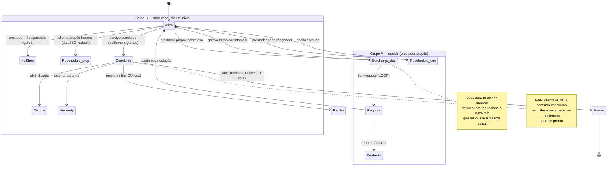

# Exceções do Pedido (Disputa, Garantia, Recotação, Sobretaxa, Reagendamento, No-show) + Recibo + Avaliação

## Visão geral (objetivo; personas)

**Objetivo do módulo.** Cobrir tudo que sai do caminho feliz depois que o pedido está ativo ou concluído: o prestador propõe um acréscimo (sobretaxa) ou uma nova cotação (recotação), pede ou responde reagendamento, não aparece (no-show); e, no pós-conclusão, o cliente abre disputa ou aciona garantia, vê o recibo e avalia o serviço. São **seis telas de exceção** (`requote.tsx`, `surcharge.tsx`, `reschedule.tsx`, `no-show.tsx`, `dispute.tsx`, `warranty.tsx`) mais duas rotas standalone que duplicam conteúdo já inline (`receipt.tsx`, `rate.tsx`).

**Personas.**
- **Cliente contrariado**: o valor subiu (sobretaxa/requote) ou o prestador não veio; quer decidir rápido e com clareza do impacto financeiro.
- **Cliente insatisfeito pós-serviço**: quer abrir disputa ou garantia com evidências (foto + texto).
- **Cliente que só quer o recibo / avaliar**: chegou por deep-link de notificação.

**Veredito estrutural.** As 6 exceções como telas separadas são fragmentação **parcialmente injustificável**. Elas se dividem em dois grupos de natureza oposta:

- **Grupo A — "Decidir sobre algo que o prestador propôs"** (`surcharge`, `requote`, `reschedule` entrante): mesmo padrão — card com motivo + fotos, breakdown de valor/data, par aprovar/recusar (SlideToConfirm + botão ghost). Já existem como cards clicáveis inline no `index.tsx:486-498` que **apenas empurram para a rota** — um salto de contexto desnecessário.
- **Grupo B — "Abrir um caso novo com evidências"** (`dispute`, `warranty`, `reschedule` propor, `no-show`): formulário + upload de foto + texto. Compartilham ~80% da estrutura (cabeçalho + Field multiline com voz + grid de fotos + Button), mas são **quatro telas copiadas**.

## Fluxos (texto + fluxograma Mermaid válido)



## Problemas encontrados (por severidade; evidência)

### Crítico
- **Data como texto ISO no reagendamento.** O campo de data em `reschedule.tsx:36,72` é um `Field` de texto com placeholder `2026-06-25` e regex `^\d{4}-\d{2}-\d{2}$` — **não é date picker**. Pedir ao usuário para digitar ISO-8601 garante erro de formato, sem máscara e sem calendário; inacessível. Validação só no submit, com `Alert` genérico (`:37-39`). Falha Nielsen #5/#9 e WCAG.

### Alto
- **Sobrefragmentação: 6 rotas, ~600 linhas, 2 padrões repetidos.** Todas entram por cards/botões que já vivem no `index.tsx`, então o custo real de uma decisão binária (Grupo A) é: ver o card inline → tocar → nova tela → decidir → voltar — uma navegação a mais que o necessário.
- **`dispute` e `warranty` são o mesmo formulário duplicado.** `dispute.tsx:62-81` e `warranty.tsx:102-159` são o mesmo form (cabeçalho + Field multiline com `voiceInput` + grid de fotos máx 5 + submit) com rótulos diferentes. `pickPhotos`/grid reimplementados em cada. Inconsistência de controle: **warranty deixa remover foto; dispute não** (`dispute.tsx:73`) — no dispute o usuário não consegue tirar uma foto adicionada por engano (Nielsen #3).
- **Cliente nunca confirma conclusão nem libera pagamento (gap de produto).** Existe start-code para *iniciar* o serviço, mas o cliente **nunca confirma que terminou** — o `settlement` aparece pronto e o cliente só vê o recibo (`index.tsx:558`, `ReceiptView.tsx`). Assimetria de controle relevante num marketplace (sem escrow/aprovação de conclusão pelo lado que paga).

### Médio
- **Loop de navegação surcharge ↔ requote.** Quando `tier === 'requote'`, a tela de sobretaxa **redireciona para a de requote** (`surcharge.tsx:38,121-124`) — duas telas de exceção que dizem quase a mesma coisa, saltando entre si. Confuso.
- **Feedback de sucesso inconsistente.** Sobretaxa aprova → `router.back()` silencioso (`surcharge.tsx:31`); "esperar" no no-show → `router.back()` sem mudança de estado visível (`no-show.tsx:44`). Já `requote`/`dispute`/`warranty` dão `Alert`. O usuário não sabe se a ação surtiu efeito (Nielsen #1).
- **Três superfícies para avaliar + duas para o recibo.** O `ReviewForm` aparece no **modal** que reabre a cada foco (`index.tsx:577-593`), **inline** via CTA no footer (`:288`) e na **rota dedicada** `rate.tsx`. O recibo aparece **inline** (`index.tsx:558`) e na **rota** `receipt.tsx`. Risco de avaliar duas vezes / confusão "já avaliei?".
- **Modal de avaliação renasce a cada foco (nag).** Reabre toda vez que a tela ganha foco até ser dismissado, e o `dismissedRatePrompts` é um `Set` em memória que **reseta a cada reload do app** (`index.tsx:144-147,220-222`) — quem fechou o app volta a ser assediado.

### Baixo
- **Emoji como ícone no no-show** (`no-show.tsx:39`, fonte 40) em vez do sistema de ícones — inconsistência visual.
- **CTA não-fixo no reschedule** (botão rola com o conteúdo, `reschedule.tsx:80`) enquanto surcharge/requote/warranty fixam o CTA.
- **`receipt.tsx` é alias intencional** de notificação (`payment_settled`) — documentar como tal.

## Melhorias

| Problema | Impacto | Solução | Justificativa | Esforço | Prioridade |
|---|---|---|---|---|---|
| Data ISO textual no reschedule | Erro de formato garantido; inacessível | Date picker nativo (calendário) + período em Segment | Nielsen #5/#9; WCAG | M | Crítico |
| 6 rotas, 2 padrões repetidos | Manutenção duplicada; navegação extra | Consolidar (ver proposta abaixo) | DRY; menos saltos de contexto | G | Alto |
| dispute/warranty form duplicado | Bug de consistência (remover foto só num) | `ClaimForm` parametrizado por `type` | DRY; controle uniforme | M | Alto |
| Cliente não confirma conclusão / libera pagamento | Assimetria de controle num marketplace | Etapa de "confirmar conclusão" antes do settlement | Confiança; controle de quem paga | G | Alto |
| Loop surcharge ↔ requote | Confusão entre duas telas quase iguais | Um único sheet "Mudança de preço" que sabe o tier | Elimina o loop | M | Médio |
| Feedback inconsistente (back mudo vs Alert) | Usuário não sabe se agiu | `SuccessSplash`/toast uniforme; nunca `router.back()` mudo | Nielsen #1 | P | Médio |
| 3 superfícies p/ avaliar + 2 p/ recibo | Avaliar 2×; confusão | Rota só como destino de notificação; matar modal renascente OU CTA inline | Nielsen #8 | M | Médio |

**Proposta de consolidação (mock ASCII):**

```
DE (hoje):  6 rotas + 2 duplicatas standalone
  requote.tsx  surcharge.tsx  reschedule.tsx  no-show.tsx
  dispute.tsx  warranty.tsx   receipt.tsx     rate.tsx

PARA:  ~2 rotas + 1 sheet, feedback uniforme

  Grupo A (decidir) → SHEET inline (reusa CounterOfferSheet)
  ┌───────────────────────────────────────┐
  │            ▁▁▁                          │
  │  Mudança de preço            [reforç.] │  1 sheet sabe o tier
  │  "troca de disjuntor queimado"  📷📷    │  (surcharge OU requote)
  │  combinado      R$ 240,00              │
  │  + esta         R$  60,00              │
  │  ─────────────────────────             │
  │  novo total     R$ 300,00   (+25%)     │
  │  ⟶⟶⟶ Aprovar R$ 300,00 ⟶⟶⟶  (+botão)  │  slide COM alternativa
  │            Recusar                     │  de toque (a11y)
  └───────────────────────────────────────┘
     → sucesso: SuccessSplash (nunca back mudo)

  Grupo B (abrir caso) → ClaimForm único
  rota /request/[id]/claim?type=dispute|warranty
  ┌───────────────────────────────────────┐
  │  Abrir <disputa|garantia>             │  cabeçalho contextual
  │  ┌─ O que aconteceu? ─────── 🎤 ─┐    │  Field multiline + voz
  │  │                               │    │
  │  └───────────────────────────────┘    │
  │  Fotos (máx 5)  [📷][📷][+]  ✕        │  grid COM remover (uniforme)
  │  ═════ Enviar ═════ (CTA fixo)         │
  └───────────────────────────────────────┘

  reschedule → rota própria com DATE PICKER (não texto ISO)
  no-show    → mantém tela (decisão de alto risco: esperar/reabrir/cancelar),
               mas "esperar" ganha feedback explícito
  receipt / rate → só destinos de notificação (documentar como alias)
```

## UI
- Sobretaxa tem IA densa mas correta: motivo + fotos, breakdown (combinado + acréscimos anteriores + este = novo total), badge de tier, percentual acumulado (`surcharge.tsx:80-119`).
- No-show usa emoji 🕒 como ícone — fora do sistema.
- CTA fixo em algumas telas e rolável em outras (reschedule) — inconsistência de layout.

## UX
- Grupo A poderia ser resolvido no próprio card (bottom-sheet) sem trocar de rota, como o `CounterOfferSheet` já faz.
- No-show é o caso que mais **merece** tela própria (decisão de alto risco: cancelamento/reembolso), mas "esperar" (`router.back()` sem mudança de estado) deixa o usuário sem confirmação.
- O gap de confirmação de conclusão pelo cliente é decisão de produto sobre controle/escrow — recomenda-se revisitar.

## Design System
- Extrair `ClaimForm` (Grupo B) e um sheet de decisão (Grupo A) elimina 2 padrões copiados.
- Padronizar feedback de sucesso (`SuccessSplash`/toast) em vez de `router.back()` mudo/`Alert` avulso.
- `receipt`/`rate` inline vs rota: consolidar para uma fonte de verdade.

## Performance
- Telas de exceção são leves; o custo é de navegação (saltos evitáveis), não de render.
- Consolidar em sheets reduz montagem de rotas e o "pisca" de telas intermediárias.

## Acessibilidade
- **Crítico:** campo de data textual no reschedule é inacessível (sem calendário, erro por formato).
- **Herda o crítico do `SlideToConfirm`** (usado em `surcharge.tsx:43`, `requote.tsx:41`): aprovar cobrança é inoperável por teclado/leitor de tela.
- Grids de foto (dispute/warranty) sem `accessibilityLabel` por thumbnail.

## Quick Wins
- Trocar campo de data ISO por date picker nativo no reschedule. [M]
- Dar feedback de sucesso ao "esperar" no no-show e à aprovação de sobretaxa. [P]
- Adicionar remover-foto no dispute (paridade com warranty). [P]
- Documentar `receipt.tsx`/`rate.tsx` como aliases de notificação. [P]
- Substituir emoji do no-show pelo Icon do sistema. [P]

## Score
- UX: 5/10
- UI: 6/10
- Performance: 7/10
- Acessibilidade: 3/10
- Consistência: 4/10

**Nota final: 5,0/10** — Funcionalmente completo, mas sobrefragmentado em 6 rotas com 2 padrões copiados, um campo de data inacessível, feedback inconsistente e o gap de produto de o cliente nunca confirmar a conclusão.
