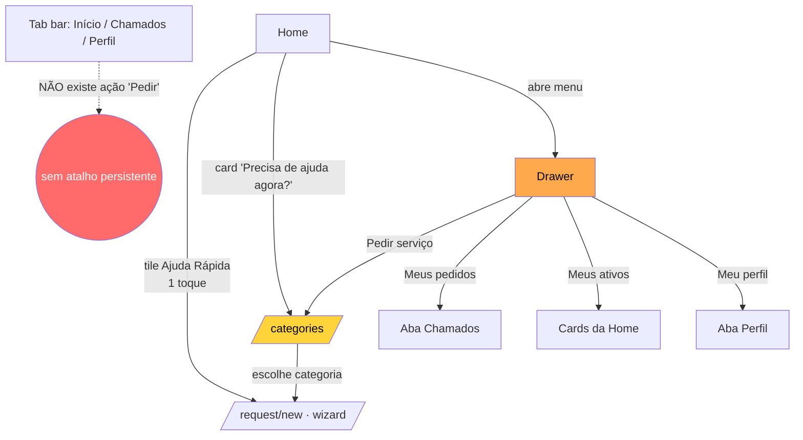

# Home & Descoberta

Módulo: Home + Drawer + Categorias — App do Cliente (Chama Fácil, React Native / Expo Router)
Fontes: `ux-audit/_notes/cluster-home-create-assets.md` (§1, §2, §3, §7, §8) e `ux-audit/_notes/dynamic-walkthrough.md` (achados 15, 16, 28).
Data: 2026-07-20

---

## Visão geral (objetivo; personas)

**Objetivo do módulo.** A camada de descoberta é o hub de conversão do app. Ela deveria responder, em menos de 2 segundos, à única pergunta que traz o usuário ao app: *"como eu peço ajuda agora?"*. Reúne três superfícies de navegação — a Home (`home.tsx`), a tab bar raiz (`_layout.tsx`) e o drawer lateral (`AppDrawer.tsx`) — mais o catálogo de categorias (`categories.tsx`) como segundo hop de descoberta.

**Personas.**
- **Aflito na estrada** (âncora do redesenho): carro quebrado, à noite, com pressa e bateria baixa. Sabe *o que* precisa ("guincho") e quer chegar ao pedido no menor caminho possível. É a persona mais mal atendida pela hierarquia atual.
- **Planejador doméstico**: agenda um encanador/limpeza sem urgência; tolera mais passos, valoriza catálogo e histórico.

**Diagnóstico de uma frase.** O app abre no *inventário de patrimônio*, não na *ação de pedir* — invertendo a expectativa de todo app de serviço sob demanda.

---

## Fluxos (texto + fluxograma Mermaid válido)

**Caminho mais curto (feliz).** Home → tile de "Ajuda Rápida" (`home.tsx:161-170`) → wizard `/request/new`. Um único toque até o wizard, mas só funciona para os 4 slugs fixos em `QUICK_HELP_SLUGS` (`home.tsx:54`): `guincho, bateria, encanador, limpeza`.

**Caminho para qualquer outra necessidade.** Home → card gradiente "Precisa de ajuda agora?" (`home.tsx:182`) → `/categories` → escolher categoria → `/request/new`. Dois hops antes do wizard, apesar de o card *soar* como a CTA de emergência.

**Caminhos redundantes.** O drawer (`19-drawer.png`) reoferece "Meu perfil", "Meus pedidos", "Meus ativos" e "Pedir serviço" — todos já alcançáveis pelas tabs ou pela Home. A ação de maior valor ("Pedir serviço") fica escondida dentro do hambúrguer.



---

## Problemas encontrados (por severidade; evidência)

### Crítico
- **Navegação redundante em 3 superfícies, com a ação primária escondida.** Tabs, Home e drawer oferecem caminhos paralelos para os mesmos destinos, e "Pedir serviço" — a ação de maior valor — não tem lugar na navegação persistente; vive enterrada no conteúdo scrollável da Home e dentro do hambúrguer. Não há FAB nem aba dedicada de "Pedir". Evidência: `dynamic-walkthrough.md` achado 15; `19-drawer.png`; `_layout.tsx:33-44` (só 3 abas: Início/Chamados/Perfil).

### Alto
- **Hierarquia invertida na Home.** A ordem vertical real (`home.tsx:133-197`) é: (1) `HomeAssets` — rail de patrimônio; (2) pedidos ativos; (3) "Ajuda Rápida"; (4) card "Precisa de ajuda agora?". A ação de maior intenção comercial (*pedir*) aparece em 3º e 4º lugar, abaixo do inventário de baixa frequência. Viola Jakob (apps de serviço abrem na ação) e Fitts (CTA primária não fixa na thumb-zone). Evidência: `dynamic-walkthrough.md` achado 16; `00b-home.png`; `22-home-scrolled.png`.
- **Ausência de ação "Pedir" persistente (sem FAB).** A CTA primária rola para fora da tela. Se o usuário está em Chamados ou Perfil e quer pedir, precisa voltar à Home e rolar. Evidência: `_layout.tsx:26-44`; `home.tsx:182`.
- **"Precisa de ajuda agora?" promete imediatismo e entrega uma lista.** O card que *soa* mais urgente é o mais lento: leva a `/categories` (`home.tsx:182`), somando um hop, enquanto os tiles de "Ajuda Rápida" logo acima vão direto ao wizard (`home.tsx:170`). Quebra de Correspondência (Nielsen). Evidência: `dynamic-walkthrough.md` achado 16.
- **Falha de acessibilidade nos elementos tocáveis da Home.** O `Pressable` do card gradiente (`home.tsx:182`) não expõe `accessibilityRole="button"` nem label — o leitor de tela não anuncia nada útil. Verificar também `CatTile` dos tiles de Ajuda Rápida (`home.tsx:168`). Evidência: `cluster-home-create-assets.md §1.6`.

### Médio
- **Estado vazio de "pedidos ativos" some inteiro.** Quando `candidates.length === 0`, a seção desaparece (`home.tsx:159`, `: null`), sem reforço de CTA no espaço mais visível — perde-se conversão para o usuário novo.
- **Categorias sem busca nem error state.** O catálogo (`categories.tsx`) não tem campo de busca (custo de rolagem cresce com o catálogo — Hick) nem estado de erro: se `useCategories` falhar, a tela fica em branco. Evidência: `cluster-home-create-assets.md §3.2, §3.3`.

### Baixo
- **Código morto enganoso.** `stepOf` (`home.tsx:40-44`) retorna `3` tanto para `isActiveStatus` quanto para o `else` (completed/cancelled); inócuo porque terminais são filtrados por `rankOf` (`home.tsx:68`), mas confunde manutenção.

### Registro: falso positivo (não é bug)
- O card "Precisa de ajuda agora?" **NÃO** está com clipping/overflow. Parecia cortado no primeiro screenshot apenas por estar abaixo da dobra; rolando, renderiza inteiro (`22-home-scrolled.png`). Fica reclassificado como problema de **hierarquia** (CTA primário no fim da rolagem), não de layout. Evidência: `dynamic-walkthrough.md` "FALSO POSITIVO descartado".

---

## Melhorias

| Problema | Impacto | Solução | Justificativa | Esforço | Prioridade |
|---|---|---|---|---|---|
| Sem ação "Pedir" persistente / navegação redundante em 3 superfícies | Ação de maior valor escondida; usuário sai da Home para pedir | FAB "Pedir" fixo na thumb-zone (ou "+" central na tab bar); enxugar o drawer para itens únicos (config/ajuda/sair) | Jakob + Fitts: toda tab bar transacional reserva o centro para a ação primária | M | Crítico |
| Hierarquia invertida (assets no topo, CTA de pedir no fim) | Usuário aflito não encontra o "pedir" em <2s | Subir "O que você precisa agora?" (atalhos) ao topo; rebaixar `HomeAssets` para "patrimônio (opcional)" | Ação primária deve ocupar o espaço nobre; assets são contexto | M | Alto |
| "Precisa de ajuda agora?" leva a `/categories` (hop extra) | CTA que soa mais urgente é a mais lenta | Card leva direto ao wizard da categoria mais provável, ou vira o próprio FAB; "Ver tudo" secundário para o catálogo | Correspondência sistema↔mundo; menos hops até o pedido | P | Alto |
| Card gradiente sem `role`/label | Leitor de tela não anuncia a CTA | `accessibilityRole="button"` + `accessibilityLabel` no `Pressable` (`home.tsx:182`); idem `CatTile` | WCAG 4.1.2 Name/Role/Value | P | Alto |
| Categorias sem busca/erro | Persona aflita não acha rápido; tela branca em falha | Campo de busca no topo + empty/error state | Hick; robustez | M | Médio |
| Estado vazio de pedidos some | Perde CTA no espaço mais visível | Reaproveitar o espaço com CTA de conversão | Aproveitar real estate para o usuário novo | P | Médio |
| `stepOf` morto | Confunde manutenção | Remover ramo redundante (`home.tsx:40-44`) | Higiene de código | P | Baixo |

**Mock ASCII — Home redesenhada (ação primária ao topo + FAB fixo):**

```
┌──────────────────────────────────────┐
│ ☰   Olá, Raul            🔔  (avatar)  │
├──────────────────────────────────────┤
│   O que você precisa agora?            │
│  ┌──────────┐ ┌──────────┐            │
│  │ 🪝 Guincho│ │ 🔋Bateria │ ← 1 toque  │
│  └──────────┘ └──────────┘  = pedido   │
│  ┌──────────┐ ┌──────────┐            │
│  │ 🔧Encanad.│ │ 🧹Limpeza │            │
│  └──────────┘ └──────────┘            │
│         [  Ver tudo  ]  → catálogo     │
│  ── Seus pedidos ativos ──             │
│  ┌────────────────────────────────┐   │
│  │ 🪝 Guincho · agora · 2 propostas│   │
│  └────────────────────────────────┘   │
│  ── Seu patrimônio (opcional) ──       │
│  [ carro ] [ casa ] [ + ]              │
├──────────────────────────────────────┤
│  🏠 Início   📋 Chamados   👤 Perfil   │
│         ╭─────────────╮                │
│         │  ⚡ PEDIR    │  ← FAB fixo    │
│         ╰─────────────╯     thumb-zone │
└──────────────────────────────────────┘
```

---

## UI
- Skeletons presentes e corretos: `SkeletonList` para pedidos (`home.tsx:139`) e `SkeletonTiles` para categorias (`home.tsx:163`); `categories.tsx` tem skeleton dedicado (`:21-33`). Bom.
- Card gradiente usa `LinearGradient` com `flex:1` no texto + caixa 46×46 do ícone (`home.tsx:182-197`) — sem clipping real (confirmado no device).
- Categorias em grid de 3 colunas (31%, `categories.tsx:48`), agrupado por `SectionLabel`. Limpo.

## UX
- Único caminho de 1 toque (Ajuda Rápida) é bom, mas condicionado a 4 slugs fixos; qualquer outra necessidade paga 2 hops.
- Boa contenção de escolhas na Home (só 4 atalhos — Hick), mas a CTA primária compete com o inventário pelo topo e perde.
- Drawer sem função própria: replica destinos das tabs em vez de agregar valor.

## Design System
- **Card gradiente CTA duplicado (Médio):** `home.tsx:182-197` ("Precisa de ajuda agora?") e `HomeAssets.tsx:154-174` (`FirstAssetCard`) são quase idênticos (`Pressable → LinearGradient(t.grad) → texto flex + caixa 46×46 com ícone`). Extrair um `<GradientCTACard title body icon onPress/>` compartilhado.
- **Drawer reimplementa Modal/backdrop/inset** (`AppDrawer.tsx:48-53`) no mesmo padrão de `RequestFilterSheet` e `Wiz` — candidato a um primitivo `<BottomSheet>`/`<Drawer>` único (ver `cluster-home-create-assets.md §8.1`).

## Performance
- Sem problema técnico observado nas superfícies de navegação; skeletons cobrem o carregamento. Insets Android tratados corretamente (`_layout.tsx:26-28`).

## Acessibilidade
- **Alto:** `Pressable` do card gradiente (`home.tsx:182`) sem `accessibilityRole`/label; verificar `CatTile` (`home.tsx:168`) e `Card onPress` de `categories.tsx:43-48`.
- `IconButton` de menu e sino têm `accessibilityLabel` (`home.tsx:119, :124). Bom.
- `AvatarGrad` decorativo — garantir marcação como não-acessível.

## Quick Wins
1. Fazer "Precisa de ajuda agora?" apontar direto ao wizard (ou virar FAB) — remove 1 hop (P, Alto).
2. Adicionar `accessibilityRole="button"` + label ao card gradiente e tiles (P, Alto).
3. Campo de busca + error state em `/categories` (M, Médio).
4. Remover ramo morto de `stepOf` (P, Baixo).

## Score
- UX: 4/10
- UI: 7/10
- Performance: 8/10
- Acessibilidade: 4/10
- Consistência: 6/10

**Nota final: 5,5/10** — A descoberta é visualmente limpa e bem instrumentada (skeletons, contenção de escolhas), mas a arquitetura de informação enterra a ação primária sob o inventário e espalha navegação redundante por três superfícies sem oferecer um caminho persistente de "Pedir".
