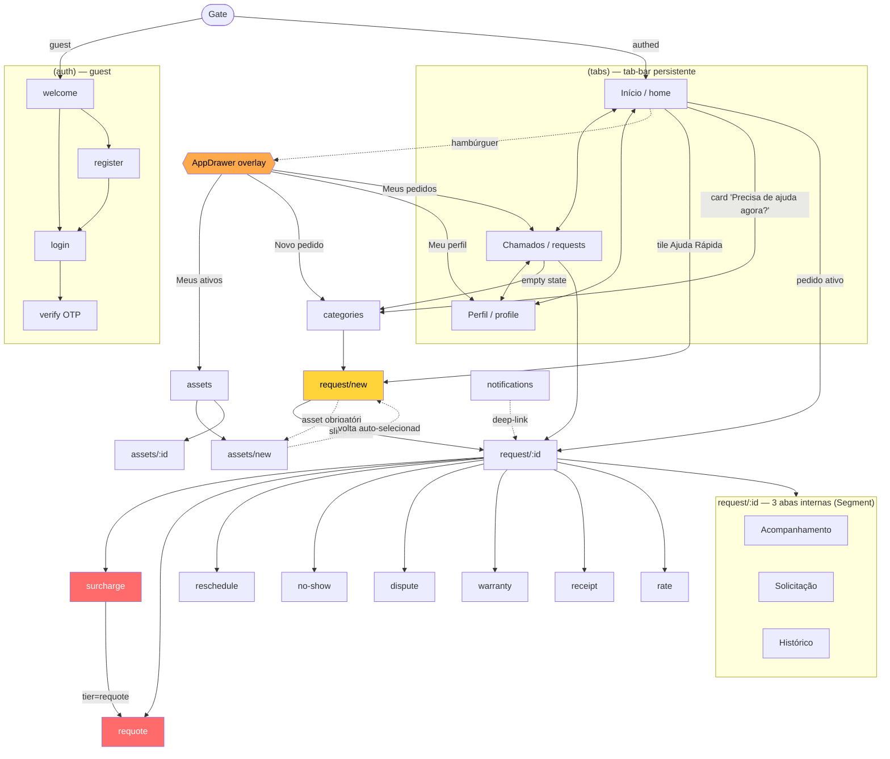
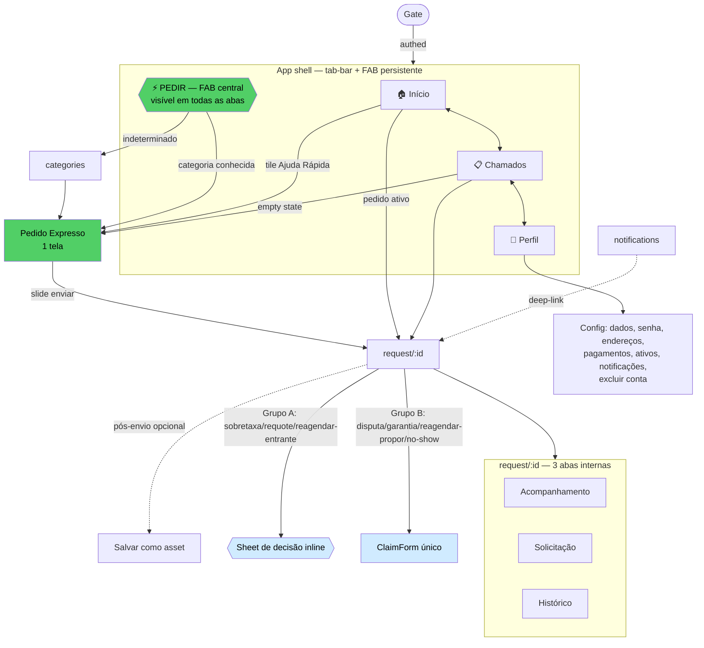

# Chama Fácil — App Customer · Mapa de Navegação

Estrutura de navegação file-based (Expo Router), o gate de autenticação, e a análise crítica da **redundância em 3 superfícies** com uma IA de navegação alvo.
Data: 2026-07-20 · pt-BR.

---

## 1. Estrutura geral

```
Root Stack (app/_layout.tsx → <Gate/> → <Stack/>)
├── Gate (redirect por auth; POC medicao/ar-medicao exemptas)
├── index                         → Redirect /(tabs)/home
├── (auth)/  [stack]              guest
│   ├── welcome  (default guest)
│   ├── login
│   ├── register
│   └── verify
├── (tabs)/  [tab navigator]      authed — 3 abas
│   ├── home        (Início)   ── AppDrawer overlay (hambúrguer)
│   ├── requests    (Chamados)
│   └── profile     (Perfil)
├── categories                    push
├── request/
│   ├── new                       push (wizard 7 etapas)
│   └── [id]/                     push (tela-mãe, 3 abas internas)
│       ├── (Acompanhamento | Solicitação | Histórico)  ← Segment, não rotas
│       ├── proposals  → Redirect [id]
│       ├── track      → Redirect [id]
│       ├── receipt / rate                    push (+ inline no [id])
│       └── surcharge / requote / reschedule / no-show / dispute / warranty  push
├── assets/
│   ├── index                     push
│   ├── new                       push (sub-wizard; ?pick=1 vindo do pedido)
│   └── [id]/ index | edit | setup   push
├── notifications                 push
├── medicao / ar-medicao          push (exemptas de auth — POC)
└── +not-found                    catch-all
```

**Superfícies de navegação persistentes:**
1. **Tab-bar** (3 abas): Início · Chamados · Perfil — `(tabs)/_layout.tsx`.
2. **Drawer overlay** (hambúrguer na Home): overlay em Modal, não navigator — `AppDrawer.tsx`, seções definidas em `home.tsx:207-224`.
3. **Conteúdo da Home**: tiles "Ajuda rápida", card gradiente, rail de assets.
4. **Abas internas do pedido** (`Segment` dentro de `[id]/index.tsx`): Acompanhamento / Solicitação / Histórico — não são rotas.

---

## 2. Gate de autenticação (`app/_layout.tsx:30-93`)

```mermaid
flowchart TD
    A([App abre]) --> B{status?}
    B -- loading --> S[SplashBrand]
    B -- guest --> G{em '(auth)'\nou exempt medicao/ar?}
    G -- não --> W[/redirect /(auth)/welcome/]
    G -- sim --> AUTHZONE[Zona guest / POC]
    B -- authed --> H{em '(auth)'?}
    H -- sim --> HOME[/redirect /(tabs)/home/]
    H -- não --> APP[App autenticado]
    APP -. qualquer 401 .-> KICK[[logout silencioso]] --> W
```

- `exempt = medicao | ar-medicao` → POC acessível **sem auth**.
- 401 transitório derruba a sessão sem refresh token nem aviso.

---

## 3. Diagrama de navegação — ATUAL



---

## 4. Seção crítica — Redundância de navegação em 3 superfícies

O app oferece **três caminhos concorrentes** para os mesmos destinos, e ao mesmo tempo **não tem** um lugar persistente para a ação de maior valor (pedir). Evidência de código em `home.tsx:207-224` (drawer), `(tabs)/_layout.tsx:33-44` (abas) e `home.tsx` (conteúdo).

| Destino | Tab-bar | Drawer | Conteúdo da Home |
|---------|---------|--------|------------------|
| Perfil | ✅ aba Perfil | ✅ "Meu perfil" → `/(tabs)/profile` | — |
| Chamados | ✅ aba Chamados | ✅ "Meus pedidos" → `/(tabs)/requests` | ✅ cards de pedido ativo |
| Ativos | — | ✅ "Meus ativos" → `/assets` | ✅ rail `HomeAssets` |
| **Pedir serviço** | ❌ **ausente** | ✅ "Novo pedido" → `/categories` | ✅ tiles "Ajuda rápida" → `/request/new` + card gradiente → `/categories` |

**Problemas:**

1. **O drawer é quase 100% redundante.** Todos os seus itens já existem nas abas ou no conteúdo da Home. Ele adiciona uma superfície de manutenção e decisão sem destino exclusivo. (Walkthrough `19-drawer.png`.)

2. **A ação de maior valor está escondida no hambúrguer** e ainda espalhada em rotas divergentes: drawer e card gradiente vão para `/categories` (com hop extra), mas os tiles da Home vão direto para `/request/new`. Mesmo verbo ("pedir"), **dois destinos e dois números de toques**.

3. **Não há "Pedir" persistente.** Em Chamados ou Perfil, para pedir é preciso voltar à Home e rolar até os tiles (ou abrir o hambúrguer). A tab-bar reserva o centro para nada — todo app transacional (iFood, Uber, 99) fixa a ação primária ali. Viola Fitts + Jakob.

4. **Inconsistência de intenção:** o card que *soa* mais urgente ("Precisa de ajuda agora?") é o **mais lento** (leva ao catálogo, não cria pedido).

**Conclusão:** consolidar as 3 superfícies em 1 sistema previsível e **promover "Pedir" a cidadão de primeira classe** (FAB/aba central). O drawer pode ser aposentado — seus únicos itens não-redundantes ("Ativos") cabem no Perfil.

---

## 5. IA de navegação alvo (proposta)

**Princípios:**
- **Ação "Pedir" persistente** na thumb-zone (FAB central elevado sobre a tab-bar), disponível de qualquer aba.
- **Um destino único por verbo:** "Pedir" abre sempre o mesmo fluxo (expresso a partir de categoria conhecida; catálogo só quando indeterminado).
- **Aposentar o drawer:** mover "Ativos" para dentro do Perfil (que precisa virar um Config real). Home, Chamados e Perfil cobrem tudo.
- **Assets como enriquecimento pós-pedido**, nunca pedágio.



**Ganhos:**
- **De 3 superfícies para 1** (tab-bar + FAB), sem drawer.
- **"Pedir" acessível de qualquer lugar** em 1 toque, sempre para o mesmo fluxo.
- **6 rotas de exceção → ~2** (Grupo A vira sheet inline, resolvendo o loop surcharge↔requote; Grupo B vira `ClaimForm`).
- **Perfil vira Config de verdade** — absorve "Ativos" e ganha editar/pagamentos/endereços/excluir conta (destrava publicação nas lojas).
