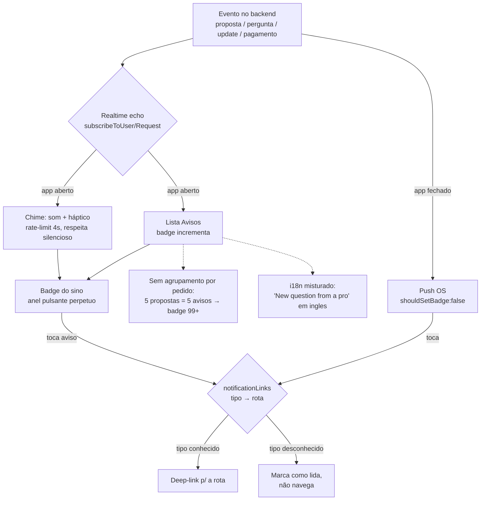

# Notificações e Realtime (Avisos, echo/chime/push)

## Visão geral (objetivo; personas)

**Objetivo do módulo.** Manter o cliente informado em tempo real sobre o ciclo do pedido — propostas que chegam, perguntas do prestador, atualizações do atendimento, pagamento liquidado — por três canais: a lista **Avisos** (`notifications.tsx`), o **realtime** in-app (`echo.ts` / `useRealtimeNotifications.ts`), o **chime** sonoro/háptico (`useNotificationChime.ts`) e o **push** (`push.ts`). Os deep-links (`notificationLinks.ts`) levam de cada aviso à rota certa.

**Personas.**
- **"Aflito na estrada"**: precisa saber na hora que uma proposta chegou — o realtime + chime entregam bem isso.
- **Cliente com pedido movimentado**: 1 pedido com 5 propostas gera ~10 avisos; sofre com spam e badge 99+.
- **Usuário pt-BR**: encontra strings em inglês misturadas na lista.

**O que está bom (manter).** O `notificationLinks.ts` é o melhor arquivo do cluster: mapa **aditivo** de 25+ tipos → rota + ícone, com fallback gracioso (tipo desconhecido ainda lista/lê, só não navega). O chime tem rate-limit de 4s, respeita o modo silencioso e degrada sem áudio. O realtime (`echo.ts`) é robusto. O realtime **de fato funciona** no device (propostas entram sozinhas, com chime).

## Fluxos (texto + fluxograma Mermaid válido)



## Problemas encontrados (por severidade; evidência)

### Alto
- **Spam sem agrupamento por pedido → badge 99+.** Cada proposta e cada pergunta geram um aviso separado; a lista não colapsa tipos repetidos por pedido. 1 pedido com 5 propostas ≈ 10 avisos, e o badge "99+" perpétuo vira ruído (o cap `99+` em `primitives.tsx:98` está correto, mas o volume não). Evidência: `ux-audit/screens/23-notifications.png`, `00b-loading.png`.
- **i18n misturado na lista de avisos.** Títulos "**New question from a pro**" (inglês, string hardcoded do app) convivem com "Nova proposta recebida" e "Atualização do atendimento" (pt-BR). String não traduzida. Evidência: `ux-audit/screens/23-notifications.png`.

### Médio
- **Anel pulsante perpétuo no badge do sino.** O `Badge` de contagem tem um `Animated.loop` infinito (`primitives.tsx:51-59`) enquanto houver qualquer não-lida: com 12 avisos, o sino fica "respirando" para sempre — ruído/ansiedade e consumo de bateria (loop constante mesmo com `useNativeDriver`). Deveria pulsar **na chegada** e parar.

### Baixo
- **Realtime não reconecta em troca de token.** `echo.ts` guarda um socket singleton autenticado com o token capturado no momento da conexão (`:24,66`); após refresh de token, segue com o antigo até `disconnectRealtime()`. Sem reassinatura no refresh.
- **Sem badge no ícone do launcher.** `setupNotificationHandler` usa `shouldSetBadge:false` (`push.ts:52`) — o número no ícone do app fica sempre zerado; a contagem só vive dentro do app. Decisão consciente, mas o cliente não vê pendências sem abrir o app.
- **Rate-limit do chime por instância.** `MIN_GAP_MS` é global por instância do hook; se dois listeners montarem o hook, o rate-limit não é compartilhado (`useNotificationChime.ts:22`).

**Pontos fortes (manter):** deep-link aditivo com fallback gracioso (`notificationLinks.ts:8-9,20-71`); chime que respeita silencioso e degrada sem áudio; `notifications.tsx:20-26` marca como lida ao tocar mesmo sem rota.

## Melhorias

| Problema | Impacto | Solução | Justificativa | Esforço | Prioridade |
|---|---|---|---|---|---|
| Spam sem agrupamento → badge 99+ | Ruído; cliente ignora avisos importantes | Agrupar por pedido: "Pedido #123 · 5 propostas" (1 linha expansível); badge conta grupos, não eventos | Reduz carga; recupera sinal | M | Alto |
| i18n "New question from a pro" | Quebra de confiança/polimento num app pt-BR | Traduzir a string; auditar strings hardcoded de notificação | Consistência de idioma | P | Alto |
| Anel pulsante perpétuo | Ruído visual, ansiedade, bateria | Pulsar só na chegada e parar; badge estático depois | Menos ruído; economia | P | Médio |
| Sem reconexão em troca de token | Realtime cai silenciosamente após refresh | Reassinar socket no refresh de token | Confiabilidade do realtime | M | Médio |
| Sem badge no launcher | Cliente não vê pendências fora do app | Avaliar `shouldSetBadge:true` para contagem real | Reengajamento | P | Baixo |

**Mock ASCII — central de mensagens com agrupamento por pedido:**

```
┌─────────────────────────────────────────┐
│  Avisos                     [Marcar tudo] │
├─────────────────────────────────────────┤
│  🔧 Guincho · Rua Patrícia, 805      ▸   │  1 grupo = 1 pedido
│     5 propostas · 2 perguntas   agora    │  (expande p/ ver todas)
│     ● ← ponto de não-lida com rótulo     │
├─────────────────────────────────────────┤
│  💳 Elétrica · Tomada                ▸   │
│     Pagamento liquidado         2 h      │
├─────────────────────────────────────────┤
│  Antes: 10 linhas soltas p/ 1 pedido,    │
│  título em inglês, badge 99+ perpétuo    │
└─────────────────────────────────────────┘
   badge do sino: conta GRUPOS (2), pulsa só ao chegar
```

## UI
- A lista é paginada e usa `EmptyState` corretamente (`notifications.tsx:49`).
- Timestamps usam `ink3` (contraste ~2.6:1) — captions de baixa legibilidade (`notifications.tsx:87`).
- Dot de não-lida é **cor-apenas** (`notifications.tsx:92`), sem texto alternativo (WCAG 1.4.1).

## UX
- Realtime + chime entregam o "chegou proposta" na hora — grande acerto para a persona aflita.
- O volume sem agrupamento anula esse ganho: o cliente aprende a ignorar o sino.
- Deep-link com fallback gracioso é exemplar (app antigo vs server novo continua funcionando).

## Design System
- Badge de contagem tem cap correto mas animação perpétua — ajustar o padrão de pulso.
- Falta um padrão de "notificação agrupada" no kit; hoje cada evento é uma linha.
- Strings de notificação precisam passar 100% pela camada de i18n.

## Performance
- `Animated.loop` perpétuo no badge consome bateria mesmo com `useNativeDriver` — parar após a chegada.
- `echo.ts` tem lazy-require por plataforma e desembrulho defensivo — bem resolvido.
- Chime com rate-limit de 4s evita rajadas sonoras.

## Acessibilidade
- **Médio:** "marcar todas" é `<Pressable>` sem `accessibilityRole="button"` e ~29px de altura (`notifications.tsx:39`) — abaixo de 44px.
- Dot de não-lida cor-apenas sem alternativa textual (1.4.1).
- Timestamps em `ink3` reprovam contraste AA (1.4.3).

## Quick Wins
- Traduzir "New question from a pro" e auditar strings de notificação. [P]
- Parar o anel pulsante após a chegada. [P]
- Adicionar `accessibilityRole="button"` + label ao "Marcar todas". [P]
- Rótulo textual ao dot de não-lida. [P]

## Rastreador ao vivo — implementação e o que o teste em aparelho revelou (2026-07-21)

Esta seção é posterior à auditoria: nasceu de construir a notificação persistente de "chamado em andamento" e testá-la num Galaxy real (Android 14 / One UI 6.1), não da leitura de código. Achados canônicos: **NOTIF-06 a NOTIF-10** em `findings.md`.

**Três bugs faziam o sync em background ser um no-op completo** — e o conjunto *parecia* funcionar, porque o logcat imprimia `Finished task 'active-request-push'` de qualquer jeito:

1. O payload do Expo no Android **não entrega os campos direto**: o envelope traz `scopeKey`/`experienceId`/`projectId` e a carga real como **string JSON** em `data.dataString`. Lendo o envelope, `type` era `undefined` e o handler retornava na primeira linha.
2. O `ExpoChannel` mandava `channelId` junto do push silencioso. O Expo converte qualquer indício de alerta visível em **mensagem de notificação do FCM** — o Android então desenhava um card vazio no `fcm_fallback_notification_channel` e **nunca acordava a task**.
3. `TaskManager.defineTask` e `notifee.onBackgroundEvent` eram avaliados só quando `_layout` os importava. Num start **headless** nada sob `app/` roda, então a task ficava registrada nativamente e indefinida em JS.

**Lição transversal:** handler que precisa existir sem UI tem que ser registrado no *entry point* (`index.js`), nunca numa tela, layout ou provider.

**Sobre persistência no Android 14 (API 34):** `setOngoing(true)` **não** impede mais o usuário de deslizar a notificação para fora — verificado no aparelho. E **foreground service não resolveria**: desde a API 34 a notificação dele também é dispensável (só resiste ao "Apagar" e à tela bloqueada). As únicas indispensáveis são `CallStyle`, mídia e política de dispositivo. A solução adotada foi repor após a dispensa, com orçamento de 3 reposições por estágio — persistente sem virar inescapável.

**Limites conhecidos:** *force stop* pelas configurações mata tudo (flag `FLAG_STOPPED` do Android, sem contorno); a barra de progresso sai **azul** no One UI, que impõe o accent do sistema e ignora `color`; e o botão "Ligar" está implementado mas nunca renderiza, porque a listagem `/requests` não expõe `provider.phone` — decisão de privacidade em aberto (ver `findings.md`).


## Score
- UX: 6/10
- UI: 6/10
- Performance: 7/10
- Acessibilidade: 4/10
- Consistência: 5/10

**Nota final: 5,6/10** — Realtime e deep-link sólidos, mas a experiência de notificação é minada por spam sem agrupamento, badge 99+ com anel perpétuo e strings em inglês num app pt-BR.
