# Onboarding

## Visão geral (objetivo; personas envolvidas)

Onboarding, aqui, é o intervalo entre "app aberto pela primeira vez" e "primeiro pedido de serviço enviado". O objetivo de negócio do Chama Fácil é **converter um problema urgente em um chamado**. A auditoria constata que **não existe onboarding de cliente orientado a esse objetivo**: a welcome (3 slides) apenas empurra para cadastro, e a única experiência de primeira execução pós-login é o `FirstAssetTutorial`, que está **invertido** — força cadastrar um ativo (imóvel/veículo) antes de deixar a pessoa pedir ajuda.

Personas:
- **"Aflito na estrada"** (persona primária do percurso): carro quebrado, com pressa, quer guincho já. Para essa pessoa, qualquer passo antes de pedir é atrito puro.
- **Novo usuário sem contexto**: acabou de instalar, ainda não entendeu a proposta de valor; precisa de "valor primeiro".

## Fluxos (texto + fluxograma Mermaid)

Hoje, um novo cliente atravessa: welcome (3 slides) → register → home. Na home, um `FirstAssetTutorial` full-screen abre por conta própria (`FirstAssetTutorial.tsx:19,52`) com 3 passos (casa/foto/chave inglesa) e, no CTA final, empurra para `/assets/new?guided=1` (`FirstAssetTutorial.tsx:41-46`) — ou seja, **cadastrar um ativo** antes de qualquer pedido. O tutorial é skippável e lembra que foi pulado, o que é bom; mas a rota principal que ele oferece coloca patrimônio antes de valor.

O percurso dinâmico confirma o custo: do atalho ao envio são **~10 interações e 7 telas** (dynamic-walkthrough `:12`), com etapas fracas (etapa 5 é uma tela inteira só para foto opcional). Não há modo expresso nem FAB/aba dedicada de "Pedir" (dynamic-walkthrough `:37,40`).

```mermaid
flowchart TD
    subgraph ATUAL[Fluxo atual - valor por ultimo]
      A([Instala]) --> W1[welcome 3 slides]
      W1 --> R1[register]
      R1 --> H1[home]
      H1 --> FT[FirstAssetTutorial abre sozinho]
      FT -- CTA --> AN[/assets/new?guided=1/]
      AN -->|cadastra imovel/veiculo| H1b[home]
      H1b --> WZ[wizard 7 etapas]
      WZ --> ENV[envia pedido]
    end

    subgraph PROP[Fluxo proposto - valor primeiro]
      B([Instala]) --> V1[1 slide: o que e Chama Facil]
      V1 --> V2[Escolha o que precisa: chips]
      V2 --> V3[Modo expresso: descricao + local]
      V3 --> AUTH[/auth so na hora de enviar - OTP/]
      AUTH --> ENV2[pedido enviado <= 4 toques]
      ENV2 -.opcional depois.-> AST[Cadastrar ativo p/ agilizar futuros]
    end
```



## Problemas encontrados

### Crítico

- **Ausência de onboarding do cliente orientado a valor.** A welcome é institucional (3 slides ilustrados) e sua única função real é jogar para o cadastro; nenhuma tela ajuda o usuário a chegar ao primeiro pedido mais rápido. Evidência: `welcome.tsx:71-124` (rodapé com 3 CTAs concorrentes que levam a register/login).
- **`FirstAssetTutorial` invertido: exige cadastrar ativo antes de pedir.** O CTA final do tutorial de primeira execução leva a `/assets/new?guided=1` (`FirstAssetTutorial.tsx:41-46`), colocando o cadastro de patrimônio (baixa frequência, alto esforço) na frente da ação de maior valor (pedir ajuda). Para a persona aflita, é o oposto do que ela precisa. Reforçado pela hierarquia da home, que lista "Meus ativos" no topo e o CTA "Precisa de ajuda agora?" no fim (dynamic-walkthrough `:41`).

### Alto

- **Caminho até o primeiro pedido longo demais.** ~10 interações / 7 telas para um chamado urgente (dynamic-walkthrough `:12,37`), sem modo expresso.
- **Ação de maior valor escondida.** Não há FAB nem aba "Pedir"; a ação primária vive dentro do hambúrguer e da rolagem da home (dynamic-walkthrough `:40,41`). Evidências: `19-drawer.png`, `22-home-scrolled.png`.

### Médio

- **Onboarding institucional consome atenção sem entregar valor.** Os 3 slides da welcome mostram cenas decorativas ("R$ 95", "Melhor opção") que parecem dados reais e não ensinam a pedir (cluster-auth `welcome.tsx:52-132`).
- **Sem momento de sucesso ao enviar o primeiro pedido** (Peak-End): após arrastar para enviar, cai direto no detalhe "Aberto", sem celebração (dynamic-walkthrough `:46`). Evidência: `12`→`13`.

## Melhorias

| Problema | Impacto | Solução proposta | Justificativa | Esforço | Prioridade |
|----------|---------|------------------|---------------|---------|-----------|
| Tutorial força cadastrar ativo antes de pedir | Atrito máximo p/ persona aflita; abandono | Inverter: primeiro deixar pedir; oferecer cadastro de ativo **depois**, como atalho para próximos pedidos | Valor primeiro converte; patrimônio é otimização, não pré-requisito | M | Crítico |
| Sem onboarding de valor | Usuário não entende proposta nem chega rápido ao pedido | 1 slide de valor + seletor "o que você precisa?" que já inicia o pedido | Reduz tempo-até-valor; ensina fazendo | M | Alto |
| ~10 toques / 7 telas até enviar | Fricção em emergência (Doherty/Hick) | "Modo expresso": descrição + localização em 1 tela, resto opcional/pós-envio | Emergência exige o mínimo | G | Alto |
| Ação "Pedir" escondida | Baixa descoberta da ação central | FAB persistente "Pedir ajuda" + aba dedicada | Ação primária deve ser 1 toque de qualquer lugar | M | Alto |
| Sem momento de sucesso | Pico de esforço não recompensado | Tela de confirmação "Pedido enviado! Avisaremos quando chegarem propostas" | Peak-End melhora percepção | P | Médio |

### Mock ASCII do onboarding proposto ("valor primeiro / pedir em <=4 toques")

```
TOQUE 0 - Abertura (1 slide de valor, sem cadastro na frente)
+-----------------------------------+
|        Chama Facil                |
|  Ajuda de verdade, a um toque.    |
|  Guincho, chaveiro, casa, pets.   |
|                                   |
|   [  Preciso de ajuda agora  ->]  |  <- TOQUE 1
|   Ja tenho conta?  Entrar         |
+-----------------------------------+

TOQUE 1 -> Do que voce precisa? (chips = ja inicia o pedido)
+-----------------------------------+
| Do que voce precisa?              |
| [ Guincho ] [ Chaveiro ] [ Casa ] |  <- TOQUE 2 (Guincho)
| [ Pets   ] [ Eletrica  ] [ ... ]  |
+-----------------------------------+

TOQUE 2 -> Modo expresso (1 tela: descricao + local)
+-----------------------------------+
| Guincho                           |
| O que aconteceu?  [ ditar (mic) ] |
| [ Carro nao liga na BR-116..... ] |  <- digita/dita
| Onde voce esta?                   |
| [ Usar minha localizacao (o) ]    |  <- TOQUE 3
| (orcamento/foto = opcionais)      |
|   [  Enviar pedido          ->]   |  <- TOQUE 4  => ENVIADO
+-----------------------------------+
   Auth (OTP) so aqui, na hora de enviar - nao antes.

DEPOIS (opcional, nao bloqueia):
+-----------------------------------+
| Pedido enviado! Avisaremos as     |
| propostas chegarem.               |
| Quer agilizar os proximos?        |
| [ Cadastrar meu veiculo ] (skip)  |  <- ativo AGORA faz sentido
+-----------------------------------+
```

## UI

Aproveitar os componentes já existentes (chips de categoria `CatIc`, `SlideToConfirm`, campo com ditado por voz) para montar o modo expresso — nada novo precisa ser desenhado. O `FirstAssetTutorial` já tem boa estrutura visual (gradiente, dots, CTA branco `FirstAssetTutorial.tsx:52-126`); o que muda é o **destino** do CTA, não o visual. Evitar telas quase vazias como a etapa 5 (só foto opcional) do wizard atual.

## UX

O princípio a inverter é o de **postponed registration / postponed setup**: pedir esforço (cadastrar ativo, criar conta) só depois de a pessoa perceber valor. Hoje o app faz o contrário. A oferta de cadastrar o veículo faz muito mais sentido **após** um guincho, quando o usuário entende que isso agiliza os próximos pedidos. Manter o comportamento positivo do tutorial atual de ser skippável e lembrar do skip (`FirstAssetTutorial.tsx:17`).

## Design System

Reaproveitar `Screen`, chips de categoria, `SlideToConfirm` e o padrão de gradiente do `FirstAssetTutorial`. O modo expresso deve usar `<Screen>` (a welcome hoje não usa e recalcula insets à mão — cluster-auth `welcome.tsx:166-168`). Nenhum componente novo é estritamente necessário para o fluxo proposto.

## Performance

O `FirstAssetTutorial` é um `Modal` renderizado de dentro do scroll da home (`FirstAssetTutorial.tsx:48-52`) — leve. O ganho de performance percebida do fluxo proposto vem de **menos telas** até o valor (7 → ~3), não de otimização de render. Carregar o mapa Leaflet só quando necessário (já é o caso) mantém a tela de local leve.

## Acessibilidade

O tutorial já traz `accessibilityRole="button"` no CTA e `hitSlop` no skip (`FirstAssetTutorial.tsx:61,108-110`) — bom. Ao construir o onboarding proposto, garantir: chips com role de botão e estado selecionado, dots de paginação anunciando "passo X de N", e o campo de descrição com label persistente. Não repetir o erro da welcome de expor cenas decorativas ao leitor de tela.

## Quick Wins

1. Trocar o destino do CTA do `FirstAssetTutorial` de `/assets/new?guided=1` para a home/seleção de serviço (inverte a lógica com baixo esforço).
2. Adicionar um FAB "Pedir ajuda" persistente na home.
3. Adicionar tela/toast de sucesso após o envio do pedido.
4. Mover "Meus ativos" para baixo do CTA de pedir na home (hierarquia).

## Score

| Dimensão | Nota (0-10) |
|----------|-------------|
| UX | 3 |
| UI | 6 |
| Performance | 7 |
| Acessibilidade | 5 |
| Consistência | 5 |

**Nota final: 4,0/10** — Veredito: o app tem um tutorial bem construído apontando para o lado errado — inverter "cadastrar ativo primeiro" para "pedir primeiro, cadastrar depois" e criar um modo expresso de <=4 toques é a maior alavanca de conversão do produto.
