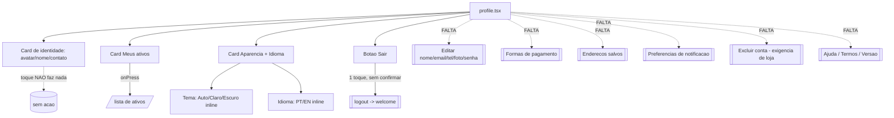

# Perfil e Configurações

## Visão geral (objetivo; personas envolvidas)

A tela `profile.tsx` deveria ser o centro de controle da conta: identidade, dados pessoais, pagamento, endereços, preferências e saída. Na prática, é uma tela de **configurações mínimas fantasiada de "Perfil"**: mostra um card de identidade, um card "Meus ativos", um card de Aparência + Idioma e um botão Sair. Nada mais é editável.

Personas:
- **Cliente recorrente** que precisa corrigir e-mail/telefone, gerenciar formas de pagamento e endereços — e não consegue.
- **Usuário que quer sair da plataforma**: não há "excluir conta", o que é **exigência de App Store/Play** e representa risco de rejeição de publicação.

Evidência primária: `21-profile.png`; dynamic-walkthrough `:42` ("Perfil é um beco sem saída").

## Fluxos (texto + fluxograma Mermaid)

A tela expõe apenas três destinos reais: navegar para "Meus ativos" (o único card com `onPress`), alternar tema/idioma inline e sair. O card de identidade parece tocável mas não faz nada (dynamic-walkthrough `:42`). O logout dispara em 1 toque, sem confirmação (`profile.tsx:71`), e cai na camada de auth que reseta a sessão.



## Problemas encontrados

### Alto

- **Perfil raso: não edita nada.** Impossível alterar nome, e-mail, telefone, foto ou senha — não há tela de edição em lugar nenhum do cluster. Evidência: `profile.tsx` (ausência); `21-profile.png`.
- **Sem "Excluir conta".** Exigência de App Store e Play para apps com login; a ausência é **bloqueio de publicação** / risco de rejeição nas lojas. Evidência: `profile.tsx` (ausência); dynamic-walkthrough `:42`.
- **Ausência de pagamento, endereços e notificações.** Nenhum método de pagamento, endereço salvo ou preferência de notificação — funções esperadas de um marketplace de serviços. Evidência: `21-profile.png`.
- **Logout sem confirmação.** Ação destrutiva (perde sessão e contexto) em 1 toque, sem diálogo (Nielsen #3, Controle do usuário). Evidência: `profile.tsx:71`.

### Médio

- **Card de identidade sem affordance.** Parece tocável (avatar + nome + contato) mas não navega para edição — quebra a expectativa (Jakob). Evidência: `21-profile.png`; dynamic-walkthrough `:42`.
- **Botões sm de tema/idioma < 44dp e sem estado `selected`.** `size="sm"` → altura 38dp (`Button.tsx:37`, abaixo de 2.5.5/2.5.8); botão ativo não expõe `accessibilityState={{selected:true}}`, então o leitor de tela não sabe qual está ativo (4.1.2). Evidência: `profile.tsx:44-67`.
- **Paletas do tema inacessíveis.** `themes.ts` define sunset/trust/night, mas o perfil só troca light/dark/auto — o usuário nunca acessa trust/night (Nielsen #7). Evidência: `profile.tsx:44`; `themes.ts`.
- **Troca de idioma pode não sincronizar o backend.** `i18n.changeLanguage` + `persistLanguage` são chamados, mas não parece haver `setApiLocale` aqui — o backend continuaria no locale antigo até o próximo boot. Verificar. Evidência: `profile.tsx:62-65`.

### Baixo

- **Fallback ausente na linha de contato.** `user?.email ?? user?.phone` (`profile.tsx:24`) — se ambos forem nulos, a linha renderiza vazia sem fallback.

## Melhorias

| Problema | Impacto | Solução proposta | Justificativa | Esforço | Prioridade |
|----------|---------|------------------|---------------|---------|-----------|
| Sem excluir conta | Bloqueio de publicação nas lojas | Adicionar "Excluir minha conta" com confirmação + endpoint | Requisito obrigatório Apple/Google | M | Alto |
| Perfil não edita dados | Usuário preso com dados errados | Tela "Dados pessoais" (nome/e-mail/telefone/foto/senha) acessível pelo card de identidade | Controle da própria conta é básico | G | Alto |
| Sem pagamento/endereços/notificações | Funções esperadas de marketplace ausentes | Seções "Formas de pagamento", "Endereços", "Notificações" | Completa o perfil real | G | Alto |
| Logout sem confirmação | Perda de sessão por toque acidental | Diálogo "Deseja sair?" antes de deslogar | Ação destrutiva exige confirmação (Nielsen #3) | P | Alto |
| Card de identidade inerte | Quebra expectativa de edição | Tornar o card tocável → abre "Dados pessoais"; ícone de lápis | Affordance clara | P | Médio |
| Botões tema/idioma < 44dp / sem selected | Falha 2.5.5/4.1.2 | Aumentar alvo p/ >=44dp; expor `accessibilityState.selected` | Toque e leitor acessíveis | P | Médio |

### Mock ASCII do Perfil expandido

```
+-------------------------------+
| Perfil                        |
| +---------------------------+ |
| | (av) Raul Neto        [/] | | <- toca = Dados pessoais
| |      raul@email.com       | |
| +---------------------------+ |
| CONTA                         |
| > Dados pessoais / senha      |
| > Enderecos                   |
| > Formas de pagamento         |
| > Meus ativos            (3)  |
| PREFERENCIAS                  |
| Tema  [Auto][Claro][Escuro]   | <- >=44dp, selected exposto
| Idioma[ PT ][ EN ]            |
| Notificacoes              >   |
| SOBRE / AJUDA                 |
| > Central de ajuda            |
| > Termos . Privacidade        |
| > Versao 1.x.x                |
| [        Sair             ]   | <- confirma antes
| Excluir minha conta           | <- obrigatorio p/ loja
+-------------------------------+
```

## UI

A implementação atual usa o Design System de forma consistente (Screen, Card, Avatar, Button, Row, Icon) — o problema é de **escopo, não de implementação**. Os únicos ajustes de UI necessários são: dar affordance ao card de identidade (ícone de lápis), aumentar os botões de tema/idioma para >=44dp e organizar a tela em seções (Conta / Preferências / Sobre) conforme o mock.

## UX

- **Controle do usuário** (Nielsen #3): logout destrutivo em 1 toque precisa de confirmação.
- **Flexibilidade** (Nielsen #7): paletas trust/night existem mas são inacessíveis.
- **Correspondência com expectativa** (Jakob): usuários esperam "Editar perfil" e "Sair" separados; aqui só há Sair. O card que parece editável não é.
- Positivo: tema e idioma **inline** na própria tela (troca imediata, sem submenu) é um bom padrão — manter, apenas corrigindo alvo e estado `selected`.

## Design System

Nenhuma divergência de componentes — a tela é fiel ao DS. Ao expandir, reutilizar o padrão de linha `Row` com `arrowR` para os novos itens de navegação (Dados pessoais, Endereços, Pagamento) e manter os toggles inline para Tema/Idioma. O `Button size="sm"` (38dp) não deve ser usado para controles primários de seleção — subir para o tamanho padrão.

## Performance

Tela leve, sem listas pesadas nem imagens grandes — nenhum gargalo. A expansão proposta (seções de navegação) não adiciona custo relevante de render; as subtelas (dados pessoais, pagamento) carregam sob demanda. Verificar apenas que a troca de idioma não force um reboot custoso do app para sincronizar o locale do backend (`profile.tsx:62-65`).

## Acessibilidade

Falhas: **2.5.5/2.5.8** (botões sm de 38dp), **4.1.2** (estado `selected` não exposto nos toggles de tema/idioma). Ao adicionar itens: garantir role de botão nas linhas navegáveis, confirmação acessível no logout e no "excluir conta", e labels claras nos toggles. O card de identidade, ao virar tocável, precisa de role de botão e label ("Editar dados pessoais").

## Quick Wins

1. Adicionar diálogo de confirmação no logout (`profile.tsx:71`).
2. Expor `accessibilityState={{selected:true}}` nos botões de tema/idioma ativos.
3. Aumentar os botões de tema/idioma para >=44dp.
4. Adicionar fallback na linha de contato quando e-mail e telefone forem nulos (`profile.tsx:24`).
5. Tornar o card de identidade tocável com ícone de lápis (mesmo que só abra um stub inicialmente).

## Score

| Dimensão | Nota (0-10) |
|----------|-------------|
| UX | 3 |
| UI | 6 |
| Performance | 8 |
| Acessibilidade | 4 |
| Consistência | 7 |

**Nota final: 4,0/10** — Veredito: uma tela bem construída, mas rasa demais para se chamar "Perfil" — faltam edição de dados, pagamento, endereços e, criticamente, "excluir conta", cuja ausência pode barrar a publicação nas lojas.
