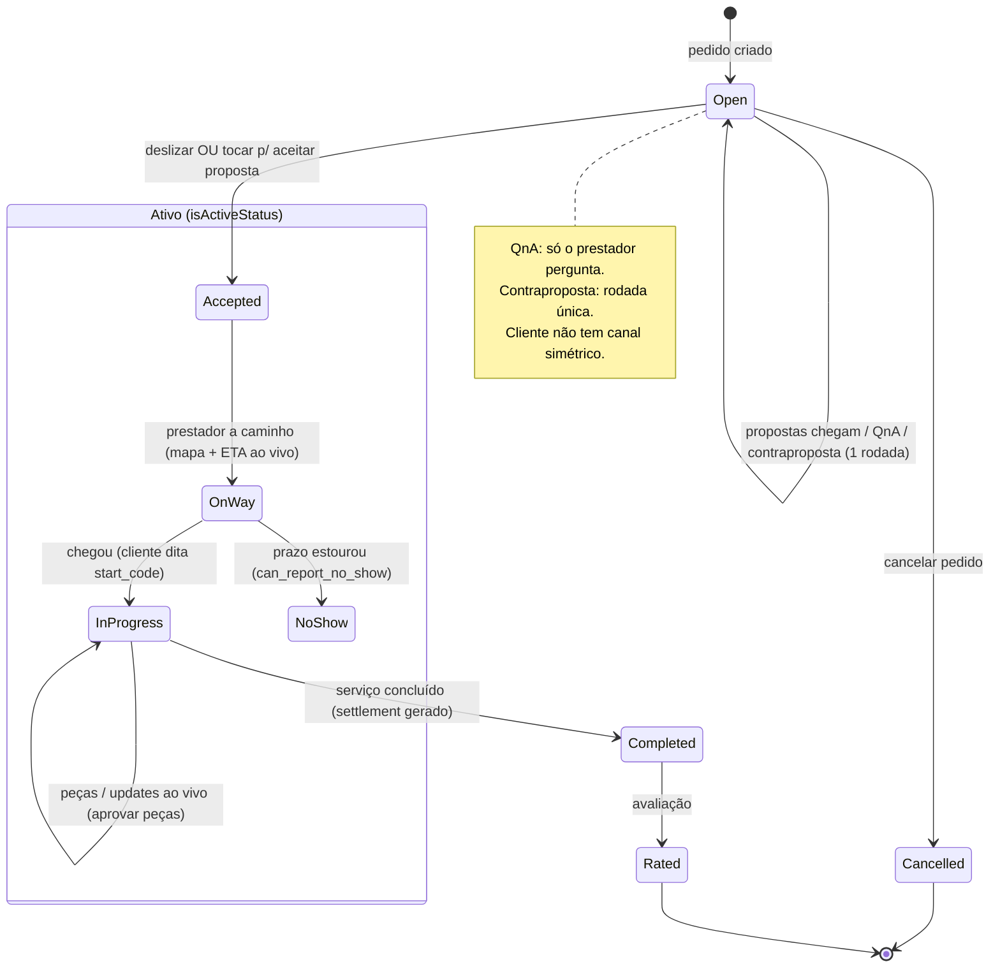

# Propostas, Rastreio, QnA e Aceite

## Visão geral (objetivo; personas)

**Objetivo do módulo.** Depois que o pedido é criado, esta é a superfície onde o cliente recebe propostas dos prestadores em tempo real, compara preço/tempo/nota, tira dúvidas via QnA, negocia (contraproposta) e finalmente aceita uma proposta — o que dispara o rastreio ao vivo (mapa, ETA, código de início). Tudo isso vive dentro da aba **Acompanhamento** da tela-mãe `apps/customer/app/request/[id]/index.tsx`, com a lista de propostas em `src/components/ProposalsList.tsx` e o QnA em `QnaThread.tsx`.

**Personas.**
- **"Aflito na estrada"** (persona principal do walkthrough): carro quebrado, com pressa, quer guincho já. Precisa aceitar a proposta certa com o mínimo de fricção e com confiança de que não vai ser cobrado a mais.
- **Cliente comparador**: tem tempo, quer comparar preço, nota e tempo de chegada entre prestadores antes de decidir.
- **Usuário de leitor de tela / teclado**: hoje **bloqueado** de aceitar proposta (ver Acessibilidade).

Este é o ponto de maior valor e maior risco do ciclo: é onde o cliente assume um **compromisso financeiro**. Merece o padrão mais alto de clareza, confirmação e acessibilidade — e é justamente onde estão os problemas mais graves.

> **⟳ Direção de produto (definida pelo cliente):** a seleção de oferta passará a ser por **tela de detalhe da oferta** — na lista, tocar numa proposta **navega para o detalhe da oferta**, onde ficam todas as informações e o **slide para aceitar**. Isso resolve por design o achado "dois mecanismos de aceite na mesma tela" (a lista deixa de ter aceite inline) e cria o lugar natural para o **resumo do compromisso + confirmação + carregamento + sucesso**. As recomendações abaixo sobre aceite devem ser lidas sob esse padrão-alvo.

## Fluxos (texto + fluxograma Mermaid válido)

**Caminho feliz (poucos toques, bom):** abrir pedido → aba Acompanhamento já é default → propostas entram sozinhas em tempo real (4→5, com chime) → comparar → deslizar para aceitar a "melhor opção" (ou tocar "Aceitar proposta" nas demais) → cai direto no rastreio ao vivo (mapa, ETA, código de início).

**Negociação:** o prestador faz **perguntas** pré-lance (QnA); o cliente **responde** (texto + foto). Para renegociar preço, o cliente usa **contraproposta** (`CounterOfferSheet`), um canal separado, de rodada única. Se o prestador contrapropõe de volta, o estado vira `pending_counter_offer` e o cliente só pode aceitar ou recusar — não recontrapropor.



## Problemas encontrados (por severidade; evidência)

### Crítico
- **`SlideToConfirm` inacessível — bloqueio funcional.** O componente `packages/shared/src/ui/SlideToConfirm.tsx` é um `PanResponder` puro, com **zero** props de acessibilidade. Não é operável por teclado (WCAG 2.1.1 A), não é anunciado pelo TalkBack (4.1.2 A) e falha o novo critério 2.5.7 Dragging Movements (AA, WCAG 2.2), que exige alternativa de ponto único a qualquer arrasto. Como é o **único** meio de aceitar a "melhor" proposta (`ProposalsList.tsx:382`) e de aprovar sobretaxa/requote, um usuário de leitor de tela ou teclado **não consegue aceitar proposta nem aprovar cobranças**. O próprio código admite a intenção: "a plain click springs back… so the drag stays the only way to confirm" (`SlideToConfirm.tsx:68-73`).

### Alto
- **Dois mecanismos de aceite na MESMA tela para a MESMA ação.** A 1ª proposta ("Melhor opção") usa **"Arraste para aceitar" (SlideToConfirm)**; as demais usam **botão "Aceitar proposta" (tap)**. Mesma ação, dois controles diferentes, lado a lado — o usuário tem que aprender duas gramáticas de interação para uma decisão única. Evidência: `ux-audit/screens/16-proposal-scroll.png`.
- **Aceite = compromisso financeiro sem resumo, confirmação ou feedback de sucesso.** O slide (ou tap) aceita e transiciona direto ao rastreio; não há "você vai contratar Provider 04 por R$ 103,20 — confirmar?" nem toast/splash de sucesso. `SlideToConfirm.onConfirm` dispara direto (`ProposalsList.tsx:382`); a ação é **irreversível e financeiramente relevante**. Evidência: `ux-audit/screens/16-proposal-scroll.png` → `17-accepted.png`.
- **Moeda quebrada no card de proposta (bug de runtime).** O preço renderiza `R$ 103.2` / `R$ 115.2` (ponto decimal en-US, sem centavos), enquanto a aba Solicitação e as notificações mostram `R$ 120,00` / `R$ 103,20` corretos. Formatter errado no componente de preço da proposta. Evidência: `ux-audit/screens/16-proposal-scroll.png`, `15-cancel-confirm.png` vs `14-req-solicitacao.png`, `23-notifications.png`.
- **QnA assimétrico.** Só o **prestador** pergunta; o **cliente não tem canal** para perguntar ("você traz a peça?", "aceita pix?"). Toda a curiosidade do cliente precisa caber no campo de mensagem da contraproposta, forçando uma renegociação de preço só para conversar. Pior: as perguntas só aparecem de quem **já propôs** (`ProposalsList.tsx:67-79`), então não há Q&A verdadeiramente pré-lance do lado do cliente. E a contraproposta é **rodada única** — se o prestador recontrapropõe (`pending_counter_offer`), o botão de contra some (`ProposalsList.tsx:390`) e o cliente só aceita ou recusa.

### Médio
- **Provider novo aparece como "0.0 · 0 serviços" com 5 estrelas vazias** — parece **nota zero** (sinal negativo), quando deveria ler "Novo" / "Sem avaliações ainda". Penaliza injustamente prestadores entrantes e engana o cliente. Evidência: `ux-audit/screens/16-proposal-scroll.png`.
- **ETA inconsistente entre superfícies.** O card de proposta mostra `1h4` (truncado, sem "min", para 64 min); as notificações mostram `64 min`; o rastreio mostra `~16 min`. Três formatos para tempo de chegada. Evidência: `ux-audit/screens/16-proposal-scroll.png`, `23-notifications.png`, `17-accepted.png`.
- **Prestador pergunta dados que o app já tem.** No QnA o prestador pergunta "What's the make and model of the vehicle?" sendo que a marca/modelo estão no ativo selecionado ("Test · AJP · PR3 125 Enduro"). Os dados do ativo não são repassados ao prestador — retrabalho e atrito. Evidência: `ux-audit/screens/15-cancel-confirm.png`, `16-proposal-scroll.png`. (Além disso, as perguntas seed estão em inglês num app pt-BR.)
- **`Stars` sem nome/valor acessível.** Interativo e read-only usam `Pressable`/`View` sem `accessibilityRole` nem `accessibilityLabel` (`Stars.tsx:24-31`) — o TalkBack anuncia só o glifo "★". Impossível saber "3 de 5". Falha WCAG 4.1.2.
- **Textos-como-botão sem role/target-size.** "Recusar", "Contraproposta", "Recusar lance", sort de propostas, cancelar pedido são `Text` com `onPress`, sem `accessibilityRole="button"` e frequentemente < 44×44px (`ProposalsList.tsx:387-392`, `:253`, `:160`).

## Melhorias

| Problema | Impacto | Solução | Justificativa | Esforço | Prioridade |
|---|---|---|---|---|---|
| SlideToConfirm inacessível (único meio de aceitar) | Bloqueio funcional total p/ leitor de tela e teclado | `accessibilityRole="button"`/adjustable + `accessibilityActions` (activate) + fallback de toque quando `AccessibilityInfo.isScreenReaderEnabled` | WCAG 2.1.1 / 2.5.7 / 4.1.2; desbloqueia aceitar e aprovar cobranças | M | Crítico |
| Dois mecanismos de aceite na mesma tela | Confusão, curva de aprendizado dupla | Um único padrão de aceite para todas as propostas (botão claro com resumo, ou slide com alternativa de toque) | Lei de Jakob / consistência interna | P | Alto |
| Aceite sem resumo/confirmação/sucesso | Compromisso financeiro sem "trava"; ansiedade pós-aceite | Sheet de confirmação com "Contratar X por R$ Y — confirmar?" + `SuccessSplash` ao concluir | Nielsen #1 e #5; peak-end | M | Alto |
| Moeda quebrada "R$ 103.2" | Erra o valor exibido de um compromisso financeiro | Corrigir formatter para pt-BR (`R$ 103,20`) no componente de preço da proposta | Bug de dado sensível; corrói confiança | P | Alto |
| QnA assimétrico + contraproposta rodada única | Cliente não tira dúvida sem propor preço; negociação trava | Permitir pergunta do cliente (mesmo componente, papel invertido) + ao menos 2ª rodada de contraproposta | Reduz atrito pré-lance; negociação real | M | Alto |
| Provider novo lê "0.0 · 0 serviços" estrelas vazias | Parece nota zero; penaliza entrantes | Estado "Novo" / "Sem avaliações" + estrelas neutras (não vazias) | Evita sinal negativo falso | P | Médio |
| ETA em 3 formatos (`1h4`, `64 min`, `~16 min`) | Percepção de descuido; confusão de tempo | Formatter único de duração compartilhado | Consistência de dado temporal | P | Médio |
| Prestador pergunta marca/modelo que o app já tem | Retrabalho; QnA em inglês | Repassar campos do ativo ao prestador; pré-preencher contexto | Elimina pergunta redundante | M | Médio |

**Mock ASCII — card de proposta com aceite unificado + resumo:**

```
┌─────────────────────────────────────────┐
│  Provider 04            ★★★★☆ 4,8 · 32   │  nota real (não "0.0")
│  chega em ~64 min                         │  1 formato de ETA
│  ┌───────────────────────────────────┐   │
│  │   R$ 103,20                        │   │  pt-BR, com centavos
│  └───────────────────────────────────┘   │
│  [ Perguntar ]  [ Contraproposta ]        │  cliente TAMBÉM pergunta
│  ╔═══════════════════════════════════╗    │
│  ║  Aceitar por R$ 103,20            ║    │  MESMO controle p/ todas
│  ╚═══════════════════════════════════╝    │  (com alternativa de toque)
└─────────────────────────────────────────┘
   ↓ ao tocar
   "Contratar Provider 04 por R$ 103,20?  [Confirmar]"  →  ✓ Sucesso
```

## UI
- O `TrackingMap` (`index.tsx:98-142`) tem lógica sofisticada de re-centralização com yield ao usuário — bem pensado.
- O card de proposta mistura tipografias inline; o preço herda hack de `lineHeight` documentado (`index.tsx:769-772`) para não cortar "R$" — sintoma de o sistema de tipografia não suportar override de tamanho com segurança.
- Estrelas vazias para provider novo transmitem "ruim" quando o correto seria neutro.

## UX
- Caminho feliz é curto e o realtime funciona (propostas entram sozinhas com chime) — manter.
- O aceite carece do momento peak-end: nenhum feedback de sucesso após uma decisão financeira (`16` → `17`).
- QnA estruturado é a decisão **certa** para confiança/auditoria, mas está subdimensionado: falta simetria e negociação multi-rodada.

## Design System
- `SlideToConfirm` e `Stars` são componentes compartilhados sem contrato de acessibilidade — corrigir na fonte beneficia todos os usos.
- Falta um formatter de moeda/duração único; hoje cada superfície formata por conta própria, gerando `R$ 103.2` e `1h4`.

## Performance
- Realtime de propostas performa bem no device (entrada ao vivo 4→5 com chime, sem travar a lista).
- Sem regressões observadas nesta superfície; atenção a re-render da lista de propostas com estilos inline em listas grandes.

## Acessibilidade
- **Crítico:** `SlideToConfirm` não operável por teclado/TalkBack e sem alternativa de ponto único (WCAG 2.1.1, 2.5.7, 4.1.2).
- **Alto:** `Stars` sem role/label/value (4.1.2); textos-como-botão sem `accessibilityRole="button"` e < 44px (2.5.8).
- Grids de foto do QnA usam thumbnails pequenos sem `accessibilityLabel` ("foto 1 de 3").

## Quick Wins
- Corrigir o formatter de moeda do card de proposta (`R$ 103,20`). [P]
- Trocar "0.0 · 0 serviços" + estrelas vazias por rótulo "Novo". [P]
- Formato único de ETA em todas as superfícies. [P]
- Adicionar `accessibilityRole`/`Label`/`Value` a `Stars`. [P]
- Unificar o controle de aceite (um só padrão para todas as propostas). [P]

## Score
- UX: 6/10
- UI: 6/10
- Performance: 8/10
- Acessibilidade: 2/10
- Consistência: 4/10

**Nota final: 5,2/10** — A superfície mais valiosa do app entrega compromissos financeiros por um controle inacessível, com dois padrões de aceite conflitantes e sem confirmação nem feedback de sucesso.
