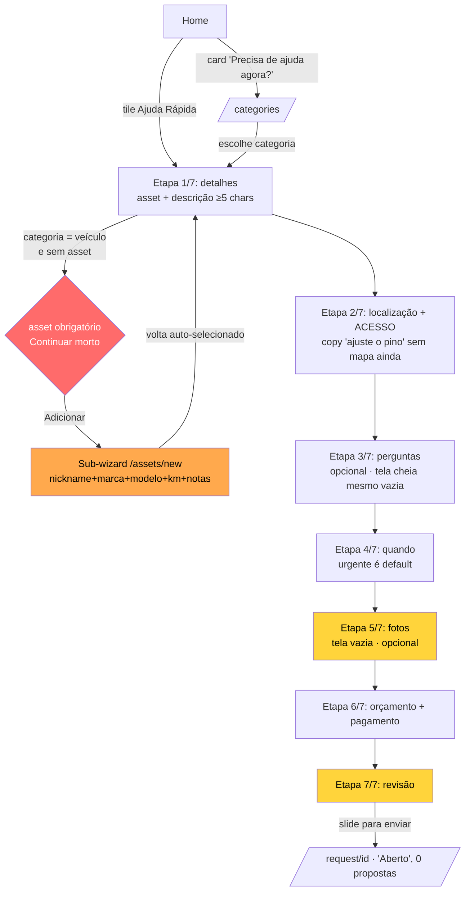
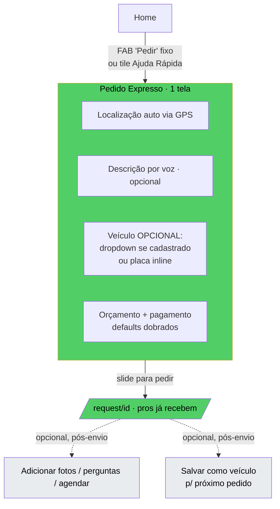

# Pedidos de Serviço — Criação e Acompanhamento

Módulo: Funil de criação (`request/new.tsx`, wizard de 7 etapas) + lista "Meus chamados" (`(tabs)/requests.tsx`) — App do Cliente (Chama Fácil).
Fontes: `ux-audit/_notes/cluster-home-create-assets.md` (§4, §5) e `ux-audit/_notes/dynamic-walkthrough.md` (achados 5, 6, 7, 9, 11, 12, 13, 14, 19).
Data: 2026-07-20

> Este é o coração da conversão do produto: é onde o dinheiro entra. Cada fricção aqui se traduz diretamente em pedido não enviado.

> **⟳ Direção de produto (definida pelo cliente):** a criação **terá etapas que variam por tipo de chamado** (fluxo adaptativo por categoria) — não é "reduzir para N etapas fixas", e sim cada categoria dirigir seus campos e sua ordem, com um **modo expresso** para urgência. Também serão adicionados **confirmações e estados de carregamento** como padrão. Portanto, as recomendações abaixo devem ser lidas como: manter etapas quando a categoria exigir, mas eliminar os anti-padrões (etapa vazia como tela cheia, campo fora de contexto como "ACESSO" para guincho, ativo obrigatório antes de pedir) e padronizar feedback/loading.

---

## Visão geral (objetivo; personas)

**Objetivo do módulo.** Levar o usuário do "preciso de ajuda" ao "pedido enviado" no menor tempo e fricção possíveis, e depois acompanhar propostas e status. Tudo na tela de criação deveria ser subordinado a uma meta: *reduzir o tempo até o "slide para pedir"*.

**Personas.**
- **Aflito na estrada** (âncora): guincho urgente, à noite, carro NÃO cadastrado. É a persona mais comum no pico de urgência — e a pior atendida pelo funil atual.
- **Planejador doméstico**: agenda serviço sem pressa; tolera etapas, valoriza revisão e agendamento.

**Diagnóstico de uma frase.** Um pedido urgente percorre exatamente o mesmo túnel de 7 telas fixas que um agendamento planejado — sem nenhum caminho expresso e com um pré-cadastro de veículo bloqueando a saída.

---

## Fluxos (texto + fluxograma Mermaid válido)

### Estrutura atual
Wizard de **7 etapas FIXAS** (`STEP_KEYS`, `new.tsx:38`):
`details → location → questions → when → photos → money → review`.
`stepKeys = STEP_KEYS` sempre (`new.tsx:116`) — **nenhuma etapa é pulada dinamicamente**, mesmo quando opcional ou vazia.

### Contagem de toques (persona da estrada, guincho, carro NÃO cadastrado)
Medição no device (`dynamic-walkthrough.md`): atalho(1) → focar descrição(2) → digitar → Continuar→2(3) → Usar localização(4) → Continuar→3(5) → Continuar→4(6) → Continuar→5(7) → Continuar→6(8) → Continuar→7(9) → arrastar para enviar(10). **~10 interações + 7 telas** — mais o sub-wizard de asset se o veículo não estiver cadastrado.

### Fluxo ATUAL



### Fluxo PROPOSTO (≤4 toques; veículo por placa inline opcional; foto/perguntas/agendamento pós-envio)



---

## Problemas encontrados (por severidade; evidência)

### Crítico
- **7 etapas fixas para um chamado urgente.** `ETAPA 1/7` a `7/7`, sem caminho expresso; um pedido urgente percorre o mesmo túnel de um agendamento planejado. Fricção excessiva (Doherty/Hick/Miller); o número cru "ETAPA x/7" comunica "isto é longo" (`Wiz.tsx:55`). Etapas fracas: a **etapa 5 (fotos) é uma tela inteira só para "Adicionar foto" opcional, com muito espaço vazio**; etapas 3/4 são inteiramente opcionais (Continuar já habilitado). Evidência: `dynamic-walkthrough.md` achado 12; `01, 06, 08, 09, 10, 11, 12` .png; `new.tsx:38, :116`.
- **Asset obrigatório em veículo mata a conversão.** Para categorias com `asset_type` (guincho, bateria), `canContinue` é falso até existir `assetId`:
  ```
  new.tsx:212
  (stepKey === 'details' && description.trim().length >= 5 && (assetType == null || assetId != null))
  ```
  Sem carro cadastrado, o botão Continuar fica morto e o usuário é jogado no sub-wizard `/assets/new?pick=1&type=vehicle` (`new.tsx:92`) para *batizar o carro* antes de pedir socorro. É a inversão do modelo de socorro: a informação do veículo é útil, mas deveria ser opcional e inline (placa/modelo em 1 campo), nunca um pré-cadastro bloqueante. A mitigação de auto-pick (`new.tsx:79-82`) só ajuda quem já cadastrou — o caso "primeiro pedido, zero assets" é o mais comum e o pior atendido. Evidência: `cluster-home-create-assets.md §4.4`.

### Alto
- **Etapa 5 (fotos) é uma tela vazia.** Opcional, mas ocupa uma tela cheia com muito espaço morto só para "Adicionar foto". Deveria ser dobrável ou puxada para pós-envio. Evidência: `dynamic-walkthrough.md` achado 12; `10-step5-photos.png` (screen 10); `new.tsx:428`.
- **Campo "ACESSO" fora de contexto para guincho.** A etapa 2 mostra "ACESSO: Adulto com chave / Código de acesso" — campo de serviço *doméstico* — para um guincho na estrada. O wizard mistura campos genéricos não adaptados (etapa 2) com campos dinâmicos adaptados (etapa 3, específicos de guincho). Evidência: `dynamic-walkthrough.md` achado 13; `06` vs `08` .png.
- **Copy "ajuste o pino" sem mapa até tocar.** A etapa 2 diz "Ajuste o pino se precisar", mas não há mapa/pino até o usuário tocar "Usar minha localização"; só então o Leaflet carrega. A copy promete uma UI que ainda não existe. Ligado ao Doherty: `getCurrentCoords` + `reverseGeocode` (`new.tsx:124-135, :139-143`) roda sem skeleton no card do mapa. Evidência: `dynamic-walkthrough.md` achado 14; `06` vs `07` .png.
- **"Continuar" desabilita sem explicar.** Com descrição vazia (ou <5 chars, ou asset não escolhido), tocar "Continuar" não faz nada e não mostra o que falta — o botão só fica opaco (`canContinue`, `new.tsx:211-217`). O usuário em pânico toca e "não acontece nada". Falta mensagem inline ("Descreva o problema para continuar"). Nielsen — prevenção/ajuda de erro. Evidência: `dynamic-walkthrough.md` achado 5; `02-step1-continue-empty.png`.
- **`BudgetMeter` inacessível (WCAG).** SVG com `PanResponder` (`BudgetMeter.tsx:84-91`), sem `accessibilityRole="adjustable"`, sem `accessibilityValue`, sem incremento por teclado. Usuário de leitor de tela não consegue definir orçamento (WCAG 4.1.2, 2.1.1). O campo numérico é saída parcial, mas o medidor visual principal é inacessível. Evidência: `cluster-home-create-assets.md §4.8`; `new.tsx:456`.

### Médio
- **Teclado cobre o campo de descrição.** O textarea "O que aconteceu?" fica no rodapé; ao focar, o teclado sobe e encobre o campo — não dá para ver o que se digita (keyboard-avoidance insuficiente). Evidência: `dynamic-walkthrough.md` achado 6; `03, 04` .png.
- **Endereço muda entre etapas.** A etapa 2 mostrou "5, Jardim Marajó"; a Revisão (etapa 7) e o detalhe mostram "Rua Patrícia Rodrigues Fontes, 805, Jardim Marajó" — geocodificação reversa inconsistente entre telas, corroendo a confiança no que será enviado. Evidência: `dynamic-walkthrough.md` achado 7; `07` vs `12`/`14` .png.
- **Status todos verdes na lista.** Na aba Chamados, "Aceito", "Em atendimento" e "Concluído" usam o mesmo verde — não dá para diferenciar ativo de concluído num relance. Evidência: `dynamic-walkthrough.md` achado 9; `20-requests-list.png`.
- **Etapas opcionais como etapas plenas.** `questions` (`new.tsx:382`) renderiza uma tela inteira mesmo quando `visibleQuestions.length === 0` (`new.tsx:384`), exibindo "nenhuma pergunta extra" (`:391`). Deveria pular automaticamente. Também `photos`.
- **Slide-to-confirm no fim de 7 telas.** Gesto deliberado é bom contra toque acidental, mas colocá-lo ao fim de um funil de 7 telas para um pedido urgente é fricção sobre fricção (`new.tsx`, etapa review).
- **Filtro server-side ausente na lista.** Filtragem client-side sobre páginas carregadas (`requests.tsx:37-40`) faz `filteredCount` mentir — conta só o que já baixou. Débito conhecido, mas visível ao usuário.
- **Sem momento de sucesso ao enviar.** Após arrastar para enviar, cai direto no detalhe "Aberto" sem celebração/confirmação — o pico de esforço não é recompensado (Peak-End). Evidência: `dynamic-walkthrough.md` achado 19; `12`→`13`.

### Baixo
- **Pluralização preguiçosa.** "5 proposta(s)", "0 foto(s)", "1 proposta(s)" — o "(s)" literal aparece na UI. Falta pluralização de i18n. Evidência: `dynamic-walkthrough.md` achado 11; `20`, `12` .png.

### Pontos positivos (manter)
- Etapa `review` totalmente editável por linha (lápis, `SumRow onPress → goTo`, `new.tsx:491-516`) — ótimo "reconhecer em vez de lembrar" (`14`).
- Auto-seleção do único asset com microcopy clara ("Selecionamos este por ser o seu único cadastrado", `new.tsx:79-82`).
- Ditado por voz no campo de descrição.
- Etapa 6 (orçamento): medidor com valor sugerido + ancoragem "Guincho custa em média R$120 nesta região" = boa transparência/CRO (ressalva: semântica de cor vermelho→verde pode confundir).
- Upload de foto "upload-first" com falha silenciosa não-fatal (`new.tsx:160-166`) — boa resiliência.
- Lista de pedidos: ordenação por acionabilidade (`STATUS_PRIORITY`, `requests.tsx:12-20`) e empty states distintos com CTA (`requests.tsx:84-100`).

---

## Melhorias

| Problema | Impacto | Solução | Justificativa | Esforço | Prioridade |
|---|---|---|---|---|---|
| 7 etapas fixas para urgência | Abandono no pico de urgência | Modo Expresso de 1 tela (localização auto + descrição por voz + veículo opcional + orçamento/pagamento dobrados); perguntas/fotos/agendamento viram "adicionar detalhes" pós-envio | Doherty/Hick/Miller; pros já recebem o pedido enquanto o cliente enriquece | G | Crítico |
| Asset obrigatório em veículo (`new.tsx:212`) | Mata conversão do 1º pedido | Tornar veículo opcional: dropdown se cadastrado, senão campo de placa/modelo inline; nunca bloquear Continuar | Modelo de socorro: carro é contexto, não pré-requisito | M | Crítico |
| Etapa 5 (fotos) tela vazia | Tela morta no meio do funil | Colapsar fotos em anexo opcional (thumbnail-strip) na etapa de detalhes, ou pós-envio | Elimina tela sem valor | P | Alto |
| Campo "ACESSO" para guincho | Confunde persona da estrada | Renderizar "acesso" só para categorias domésticas (condicional por tipo) | Adequação ao contexto | P | Alto |
| Copy "ajuste o pino" sem mapa | Promessa quebrada + sem feedback de GPS | Carregar mapa/pino ao entrar na etapa com skeleton; ajustar copy ao estado real | Correspondência + Doherty | M | Alto |
| "Continuar" desabilita sem explicar | Usuário "toca e nada" | Mensagem inline do que falta ("Descreva o problema para continuar") | Nielsen prevenção/ajuda de erro | P | Alto |
| `BudgetMeter` inacessível | Leitor de tela não define orçamento | `accessibilityRole="adjustable"` + `accessibilityValue` + incremento por teclado | WCAG 4.1.2 / 2.1.1 | M | Alto |
| Teclado cobre a descrição | Não vê o que digita | `KeyboardAvoidingView`/scroll-to-focus; subir o campo | Usabilidade básica de input | P | Médio |
| Endereço muda entre etapas | Erosão de confiança | Fixar um único resultado de geocodificação e reusar em todas as telas | Consistência de dados | M | Médio |
| Status todos verdes | Não distingue ativo de concluído | Paleta por estado (em andamento ≠ concluído ≠ cancelado) | 1.4.1 uso de cor + escaneabilidade | P | Médio |
| Etapas opcionais vazias renderizam | Telas mortas | Pular automaticamente quando `visibleQuestions.length===0` (`new.tsx:384`) | Menos passos | P | Médio |
| Sem momento de sucesso | Pico de esforço não recompensado | Confirmação/celebração breve ao enviar antes do detalhe | Peak-End | P | Médio |
| `filteredCount` enganoso | Contagem mente com paginação | Filtro server-side | Integridade de dados | M | Médio |
| Pluralização "(s)" | Aparência amadora | ICU/plural de i18n | Polimento | P | Baixo |

**Mock ASCII — Pedido Expresso (1 tela para a persona "aflito na estrada"):**

```
┌──────────────────────────────────────┐
│ ✕  Guincho                    URGENTE │
├──────────────────────────────────────┤
│  📍 Sua localização                    │
│  ┌────────────────────────────────┐   │
│  │  [mapa · pino auto via GPS]  ✓ │   │
│  │  Av. Brasil, 1200 — captado    │   │
│  └────────────────────────────────┘   │
│                                        │
│  O que houve? (opcional)               │
│  ┌────────────────────────────────┐   │
│  │ 🎤 Carro não liga...           │   │
│  └────────────────────────────────┘   │
│                                        │
│  Carro (opcional)  [ Meu Gol ▾ ]       │
│    ou digite a placa: [ ABC1D23 ]      │
│                                        │
│  Orçamento  R$120 (sugerido) · Pix     │
│  [ ajustar ▾ ]        ← dobrado        │
│                                        │
├──────────────────────────────────────┤
│   ▸▸▸  Arraste para pedir socorro  ▸▸▸ │
└──────────────────────────────────────┘
```

Tudo essencial numa tela: localização (auto), descrição por voz (opcional), veículo **opcional** (dropdown se cadastrado, ou placa inline), orçamento/pagamento com defaults dobrados. Perguntas, fotos e agendamento passam a ser "adicionar detalhes" *depois* do envio, enquanto os profissionais já começam a receber.

---

## UI
- Wizard `Wiz` com barra de progresso (`Wiz.tsx:55-63`) — o rótulo cru "ETAPA x/7" reforça a sensação de longo.
- Erros via `Alert` nativo (`new.tsx:198, :131`) — consistente, porém abrupto; toast/inline seria mais suave.
- Etapa `money`: velocímetro + steppers + campo + 3 métodos de pagamento (`new.tsx:454-484`) — muita decisão para um default que já funciona (Hick).
- Lista: `RequestFilterSheet` com chip de filtro ativo, contagem e limpar (`requests.tsx:70-82`). Bom.

## UX
- Nenhum caminho expresso; urgência e agendamento compartilham o mesmo túnel (Nielsen — Flexibilidade).
- Sub-wizard de asset no meio do pedido é fricção cerimonial no pior momento.
- Pós-conversão: ordenação por acionabilidade e empty states bem-feitos são pontos fortes da lista.

## Design System
- `Wiz` reusado entre pedido e cadastro de asset — consistência forte.
- `PaginatedList`, `EmptyState`, `Skeleton*`, `Badge`, `Segment`, `Chip` bem reaproveitados.
- `Toggle` de `shareNote` (`new.tsx:296-305`) é visual, não `Switch` real — sem semântica de switch.
- Botão de filtro (`requests.tsx:45-67`) tem `role/label/state` corretos — bom exemplo a replicar nos cards de asset.

## Performance
- Etapa `location` faz GPS + reverse-geocode sem skeleton no card do mapa (`new.tsx:124-143`) — sem feedback de progresso além do texto "locating" (`:360`). Doherty.
- Upload-first resiliente. Sem gargalos técnicos além da percepção de latência no mapa.

## Acessibilidade
- **Crítico (WCAG):** `BudgetMeter` sem semântica adjustable (`BudgetMeter.tsx:84-91`).
- **Alto:** `AssetSelector` cards (`AssetSelector.tsx:44`) sem `role`/`accessibilityState={{selected}}` — seleção só por cor de borda + check (`:57`); `Toggle` de shareNote sem role de switch (`new.tsx:303`).
- **Médio:** `Segment` (urgência, acesso, pagamento) e chips de `DynamicFields` (`DynamicFields.tsx:63`) comunicam seleção só por cor (falha 1.4.1 + 4.1.2). Ícone de remover foto 24px (`new.tsx:437`), abaixo dos 44px recomendados.

## Quick Wins
1. Mensagem inline explicando por que "Continuar" está desabilitado (P, Alto).
2. Renderizar "ACESSO" só para categorias domésticas (P, Alto).
3. Pular a etapa `questions` quando vazia (`new.tsx:384`) (P, Médio).
4. Paleta de status por estado na lista (P, Médio).
5. Corrigir pluralização "(s)" com plural de i18n (P, Baixo).
6. `KeyboardAvoidingView` no campo de descrição (P, Médio).

## Score
- UX: 3/10
- UI: 6/10
- Performance: 6/10
- Acessibilidade: 3/10
- Consistência: 6/10

**Nota final: 4,5/10** — O funil tem bons componentes isolados (revisão editável, ancoragem de preço, auto-seleção, empty states da lista), mas a espinha dorsal está errada para o produto: 7 etapas fixas e um pré-cadastro de veículo bloqueante transformam o pico de urgência — o momento de maior valor — no de maior atrito.
